# Fuel POS Platform — Expanded Architecture

**Status:** Design / brainstorming output · **Date:** 2026-06-25 · **Supersedes scope of:** `files/ARCHITECTURE.md` (the v1 *Money-Correctness Core*, which remains the canonical reference for the money core itself).

This document expands the v1 money core into a full **forecourt + convenience-store POS platform** on AWS/Kubernetes: a pump simulator, the POS itself, data storage, observability, high availability, a phased delivery roadmap, reporting modules, and an explicit scale story. It is a **deliberate-practice design**, not a product spec. The north star is unchanged from v1 — **transaction correctness under concurrency and partial failure** — now carried through a much larger system without diluting it.

The architectural thesis, validated by an independent architecture panel (see *Architecture Critique*), is **A1**: a **synchronous money core inside one Postgres ACID boundary**, wrapped in an **event-driven** periphery (settlement, loyalty, subsidy, e-invoice, analytics, reporting, c-store inventory) at the seams and the read side. Event-driven *everywhere it earns its keep*; **emphatically not** in the money write path.

### The numbers, stated honestly up front

- **Throughput target: 20,000 req/sec sustained (~1.2M/min)** — Visa-class, and *achievable*. This decomposes into **~5,000 money-writes/sec** (the hard, contended path) and **~15,000 cacheable reads/sec** (status polls, dashboards, reporting — served from replicas/cache, never the write primary).
- **1,000,000/sec was considered and deliberately rejected** as synthetic overkill that would force sharding the money ledger past the point where correctness stays simple. We design so the write path *can* shard toward higher numbers as a measured, documented step — we do not claim it on day one.
- **HA: active-active across AZs in one region + warm cross-region DR.** Not multi-region active-active (that trades money-correctness for latency a minutes-long fuel sale does not need).

### How to read this document

1. **Subsystems** (§Simulator → §Scale Story) each stand alone: what it does, how it's used, what it depends on.
2. **Money Rules**, **Security/PCI**, and the **ADR Log** are cross-cutting — read them before the roadmap.
3. The **Roadmap** sequences everything into ~18 independently-shippable phases, *correctness-first*. **The debits=credits fold is re-proven at every phase boundary.**
4. **Deferral discipline (ADR-007):** several powerful mechanisms — shard-by-pump, the cross-shard clearing machinery (ADR-009), MSK/Debezium, and the cross-AZ load — are written here in full but **fenced to the phases where a *measured* bottleneck earns them**. Where you see a *"(Phase N, deferred)"* banner, that machinery is designed-but-not-yet-built on purpose. Do not build it speculatively.

---

## Contents

- [Scope](#scope)
- [Architecture at a glance](#architecture-at-a-glance)
- [Pump Simulator & Load/Chaos Engine](#pump-simulator-loadchaos-engine)
- [Forecourt + C-Store POS](#forecourt-c-store-pos)
- [Transport Layer & Event-Driven Backbone](#transport-layer-event-driven-backbone)
- [Data Storage & Schema Evolution](#data-storage-schema-evolution)
- [Observability & SLOs](#observability-slos)
- [High Availability, Kubernetes on AWS, Admission Control & Failure Handling](#high-availability-kubernetes-on-aws-admission-control-failure-handling)
- [Reporting & Analytics](#reporting-analytics)
- [The Scale Story: Path to 20k/5k](#the-scale-story-path-to-20k5k)
- [Money Rules & Lifecycle Beyond the Happy Path](#money-rules-lifecycle-beyond-the-happy-path)
- [Security, PCI Scope & Operator Authorization](#security-pci-scope-operator-authorization)
- [Phased Delivery Roadmap](#phased-delivery-roadmap)
- [Architecture Critique & Decisions (Q&A)](#architecture-critique-decisions-qa)
- [Architecture Decision Record (ADR) Log](#architecture-decision-record-adr-log)

---

## Scope

**In scope — the expanded platform:**

- **The v1 money core** (unchanged spine): the fuel transaction lifecycle (pre-authorize an unknown amount → dispense → capture the lower actual → settle), atomic idempotency, the append-only double-entry ledger, the outbox, three-way reconciliation against an independent totalizer truth, and the expiry reaper.
- **Pump simulator** as load generator + correctness fuzzer + independent totalizer-truth emitter.
- **Forecourt + c-store POS:** fuel sales, in-store merchandise, multi-tender payment (card / cash / mobile / fleet card), price book, shift/cashier session + cash-drawer reconciliation, receipts, loyalty hooks.
- **Money lifecycle beyond the happy path:** refunds, partial refunds, post-settlement chargebacks, and subsidy/tax claw-back (ADR-014).
- **Data storage** on Aurora Postgres + the CQRS read-side (replicas/cache) + the S3/Athena warehouse.
- **Observability** (RED + domain metrics + the ledger-invariant fold + age-based lag SLIs) and **SLOs**.
- **High availability & Kubernetes on AWS** (EKS multi-AZ active-active, Aurora multi-AZ, KEDA, warm cross-region DR) plus a full **failure-handling matrix** and **admission control** (ADR-017).
- **Reporting & analytics modules** built as CQRS read-side projections.
- **Security & PCI scope** (ADR-018) and operator authorization.
- **The scale story** to 20k/5k, including the honest path to shard-by-pump.

**Deliberately deferred (seams designed for them):**

- **Saga fan-out** (loyalty, RON95 subsidy, MyInvois e-invoice) as idempotent bus consumers; OpenTelemetry/Jaeger lands with it.
- **Edge / offline-first** forecourt operation and store-and-forward sync.
- **MSK + Debezium CDC**, sharding, and the cross-shard clearing machinery — added only against a *measured* bottleneck (ADR-007/009/013).

**Explicitly out of scope:**

- **Fleet-card accounts-receivable / operator invoicing cycle** — handed off to an external ERP; `fleet-receivable` is a hand-off boundary account, not a swept account.
- **Multi-currency** — this is an MYR-only Malaysian forecourt; the currency dimension is dropped as YAGNI (ADR-016).
- **Multi-region active-active** — rejected; warm cross-region DR only.

---

## Architecture at a glance

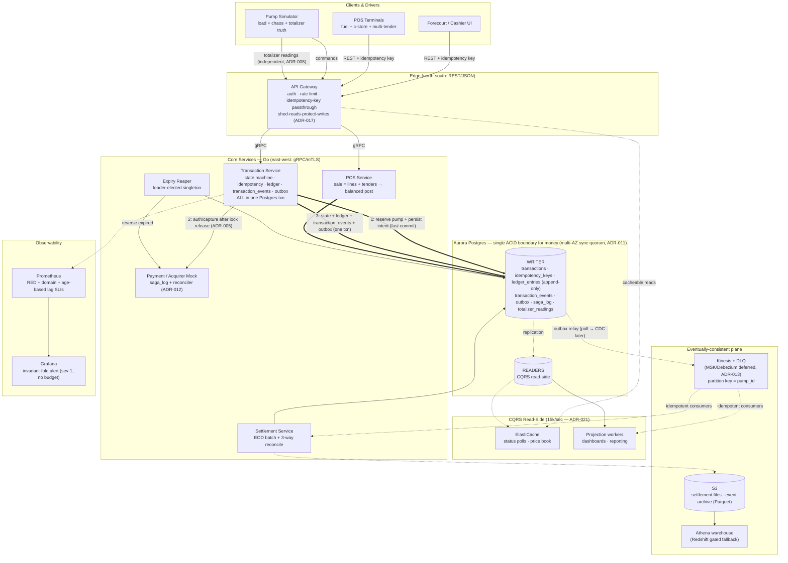

**Reading the diagram.** Thick arrows (`==>`) are the synchronous money path inside one Postgres ACID boundary; the numbered edges on the Transaction Service encode the ordering that matters (reserve+fast-commit → release → slow acquirer call → commit result — ADR-005). Solid arrows are synchronous calls. Dashed arrows are eventually-consistent. **The outbox is the single one-way membrane from the synchronous money core to the asynchronous plane** — money is *decided* in the ACID core and only *propagated* over the bus, never decided there (ADR-006).

**Two planes, two consistency models — the load-bearing idea of the whole platform:**

- **Synchronous plane (Aurora writer):** every money-defining act — state transitions, idempotency resolution, ledger posting, `transaction_events`, the outbox insert — commits in **one Postgres transaction**. The global invariant `Σ debits = Σ credits` is therefore continuously and trivially true, with no in-flight "captured-but-unbooked" window.
- **Eventually-consistent plane (Kinesis → consumers):** settlement aggregation, reporting projections, loyalty/subsidy/e-invoice fan-out, analytics. Tolerates delay; never carries money-defining work.

Everything else in this document is the engineering of those two planes — and the disciplined, *measured* path by which the synchronous plane eventually shards (Phase 16) without surrendering the invariant.

---

## Pump Simulator & Load/Chaos Engine

The simulator is not a load script bolted on at the end. It is the **adversary that proves the money core**. But it is deliberately *not* a monolith that reinvents a load generator — that work is solved, and rewriting it is how you ship a coordinated-omission bug into your own measurement. So the simulator splits cleanly into two halves with very different pedigrees:

1. **The load generator is off-the-shelf:** [k6](https://k6.io) open-model arrival-rate executors (with [vegeta](https://github.com/tsenart/vegeta) as the raw constant-rate fallback). We do **not** hand-roll an open-model arrival scheduler — k6's arrival-rate executors *are* an open-model scheduler, with corrected percentiles, and a bespoke one is just a coordinated-omission bug waiting to happen.
2. **A thin Go oracle/totalizer harness is bespoke,** because nothing off-the-shelf does it: an **independent totalizer-truth emitter** (ADR-008) and an **invariant oracle** that folds the ledger/event log and asserts the money invariants. These are the genuinely novel parts — the only parts worth writing ourselves.

The rule of thumb: **if a load tool already does it, we configure it; if it is domain money-correctness, we build the thin harness.** The harness never tries to be a load generator, and the load generator never tries to understand money.

> **§11 of the v1 doc described this at a sketch level.** This section is the engineering of it: why the load generator is k6/vegeta and not our own scheduler, the chaos knobs as a typed config surface mapped to ADRs, the independent totalizer emitter, and the invariant oracle expressed as a fold over the log.

---

### 1. Two halves, one purpose

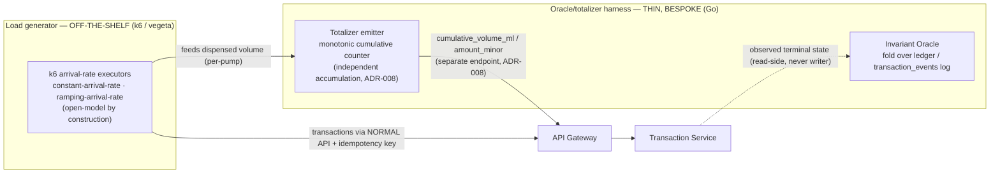

The harness reads what the load generator *intended* (k6's per-iteration sale template, emitted as structured output) so it can compute the expected-outcome envelope, and it reads the **independent** totalizer truth so reconciliation is genuine rather than the transaction log grading its own homework.

---

### 2. The independent totalizer-truth emitter (ADR-008)

A real forecourt has two physically independent signal sources:

1. The **POS / pump controller** issuing transaction commands (authorize → dispense → capture). In the test rig, k6 plays this role.
2. The **pump totalizer** — a mechanical/electronic cumulative counter inside the dispenser that only ever counts *up*, read out-of-band by the site controller. **This is the harness's job**, and it is the whole reason a thin bespoke component exists.

**Critical separation:** the totalizer model accumulates volume from its *own* dispense events, **not** from API responses. If the totalizer reading were computed from the same `captured_amount_minor` the transaction wrote, three-way reconciliation (transaction log vs `ledger_entries` vs `totalizer_readings`) is theatre — three views of one number.

When chaos drops a mid-dispense packet (the API never hears the final volume), the totalizer **still counts the fuel that physically flowed** — exactly the real-world failure where product left the tank but the books don't know. That divergence is the bug class reconciliation exists to catch, and the harness must be able to *manufacture* it on demand. The totalizer stream therefore intentionally leads or lags the transaction stream under chaos; the size of that gap is a tunable, not an accident.

This is why the totalizer emitter cannot live inside k6: k6 thinks in requests and responses, but the totalizer's defining property is that it *ignores* the response and accumulates the physical truth on its own clock.

---

### 3. Behavior distributions

Per virtual pump, every sale is drawn from configurable distributions. Defaults model a busy Malaysian forecourt; parameters live in the k6 scenario config and the harness's sale-template generator. MYR-only — there is no currency dimension to vary (ADR-016).

| Dimension | Model | Default | Rationale |
|---|---|---|---|
| **Arrivals** | Poisson process per pump, expressed as a k6 **arrival-rate** target | ~5,000 captures/sec aggregate across the network | Real arrivals are memoryless; k6's arrival-rate executor offers requests at the target rate independent of response latency (the open-model property — see §4). |
| **Fuel grade** | Categorical | RON95 0.65, RON97 0.20, Diesel 0.15 | RON95 is the subsidy path — it must dominate so we exercise the `subsidy-receivable` posting hardest (and, at Phase 16, the shard-local subsidy clearing leg — ADR-009). |
| **Volume** | Log-normal, clipped to tank/auth limits | median ~25 L, p99 ~70 L (lorry/fleet) | Right-skewed: most cars small, occasional large fleet fills that stress the `captured ≤ auth` guard. |
| **Auth estimate** | volume × grade price × headroom (1.15×) | — | Models pre-auth of an *unknown* amount; capture is deliberately lower → tests the auth/capture gap. |
| **Dwell (dispense duration)** | volume / flow-rate, flow ~35–50 L/min + jitter | seconds in sim time | Compressed from real minutes via a **time-dilation factor** (below) so a "minutes-long" dispense fits a load run. |

> **Time dilation is a first-class knob — and it preserves causality.** A real dispense takes minutes; a 20k req/sec load test cannot wait minutes per sale. We compress dispense dwell by a `time_scale` factor (e.g. 60×) **but keep the request *ordering and concurrency* faithful** — authorize → N status polls → complete → capture still interleave correctly per pump, and the totalizer's monotonic accumulation advances on the same dilated clock as the dispense it observes. We compress *think time*, never *causality*. A naive "remove the dwell entirely" collapses the auth→capture window that is the whole point of the domain (§4 of the v1 doc), so it is explicitly forbidden.

---

### 4. Driving 20k req/sec without coordinated omission

This is the single easiest thing to get silently wrong — which is *exactly why we don't write it ourselves.*

#### Why closed-loop load lies

A **closed-loop** generator (the default shape of naive Go load code, and of JMeter/Gatling "users") works like this: a fixed pool of *V* virtual users each loops `send request → block for response → send next`. The flaw: **when the system under test stalls, the load generator stalls with it.** If a capture that should take 5 ms takes 5 s because a contended shared account is serializing everything (exactly the contention we are hunting), a closed-loop user simply *waits* — and therefore **does not send** the requests it would have sent during those 5 s. Those un-sent requests, and the queueing latency they would have suffered, never appear in the results. This is **coordinated omission**: the load tool conspires with the server to hide the server's worst behavior. The reported p99 looks great precisely *because* the system was slow. For a money system whose failure mode is "contention under burst," this is the most dangerous possible measurement error.

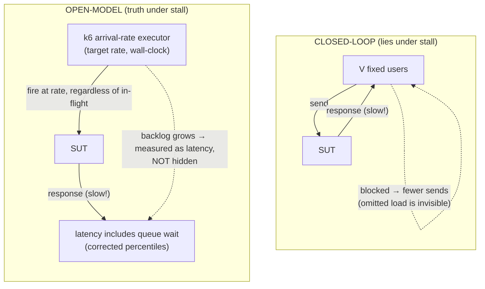

#### We configure k6, we do not build a scheduler

k6's **`constant-arrival-rate`** and **`ramping-arrival-rate`** executors are open-model by construction: they allocate VUs to *hit a target rate*, decoupling request emission from response latency, and they report corrected percentiles. That is the entire open-model architecture the previous draft proposed to hand-roll — pre-computed Poisson timelines, an unbounded-in-flight dispatcher, latency measured from intended start (the Gil Tene correction). **k6 already does all of it.** Re-implementing it in Go would add a second, less-tested code path whose subtle bugs would silently re-introduce coordinated omission — the precise failure we are trying to eliminate. So the decision is firm: **the headline number comes from k6 (or vegeta for raw constant-rate HTTP with an honest latency histogram), never from bespoke Go load code.** The v1 doc already warned to "watch for coordinated omission in the load tool" (§7); the cleanest discharge of that warning is to use a tool that gets it right.

| Property | Closed-loop (rejected for headline) | Open-model (k6 arrival-rate / vegeta) |
|---|---|---|
| Sends when SUT stalls? | No — stalls with it | **Yes — backlog grows, measured** |
| Hides tail latency? | Yes (coordinated omission) | No (corrected percentiles) |
| Models real arrivals? | No (cadence = response time) | **Yes (arrival-rate, independent of SUT)** |
| Who maintains it? | us | **k6 maintainers** |
| Right question it answers | "how fast can V users go" | **"can the system hold 20k/sec arriving regardless"** |

> **Honest caveat:** open-model can *overload itself* — if the SUT is genuinely slower than the offered rate, k6 exhausts its VU allocation (or vegeta its FDs) before the SUT does. That is not a defect; it is the correct signal that the SUT cannot hold the rate. We run the generator as a **small k6 pod fleet on separate, over-provisioned hosts** from the SUT, and we treat "generator saturated before SUT degraded" as an explicit, alarmed outcome — never as a clean pass. k6's `dropped_iterations` metric is exactly this signal.

#### Splitting the 20k: write path vs CQRS read path

The 20k/sec target is **not** 20k money-writes (§7, locked). It decomposes, and the load profile must reproduce the decomposition or it measures the wrong thing:

- **~5,000/sec money-WRITES** (authorize, complete, capture) → hit the synchronous core, the real local/Aurora Postgres primary.
- **~15,000/sec cheap cacheable READS** (status polls, forecourt dashboard, reporting) → hit the **CQRS read-side** (read replicas / ElastiCache, introduced at Phase 11 per ADR-021), **never the write primary** — the only carve-out is narrow money-confirmation read-your-write reads.

Each sale spawns a burst of status polls between authorize and capture; those polls are tagged so the gateway routes them to the read path. **If the profile pointed all 20k at the primary it would be lying about the system's real load shape** and would falsely condemn the write tier. Two k6 scenarios, two routes:

```yaml
# k6 options.scenarios — the load generator IS k6; this is config, not code
scenarios:
  write_path:
    executor: ramping-arrival-rate          # open-model
    startRate: 0
    stages: [ { target: 5000, duration: 2m }, { target: 5000, duration: 10m }, { target: 0, duration: 1m } ]
    tags: { route: primary }                 # money writes → synchronous core
  read_path:
    executor: constant-arrival-rate          # open-model
    rate: 15000
    duration: 13m
    tags: { route: replica_or_cache }        # cacheable reads → CQRS read-side, never the writer
```

---

### 5. Chaos knobs (live-tunable correctness fuzzing), mapped to ADRs

Chaos is a typed config surface, hot-reloadable **mid-run** (a `chaos.yaml` watched via fsnotify, or a SIGHUP/config endpoint) so an operator can dial up one failure class and watch a specific invariant or alert respond. Each knob is a probability or a distribution, applied per-sale at the relevant lifecycle point. The knobs live in the harness (they shape the sale template and the totalizer's divergence), and k6 reads the resulting template — so chaos and load stay decoupled.

| Knob | Type | Injects | Targets which ADR / guarantee |
|---|---|---|---|
| `decline_rate` | p ∈ [0,1] | Acquirer rejects the preauth → `DECLINED` | Terminal-state correctness; **no ledger entry on decline**. |
| `drive_off_rate` | p | Dispense completes, **capture never sent** | Expiry Reaper drives `AUTHORIZED/COMPLETED` → `EXPIRED` + reversal; **no stuck non-terminal txn** (ADR-014 reversal is a first-class money flow). |
| `mid_dispense_drop_rate` | p | TCP/packet drop during `DISPENSING`; volume flows but final amount lost to API | **ADR-008** — totalizer-vs-ledger divergence; reconciliation must flag it. |
| `preauth_expiry_rate` | p (or short hold-window) | Hold window elapses before capture | Reaper + reversal; `captured ≤ auth` never violated by a late capture. |
| `acquirer_latency` | dist (lognormal μ,σ + tail spikes) | 100 ms–2 s+ delay on auth/capture | **ADR-005** — the pump serialization point is *never* held across this; if it were, throughput collapses and the test exposes it. Also drives **ADR-017**'s circuit breaker. |
| `duplicate_send_rate` | p | Replays the same request **with the same idempotency key** | **ADR-001 + ADR-010** — must return the stored result: **no double-capture, no double-ledger-post, no double event-append** (see callout). |
| `clock_skew` / `reorder` | flag | Reorders in-flight requests per pump | Optimistic `version`-CAS must reject stale transitions (v1 §4). |

The **`duplicate_send_rate`** knob earns its own callout: it is the harness's direct assault on **idempotency (ADR-001)** *and* the **append-only aggregate (ADR-010)**. When the same capture is replayed under the same key, the oracle must observe exactly **one** `transactions` row at terminal state, exactly **one** balanced set of `ledger_entries`, **and** exactly **one** matching `transaction_events` row per logical event — ADR-010's per-event history must not double-append on retry. The fuzzer asserts *cardinality*, not just the final amount; a retry that silently appends a second event row is a drift bug ADR-010 explicitly warns about, and this knob is how we catch it.

---

### 6. The invariant oracle — chaos in, assertions out, fold over the log

Every sale carries an **expected-outcome envelope** computed by the harness at generation time (given its own chaos draws, it knows what *should* happen). Continuously (via sampling) and at run-end, the oracle reconciles the envelope against observed state read from the **CQRS read-side** — the oracle is a reader and never touches the write primary except via the narrow read-your-write carve-out.

| Invariant | Assertion | Backed by |
|---|---|---|
| **No double-capture** | Per txn id: exactly one `CAPTURED` transition, one acquirer `capture` ref, one ledger debit/credit pair, one event-row per logical event. | ADR-001, ADR-010 |
| **No stuck non-terminal txn** | After `t_run + max_hold_window + reaper_period`, **zero** txns remain in `AUTHORIZING/AUTHORIZED/DISPENSING/COMPLETED/CAPTURING`. | Reaper, §4 of v1 |
| **debits = credits (as a fold)** | `fold(+debit, −credit)` over the **ordered** `ledger_entries`/`transaction_events` log nets to 0. **No error budget — always a sev-1 page.** Necessary but **not sufficient** (a balanced-but-wrong +500/−500 passes). | ADR-002, ADR-003, ADR-010 |
| **captured ≤ auth** | For every captured sale, `captured_amount_minor ≤ auth_amount_minor`. | v1 §8 hard guard |
| **Totalizer reconciles** | `Σ ledger fuel volume` vs `totalizer cumulative` agree within the chaos-injected drop budget; any *un-accounted* drift → flagged. **This is the only check that catches balanced-but-wrong postings.** | ADR-008 |
| **Idempotent history** | `transaction_events` rows per (txn, event_type) match the logical event count — replays did not duplicate causal history. | ADR-010 |

**Why "debits = credits as a fold, not a SQL `SUM`" matters.** The v1 doc proved the invariant as a synchronous-SQL property on one ACID boundary (§8). We keep the **fold-over-the-ordered-log** framing from day one anyway — it is cheap correctness insurance, and it is the *only* definition that survives a future shard-by-pump (Phase 16, below), where there is no single SQL boundary to `SUM` over. The oracle reads `transaction_events` (ADR-010) ordered by `(account, seq)`, folds, and checks the accumulator nets to zero. This is precisely why ADR-010's per-event history is worth its honest cost (extra WAL on the hot path): the fuzzer's primary correctness check is a fold over exactly that log. And it is **necessary but not sufficient** — the totalizer 3-way reconciliation (ADR-008) is what catches a balanced-but-wrong posting that the fold waves through.

---

### 7. Exercising the *contended* write, not the easy axis

Per-pump parallelism is the **easy axis** — pumps are independent, so 5,000 pumps each doing ~1 capture/sec is embarrassingly parallel and tells us almost nothing about the hard problem. The hard problem is the **shared counter-accounts** every capture touches: `cash-clearing`, `fuel-revenue`, `RON95 subsidy-receivable`, `tax-payable`. *Every* capture, from *every* pump, posts a leg to these. A load profile that only scales the pump axis **will never touch the real contention.**

Two scenarios are buildable today; one is fenced to Phase 16.

| Load scenario | Pump axis | Shared-account axis | What it proves | Status |
|---|---|---|---|---|
| `parallel_pumps` | 5,000 wide | spread | Baseline write-TPS, per-pump serialization (ADR-004). The *easy* number. | Build now |
| `outbox_pressure` | sustained 5k/sec | — | Outbox + `transaction_events` ingest + relay drain; the unpublished-row-**age** SLI; autovacuum + partition-drop. | Build now |
| `acquirer_brownout` | any | any + `acquirer_latency` tail | ADR-005 (no lock across acquirer) + ADR-017 circuit breaker + the saga-log compensation path (§9). | Build now |
| `shared_account_storm` | concentrated | **all captures → shard-local subsidy/fuel-revenue clearing** | ADR-009 shard-local clearing + async sweep holds; cross-shard contention. **The real test.** | **Phase 16, deferred** |

#### `outbox_pressure` — the hidden write-primary bottleneck (build now)

Every capture writes an `outbox` row **and** (ADR-010) a `transaction_events` row in the *same* txn. At 5k captures/sec that is ≥10k inserts/sec into two append tables plus the relay's `UPDATE ... SET published_at`. The harness's job is to make that hurt and watch the **right** signal: an SLI on the **age** of the oldest unpublished outbox row, not its count (low count + high age = the relay is stuck on a poison row; high count + low age = a healthy burst draining). Canonical thresholds the oracle asserts against:

- **SLO < 5s @ 99.9%**; ticket when **p99 > 2s over 10m**; **PAGE (sev-2) when oldest-age > 30s sustained 2m.**
- Partition **DROP-safety predicate** (asserted before any drop): droppable IFF (a) every row has `published_at` set, AND (b) `max(created_at)` is past the bus retention horizon, AND (c) the partition is archived to S3 Parquet. We DROP published partitions; we **never DELETE**.

The bus for v1 is **Kinesis + a polling outbox relay** (ADR-013), partition key = `pump_id`. MSK + Debezium CDC and its replication-slot-lag SLI are a deferred, measured-trigger upgrade — the `outbox_pressure` scenario targets the Kinesis relay, not Debezium.

#### `shared_account_storm` — *(Phase 16, deferred — built only against a measured ceiling per ADR-007)*

**Do not build this until Phase 15 measures the single-writer ceiling.** It is documented here so the seam is understood, not so it ships in v1.

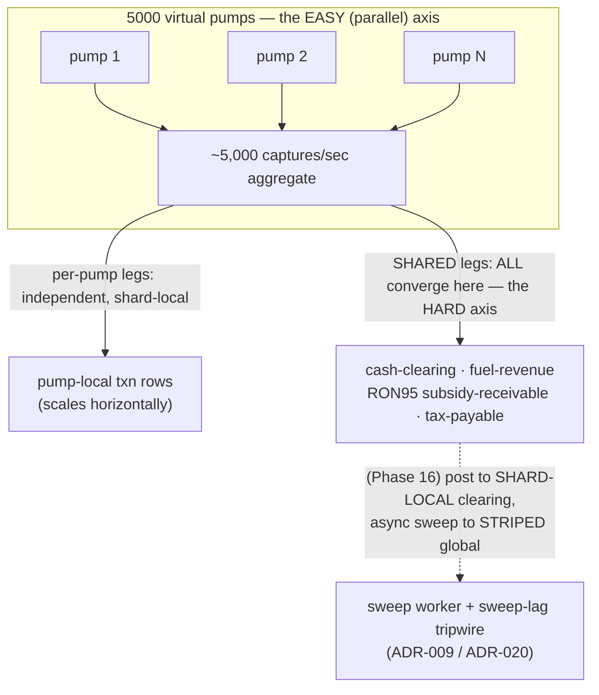

When Phase 16 is reached, the scenario must:

1. **Concentrate ~5,000 captures/sec onto the shared legs** (not spread them), with RON95 dominance making `subsidy-receivable` clearing the hottest shard-local account — exactly where ADR-009's shard-local-clearing + async-sweep earns its keep.
2. **Measure the sweep, not just the capture.** The harness emits the **sweep-lag SLI** — `EXTRACT(EPOCH FROM now() - MIN(occurred_at)) WHERE swept_at IS NULL` — and the oracle asserts the **ADR-009 tripwire** fires when the sweep worker is artificially throttled: **SLO < 60s @ 99.9%; ticket > 60s; PAGE (sev-2) > 300s sustained 5m.** "Synchronous per-shard, eventually-true globally within a monitored window" is only credible if the test *measures the window*.
3. **Validate striped global destinations (ADR-020)** so the async sweep doesn't recreate the single-writer hot-row downstream, and validate the two-line trial balance and DLQ money-class policy (ADR-019): the money-moving sweep consumer **HALTS-AND-PAGES**, never skips-to-DLQ.

Everything in this subsection — `clearing_accounts`, `clearing_sweep_state`, sweep workers, the tripwire, the striped destination — is Phase-16 machinery. It does not exist in the v1 simulator.

---

### 8. The invariant fold survives sharding — which is the whole point

The reason §6 insists on a fold (not a `SUM`) is forward-looking. Today, on one ACID boundary, a `SUM` would do. But the `shared_account_storm` future shards by pump (Phase 16), and shared legs then post to a **shard-local clearing account** swept asynchronously to a global one. There is no single SQL boundary left to `SUM` over. The fold — `reduce` the merge-ordered `transaction_events` streams across shards and assert the accumulator nets to zero **inside the documented sweep window** — holds *before and after* sharding, unchanged. We pay the small fold cost from day one precisely so the oracle does not need rewriting when Phase 16 lands. That is ADR-007 discipline applied to test infrastructure: build the cheap, future-proof framing now; defer the expensive machinery until measured.

---

### 9. Saga-log & compensation under chaos

The acquirer interaction is the one place saga discipline genuinely helps, because the acquirer leg is **already outside the ACID boundary** (ADR-005). Per ADR-012 this is **one `saga_log` row + one reconciler**, not a saga engine — canonical schema `PRIMARY KEY (txn_id, step)`, columns `(txn_id, step, state, attempt, acquirer_ref, request_hash, updated_at)`. Under `acquirer_brownout` + `drive_off_rate`, the oracle asserts that every *forward* step that did not confirm has a matching *compensation* step (reversal/void), and that `saga_log` + ledger + totalizer agree on the net effect: no money captured-but-uncompensated, no reversal fired twice. Refunds, partial refunds, post-`SETTLED` chargebacks, and subsidy/tax claw-back are first-class money flows (ADR-014) and get the same oracle treatment — each is a forward+compensation pair the harness can inject and assert. Only `acquirer_ref` is ever stored; the card PAN is tokenized at the edge and never enters `transactions`, `ledger_entries`, `transaction_events`, the `outbox`, or the totalizer stream (ADR-018), so the harness traffic stays out of PCI scope.

---

### 10. Modes, determinism & operations

- **Single-transaction mode** — one sale, fully observable, optional step-through; the debugging companion to the dashboard's manual controls (v1 §3). No k6, no chaos unless explicitly set. This is where you reproduce a fuzzer-found failure deterministically.
- **Load mode** — k6 open-model scenarios drive the 5k-write / 15k-read split; chaos active in the harness; oracle sampling continuously.
- **Determinism for reproduction:** the harness is seeded (`--seed`) and k6 runs with a fixed seed; a failing fuzzer run prints its seed, chaos config, and the k6 scenario digest so the exact sequence — including the "random" chaos draws — replays. A non-reproducible fuzzer finding is nearly worthless; this is a hard requirement.

**Local vs prod duality (locked).** Locally, k6 and the harness run as sidecar containers against Docker Compose + LocalStack (Postgres as the primary, LocalStack Kinesis/SQS for the async plane — validated for *correctness* at modest volume only). In prod-shaped runs they drive the EKS deployment against Aurora Postgres with real Kinesis and ElastiCache on the read path; k6 runs as a small pod fleet so the generator out-scales the SUT. Same images both places. **LocalStack is never the throughput target** — the headline 20k/sec (~5k writes + ~15k reads) is measured against the synchronous core + real Aurora Postgres, with ADR-011 multi-AZ synchronous-quorum writes exercised at Phases 14–15. We **never** claim 1M/sec.

---

### 11. Simulator metrics (its own SLIs)

The simulator is also observed — it must prove it offered the load it claims:

- `offered_rps` vs `achieved_rps` (write & read paths separately) — divergence, and k6's `dropped_iterations`, signal generator saturation: an alarmed condition, never a clean pass.
- `coordinated_omission_guard`: k6 already corrects for it; we surface the corrected vs naive percentile gap so the discipline stays visible.
- `oracle_violations_total{invariant=...}` — the headline. **Any** non-zero value fails the run.
- `outbox_unpublished_age_seconds` — the "eventually-true within a window" SLI the `outbox_pressure` scenario pressure-tests (thresholds in §7).
- `sweep_lag_seconds` — *(Phase 16, deferred — emitted only once shard-by-pump exists per ADR-007/009).*

---

**Honest trade-off summary.** Splitting the simulator into off-the-shelf k6 + a thin bespoke harness is the central call: it costs a little integration glue (k6 must hand its sale templates to the oracle, and the totalizer must shadow k6's per-pump dispense) but it buys us out of the highest-risk thing we could write — a hand-rolled open-model scheduler that silently lies about tail latency. The harness is still a *second non-trivial system*, and a bug in the oracle is a silent false-pass; we mitigate with seeded reproducibility and by keeping the totalizer genuinely independent of API responses (ADR-008). The open-model load shape can self-saturate, but that is a feature — it is the only shape that does not lie about tail latency under exactly the contention this architecture exists to survive.

---

## Forecourt + C-Store POS

The money core knows nothing about cashiers, baskets, price books, or receipts. That is deliberate. The POS subsystem is a **layer on top** of the ledger: it decides *what a sale is worth and how it was paid*, then resolves that into the same double-entry posting the fuel core already uses. Everything money-defining flows through the existing ACID boundary; everything else (price-book reads, receipt rendering, loyalty accrual) lives on the read side or the bus.

The discipline of this section: a forecourt fuel sale and a c-store merchandise basket are **the same kind of event** at the ledger. Different front-of-house flows, one back-of-house invariant — Σ debits = Σ credits, posted synchronously, in one transaction.

### POS as a thin shell over the money core

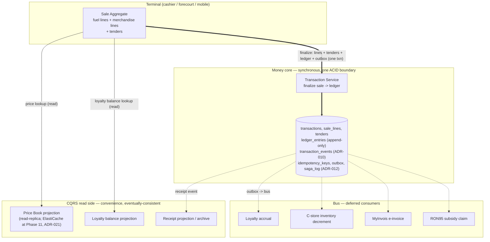

Thick arrows are the synchronous money path; dashed arrows are eventually-consistent. **The price book and loyalty balances are *reads* taken before finalization; they are never the source of truth at posting time.** What gets posted is the price the terminal *committed to at finalize*, snapshotted into the sale line, not whatever the price book says a second later. (See "Money-critical vs convenience state" below — this is the single most important line in the section.)

### The terminal flow (forecourt and c-store)

A "sale" is an open aggregate the terminal builds up, then finalizes atomically. The fuel core's *authorize-before-amount-known* lifecycle is a special case of this — it just has its line resolved by a pump dispense rather than a barcode scan.

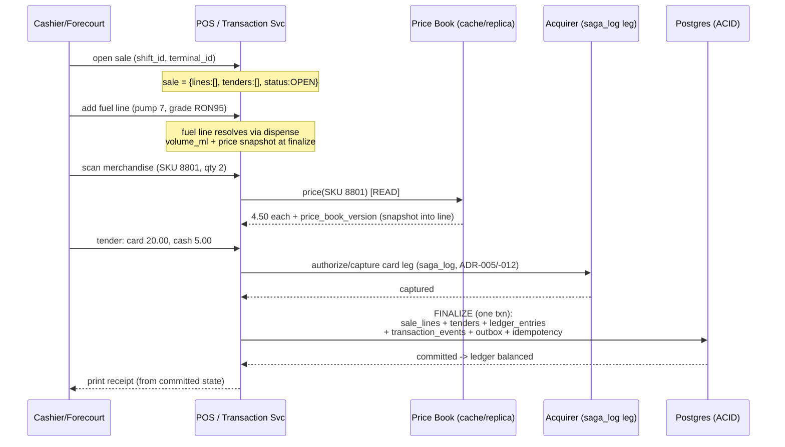

Two finalize shapes, one commit:

- **Forecourt fuel sale.** The fuel line's amount is unknown until the pump stops (`AUTHORIZED → DISPENSING → COMPLETED`). The card tender is pre-authorized for an estimate and **captured** for the actual at finalize. This is the existing money-core path; the POS layer just attaches the sale/line/tender rows around it.
- **In-store basket.** Every line's amount is known at scan time (price-book lookup). There is no pre-auth gap — authorize and capture collapse into a single capture at finalize. Drive-offs and dangling holds (the hard fuel bugs) do not exist here.
- **Mixed basket** (fuel + a coffee + a car wash on one card): one sale aggregate, multiple lines, finalized in **one** ledger transaction. The fuel line carries the pre-auth lifecycle; the merchandise lines do not; both land in the same commit.

### Fuel line vs merchandise line — same row shape, different resolver

Both are rows in `sale_lines`, both produce ledger entries, both use **integer minor units (sen)** end to end. MYR-only — there is no `currency` column anywhere in the POS schema (ADR-016). The only difference between line types is *how the final amount is determined*.

**`sale_lines`** — `id, transaction_id, line_no, line_type (FUEL|MERCHANDISE), sku_or_grade, qty_or_volume_ml, unit_price_minor, gross_minor, tax_minor, subsidy_minor, promo_minor, net_minor, price_book_version`

| | Fuel line | Merchandise line |
|---|---|---|
| Amount known at | pump-stop (dispense) | scan (price-book read) |
| Quantity unit | `volume_ml` (integer) | `qty` (integer) |
| Unit price | grade price at finalize (sen/litre) | SKU price at finalize (sen/unit) |
| Subsidy | RON95: `subsidy_minor` per litre | none |
| Pre-auth gap | yes (fuel lifecycle) | no |
| Inventory effect | totalizer/dispense (physical) | `inventory decrement` event (bus) |

`price_book_version` is stamped onto every line at finalize. This is what makes a receipt and a dispute reconstructable years later even after prices change — and it pairs with **ADR-010**: the finalize also writes a `transaction_events` row, so the *causal* history (price-quoted → tendered → captured) is preserved, not just the final numbers.

### The gazetted-price / cache-lag hole — closed by snapshot

Fuel prices in Malaysia are **gazetted** (weekly ceiling prices for RON95/RON97/diesel); the price book is also the source of c-store SKU prices and promotions. The hazard is obvious: the price book is served as an eventually-consistent CQRS projection, so a freshly gazetted price can lag by seconds across terminals. If posting trusted "whatever the projection says at commit time," two terminals could book *different prices than the customer saw on the pump display*.

The fix is a snapshot, not a stronger cache:

- **The displayed price is captured into the line at finalize, together with `price_book_version`.** Whatever number the terminal showed the customer is the number that posts to the ledger — full stop. The projection's freshness affects only *which price the next sale quotes*, never the integrity of a sale already shown to a customer.
- **Any legally-binding figure uses the shard-local synchronous value, never the async projection (ADR-015).** The e-invoice (MyInvois), SST line, and subsidy figures are computed from the snapshotted `sale_lines` row inside the finalize transaction — correct per-shard and available immediately. They never wait on, and never read from, the eventually-consistent price-book projection or any async sweep.
- **A gazetted price-change is a write-side event with an effective-from timestamp.** It bumps `price_book_version` in the authoritative `price_book` table; the projection rebuild is downstream. Reconstructing "what price was legal at 14:32 on the gazette change day" is a query against the versioned authoritative table plus the line's stamped `price_book_version` — not a guess about cache propagation.

So the cache *is* allowed to lag. The snapshot makes that lag harmless to money: the displayed-and-posted price is one immutable fact, and the legally-binding figure is computed synchronously from it.

### Multi-tender → ledger entries

A sale's lines establish *what is owed*; its tenders establish *how it was paid*. The POS invariant is local and total:

```
Σ tender amounts  ==  Σ line net (gross − promo − subsidy + tax)
```

**`tenders`** — `id, transaction_id, tender_type (CARD|CASH|MOBILE|FLEET|LOYALTY), amount_minor, acquirer_ref (nullable), saga_id (nullable), status`

Each tender and each line resolves into ledger legs in the **same finalize transaction**. The ledger is where the two halves (owed vs paid) must balance to zero. Concrete posting for a mixed sale — fuel RON95 (subsidized) + a c-store item, split card+cash:

```
DEBIT  cash-clearing            500   (cash tender)
DEBIT  card-clearing           2000   (card tender, via acquirer)
  CREDIT fuel-revenue          1800   (fuel line net, customer-paid portion)
  CREDIT subsidy-receivable     150   (RON95 govt-owed portion)
  CREDIT merchandise-revenue    450   (c-store line)
  CREDIT tax-payable            100   (SST on merchandise)
```

Σ debits (2500) = Σ credits (2500). The tenders contribute the debit side (money received / claimable); the lines contribute the credit side (revenue + subsidy + tax owed). **Tender splits are not special-cased in the ledger** — they are just additional debit legs. Adding a third tender (mobile wallet) adds one debit leg; the invariant is unchanged.

Tender-type mechanics that *do* differ — and where they live:

| Tender | Synchronous at finalize? | Notes |
|---|---|---|
| **Cash** | yes — pure ledger | No external call. Debits `cash-clearing`; reconciled against the drawer at shift close. |
| **Card** | acquirer leg is a **saga_log row** (ADR-005/-012) | Authorize/capture happens *outside* the lock, *before* finalize; finalize posts against the captured `acquirer_ref`. |
| **Mobile** (DuitNow/e-wallet) | saga_log leg, like card | Same shape, different acquirer adapter. |
| **Fleet card** | saga_log leg + a debit to `fleet-receivable` | Posts to `fleet-receivable` instead of `card-clearing`. **AR and invoicing the fleet operator are OUT OF SCOPE — see below.** |
| **Loyalty (redemption)** | yes — saga_log hold on the point balance *before* finalize | Points spent as payment are a money-critical tender; see "Loyalty hooks." |

The subsidy-receivable, tax-payable, cash-clearing, and revenue accounts are *shared counter-accounts*. Today (single ACID boundary) they post directly. **(Phase 16, deferred — built only against a measured ceiling per ADR-007):** when we shard by pump, the fuel line's revenue posts shard-locally while these shared legs post to a **shard-local clearing account** swept asynchronously to the global account, with a tripwire on sweep lag (ADR-009). The schema names them as clearing accounts now so that migration is a config change, not a rewrite — but **none of the sweep machinery is built in v1.**

### Fleet card — the hand-off boundary (out of scope)

Fleet cards stop at the ledger. The fuel/merchandise sale finalizes synchronously like any other tender, debiting **`fleet-receivable`** — a real ledger account that records "this fleet operator owes us for this sale." That is where the money core's responsibility ends.

- **Accounts-receivable and invoicing the fleet operator are OUT OF SCOPE.** Monthly statementing, credit limits, dunning, payment terms, and consolidated fleet invoices are an **external ERP's job**, not this platform's. We do not model an AR cycle, and we do not build a fleet-billing engine.
- **`fleet-receivable` is a hand-off account, not a swept account.** It is explicitly *not* one of the ADR-009 shard-local clearing accounts (cash-clearing, fuel-revenue, subsidy-receivable, tax-payable) that get asynchronously swept to a global account. There is no sweep worker, no sweep-lag SLI, and no global striped destination for it. Its balance is the integration surface: the ERP pulls the per-operator `fleet-receivable` movements (from `transaction_events`, ADR-010) and owns everything downstream of that read.
- **One line on the seam:** the hand-off is a read against committed ledger state, exported on the bus or via batch extract. The ERP reconciles and bills; we keep the books balanced and hand over an auditable, versioned movement log. Drawing the boundary here keeps fleet AR — a genuinely large subsystem — out of the money core entirely.

### The invariant as a fold (kept from day 1)

Stated as SQL, "Σ debits = Σ credits" is a `SELECT SUM(...) GROUP BY direction` against `ledger_entries` — true continuously *because* posting is synchronous (ADR-002). We keep a stronger framing from day 1 as cheap correctness insurance: state it as an **associative fold over the ordered ledger/transaction_events log**:

```
balance = foldl (\acc e -> acc + signed(e)) 0 ledger_entries_ordered_by_seq
invariant: balance == 0   (globally; MYR, single currency per ADR-016)
```

This is identical to the SQL answer today, and it has **no error budget — a non-zero fold is always a sev-1 page.** It is also *necessary but not sufficient*: a balanced-but-wrong `+500/−500` posting passes it. Only the totalizer three-way reconciliation (ADR-008) catches a balanced-but-wrong fuel posting.

**(Phase 16, deferred — built only against a measured ceiling per ADR-007):** the reason the invariant is written as a fold rather than a point-in-time SQL sum is that sharding by pump (ADR-009) means no single SQL statement spans shards. Post-shard, each shard folds its own slice to a per-shard residual; the residuals plus the swept clearing balances must fold to zero globally, and the **sweep-lag tripwire** is what tells you the global fold is momentarily non-zero *by design rather than by bug*. That fold-over-shards machinery is **not built in v1** — only the fold framing is.

### Price book — fuel grades, promotions, RON95 subsidy

The price book is **convenience state, read-side, eventually-consistent** — with one hard rule already stated above: *the price the terminal showed the customer is snapshotted into the sale line at finalize, with `price_book_version`.*

- **Storage:** authoritative price book in Postgres (`price_book` table, versioned); served to terminals as a **denormalized CQRS projection** off a read-replica, never the write primary. **(Phase 11, ADR-021):** the projection moves to ElastiCache/Redis against the measured 15k/sec read requirement — a conscious retirement of v1's Redis deferral, not a speculative add. A price-book change publishes a `price.updated` event; the projection is rebuilt and pushed; terminals poll/subscribe.
- **Fuel grade pricing:** sen-per-litre per grade (RON95, RON97, Euro5 diesel). `gross_minor = round(unit_price_sen_per_litre × volume_ml / 1000)`.
- **Promotions:** line-level (`promo_minor`) or basket-level, resolved at finalize against the snapshotted price-book version. Promo logic is POS-layer; the ledger only sees the resulting `net_minor`.
- **RON95 subsidy pricing:** the customer pays the **capped** pump price; the **subsidy delta** (market − capped, per litre) is posted to `subsidy-receivable`. Rounding happens **once, at line finalization** — `subsidy_minor = round(subsidy_rate_sen_per_litre × volume_ml / 1000)` — and the line stores both `net_minor` (customer) and `subsidy_minor` (government) so the parts sum back to gross with no one-sen drift. The subsidy **claim** to the government is a deferred bus consumer (`RON95 subsidy claim`), fed from the same `transaction_events` history (ADR-010) for audit. The subsidy figure on any legally-binding subsidy pack is the shard-local synchronous value (ADR-015), never the async projection.

### Shift / cashier session & cash drawer reconciliation

A shift is the **human accountability boundary**, and it is where cash — the one tender with no acquirer truth — gets reconciled.

**`shifts`** — `id, terminal_id, cashier_id, opened_at, closed_at, opening_float_minor, declared_cash_minor, status`

- **Session management** (convenience / operational, not money-critical): open shift records the opening float; sales stamp `shift_id`; close shift stops accepting new sales on that terminal. A crashed terminal mid-shift loses *no money* — every finalized sale is already committed to the ledger; the shift is just a grouping key.
- **Cash drawer reconciliation** (money-adjacent, synchronous on close): at close, the cashier declares counted cash. The system computes *expected* cash as a **fold over that shift's cash tenders**:

```
expected_cash = opening_float + Σ(tenders WHERE type=CASH AND shift_id=S)
                              − Σ(cash payouts / refunds)
variance = declared_cash − expected_cash
```

The `cash-clearing` ledger account is the bridge: every cash tender debited it during the shift; the count-and-declare at close is reconciled against it. A non-zero `variance` posts a **`cash-over-short`** ledger entry (a real account — overage credits it, shortage debits it) so the books *stay balanced even when the drawer doesn't*. This is the c-store analogue of the fuel **three-way reconciliation**: drawer count is the independent second truth, like the totalizer is for fuel.

### Receipts

Receipts are **convenience, eventually-consistent, derived** — never on the money path. A receipt is a *rendering* of committed state; it must never be the thing that defines the sale.

- The finalize commit emits a `sale.finalized` outbox event. A receipt projection consumer renders the receipt (line detail, tender split, subsidy disclosure, SST, loyalty earned) and archives it (S3, like settlement files).
- **Reprint = re-render from `transaction_events` + `sale_lines`** (ADR-010), so a reprint years later shows the *exact* prices, promos, and subsidy as finalized, regardless of current price book — the snapshotted `price_book_version` is doing the work.
- Legal e-invoice (MyInvois) is a **separate deferred consumer**, not the customer receipt — it has its own idempotent submission saga and carries the shard-local synchronous figure (ADR-015), fed from the same committed history.

### Loyalty hooks — accrual is async, redemption-as-payment is synchronous

Loyalty splits cleanly along the money line, and the split is the whole point.

- **Accrual (earning points) is an async bus consumer.** The `sale.finalized` event (with line + tender detail) is consumed by a loyalty service that awards points **idempotently** (dedupe on `transaction_id`). Getting points slightly late is fine; double-awarding them is not. Zero core changes — it attaches at the existing bus seam (ADR-006). Accrual is *convenience.*
- **Redemption-as-payment is a synchronous, money-critical tender.** If points *pay* for part of a sale, redemption is a **tender** (`LOYALTY` tender type) and must hold-and-confirm the point balance *before* finalize, exactly like a card auth, via a **saga_log leg (ADR-012)**. It posts inside (or saga-fenced before) the finalize transaction.

That is the boundary in one sentence: a loyalty *read* and a loyalty *accrual* are convenience; a loyalty *tender* is money. Same product, opposite planes.

### Money-critical (synchronous) vs convenience (eventually-consistent)

The classification that governs the entire subsystem:

| POS state / action | Class | Plane |
|---|---|---|
| Sale lines (amounts, qty, snapshotted price + `price_book_version`) | **Money-critical** | Synchronous, in finalize txn |
| Tenders + tender↔line balance | **Money-critical** | Synchronous, in finalize txn |
| Ledger posting (lines + tenders → entries) | **Money-critical** | Synchronous, in finalize txn |
| Card/mobile acquirer leg | **Money-critical** | Saga_log, *before* finalize (ADR-005/-012) |
| Fleet-card sale → `fleet-receivable` debit | **Money-critical** | Synchronous, in finalize txn |
| Loyalty **redemption** as a tender | **Money-critical** | Saga_log, *before* finalize (ADR-012) |
| Legally-binding figure (e-invoice, SST, subsidy pack) | **Money-critical** | Shard-local synchronous value (ADR-015) |
| Cash drawer reconciliation at shift close | **Money-adjacent** | Synchronous on close |
| RON95 subsidy **leg** in the ledger | **Money-critical** | Synchronous |
| Fleet AR / fleet-operator invoicing | **Out of scope** | External ERP (hand-off, not swept) |
| RON95 subsidy **claim** to government | Convenience | Bus consumer |
| Price book display / promotions catalog | Convenience | Read-side (replica; cache at Phase 11) |
| Loyalty **accrual** (earning points) | Convenience | Bus consumer |
| Receipt render / reprint / archive | Convenience | Bus consumer / projection |
| C-store inventory decrement | Convenience | Bus consumer |
| MyInvois e-invoice submission | Convenience | Bus consumer (saga) |

**The rule that generates this table:** if getting it wrong **moves money or its claim**, it is synchronous and inside (or saga-fenced before) the finalize transaction. If getting it wrong only makes a *display* stale or a *side-effect* late, it is eventually-consistent. Price is convenience *until finalize*, at which point the snapshot makes it money-critical and immutable.

### Edge / offline-first seam (deferred)

Forecourts must keep selling when the cloud link drops (ADR-007 keeps this deferred, but the seam is designed now). The reconciliation against the ledger + totalizer is what makes offline safe.

- **Offline finalize is provisional, not authoritative.** A terminal that loses connectivity finalizes locally into a **store-and-forward journal** (an append-only local outbox), assigning each sale a terminal-local idempotency key. Cash sales complete fully offline; card sales fall back to floor-limit / store-and-forward auth (an explicit business-risk acceptance, recorded on the sale).
- **Reconciliation on reconnect** is a **fold-and-merge against two independent truths**:
  1. **Ledger:** each queued sale is replayed through the normal finalize path. The idempotency key (ADR-001) makes replay safe — a sale that *did* reach the cloud before the link dropped is deduped, not double-posted.
  2. **Totalizer (ADR-008):** the fuel portion is reconciled against the pump's independent cumulative reading. The totalizer is monotonic and link-independent, so `Σ offline fuel volume` for a pump must match the totalizer delta across the outage window — catching any offline sale that was lost or fabricated. This is the three-way reconciliation doing exactly the job it was built for, now across an outage boundary.
- The store-and-forward journal folds into the **same global ledger invariant** once replayed — which is *why* the invariant was defined as a fold over an ordered log rather than a point-in-time SQL sum. Offline operation is just a delayed segment of that log.

**Honest trade-off:** offline card sales accept real chargeback/decline risk (you took an order you couldn't authorize). That is a deliberate availability-over-strict-consistency choice for the forecourt, scoped and logged per sale — and it is the *only* place in the POS where we knowingly relax the money invariant, precisely because a fuel station that can't sell during a network blip is a worse failure than a rare bad-debt write-off.

---

## Transport Layer & Event-Driven Backbone

This section answers two questions head-on — *"what's the transport layer?"* and *"where does event-driven actually live?"* — and draws the bright line the rest of the doc depends on: **event-driven at the seams and the read side, never inside the money write path** (ADR-006). Transport is not one decision; it's three planes with three different jobs, and conflating them is how money systems get slow *and* wrong at the same time.

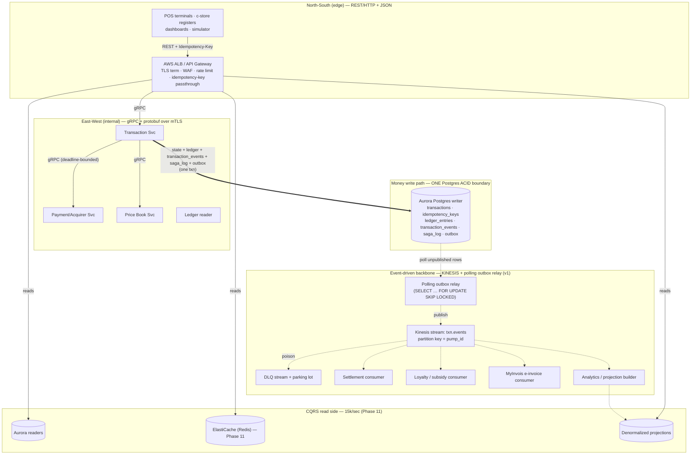

Thick arrows are the synchronous, single-ACID-boundary money path. Solid arrows are synchronous RPC. Dashed arrows are eventually-consistent. The read side (bottom) never touches the writer.

---

### 1. North-South: REST/HTTP + JSON at the edge

Everything *crossing the trust boundary* — POS terminals, c-store registers, the dashboard, the simulator, third-party fleet-card webhooks — speaks **REST over HTTP/1.1 (and HTTP/2 where the client supports it), JSON bodies**, terminating at an **AWS Application Load Balancer fronted by API Gateway / WAF**.

**Why REST at the edge, not gRPC:**

- **Heterogeneous, partly-untrusted, long-lived clients.** Forecourt terminals and register firmware are upgraded on multi-year cycles. JSON over HTTP is debuggable with `curl`, survives corporate proxies, and doesn't require an HTTP/2 trailer-capable path end to end. gRPC at the public edge buys latency we don't need (the human-facing operations are not chatty) and costs us field-debuggability we badly need.
- **The edge is a translation boundary, not a performance boundary.** The hard performance work is *inside* (ledger posting). The edge's job is auth, shaping, rate limiting, and idempotency-key passthrough — all of which REST does cleanly.

**Idempotency-Key header — the contract that makes retries safe.** Every state-changing edge call carries `Idempotency-Key: <uuid>` (one key per *business intent* — one sale's `authorize`, one `capture`). The gateway **does not store or resolve idempotency** — it forwards the key inward unchanged. Resolution happens exactly once, atomically, in the Transaction Service against the `idempotency_keys` table in the *same* Postgres transaction as the effect (ADR-001). This is the single most important header on the platform: pumps and registers retry aggressively on timeout, and without it every flaky network blip is a potential double-charge.

```
POST /v1/transactions/authorize
Idempotency-Key: 6f1c…
Content-Type: application/json
{ "pump_id": "P-014", "fuel_grade": "RON95", "auth_amount_minor": 20000 }
```

(Amounts are MYR minor units — sen. Currency is not a field: the platform is MYR-only per ADR-016. It would only re-enter as an explicit per-line `currency` column plus a per-currency ledger account tree, never as a runtime FX conversion.)

**Rate limiting and admission control live here (ADR-017), two-tiered:**

- **Per-terminal token bucket** (the normal case — a register can't reasonably exceed a few req/sec). Enforced at the gateway with a small per-key counter (ElastiCache, not the writer).
- **Write-tier admission control / shed-reads-protect-writes.** The money writer has a finite write-TPS ceiling (~5,000 money-writes/sec of the 20,000 req/sec target). A **bounded in-flight semaphore** on the money path caps concurrency; an **acquirer circuit breaker** stops feeding a failing downstream; and when the admission queue saturates, the gateway **sheds reads first** and returns `429` with `Retry-After` on writes. The whole point: the idempotency-deduped retry storm — pumps and registers re-firing on timeout — must not melt the writer.

**Path split is explicit (CQRS, see §6):** `GET` status/dashboard/reporting routes are tagged read-only at the gateway and routed to readers/cache. They never reach the writer. This is the ~15,000/sec of the 20,000/sec target, and keeping it off the writer is non-negotiable. The **only** reads permitted on the Aurora writer are narrow money-confirmation read-your-write reads; every other read and every report goes to readers/cache.

---

### 2. East-West: gRPC + protobuf between Go services

Internal service-to-service calls — Transaction → Payment, Transaction → Price Book, readers → projection services — use **gRPC with protobuf over mTLS**.

**Why gRPC internally (the inverse of the edge reasoning):**

- **We own both ends.** Schemas evolve in lockstep through a shared `.proto` repo with CI compatibility checks. The debuggability tax of binary framing is paid back by codegen, strict typing, and no hand-rolled JSON marshalling in the hot path.
- **Deadlines and cancellation are first-class.** This is the real reason. A capture that's blocked on a slow downstream must *propagate cancellation*, not leak a goroutine and a held connection.

**Idempotency-key forwarding is end-to-end.** The edge's `Idempotency-Key` is carried inward as gRPC request metadata on every internal hop, so the Transaction Service resolves it against `idempotency_keys` in the same Postgres transaction as the effect (ADR-001). The key is never minted internally and never dropped at a hop boundary — one business intent, one key, all the way down.

**Context propagation and deadlines — the discipline that keeps partial failure honest:**

```go
// Edge handler establishes the budget; every inner hop inherits and shrinks it.
ctx, cancel := context.WithTimeout(r.Context(), 1500*time.Millisecond)
defer cancel()

// gRPC carries the deadline AND the idempotency key in request metadata.
ctx = metadata.AppendToOutgoingContext(ctx, "idempotency-key", idemKey)
authResp, err := paymentClient.Authorize(ctx, &pb.AuthorizeRequest{...})
if errors.Is(err, context.DeadlineExceeded) {
    // We do NOT know if the acquirer succeeded — treat as indeterminate,
    // leave the txn in AUTHORIZING, reconcile out of band (never assume success).
}
```

- A single end-to-end **deadline budget** is set at the edge and threaded through every gRPC hop via `context.Context`. Each hop spends from it; nobody gets to wait forever.
- **The acquirer leg is the exception that proves the rule** (ADR-005). The slow, flaky acquirer call is made *after* the per-pump serialization point is released and *outside* the ACID boundary. A deadline-exceeded there yields an *indeterminate* outcome, not a failure — see the saga discipline below.
- **mTLS everywhere east-west**, certs from AWS Private CA, rotated short. Inside the cluster (EKS) we still authenticate every hop; "soft inside, crunchy outside" is how a single compromised pod becomes a ledger-write.
- **Connection pooling + keepalive** per service; gRPC multiplexes over HTTP/2, so we hold a small pool of long-lived connections rather than per-call dials. Watch for the classic L4-load-balancer-pins-one-backend trap — use client-side round-robin (`grpc.WithDefaultServiceConfig` with `round_robin`) or a headless service so connections spread across pods.

**What gRPC does NOT do here:** it is not a substitute for the bus. A synchronous gRPC call between two services creates *temporal coupling* — if the callee is down, the caller fails. That's correct and desirable for the money path (you *want* a capture to fail loudly if the ledger can't be written). It's exactly wrong for settlement/loyalty/e-invoice, which must survive a consumer being down for an hour. That work goes on the bus.

---

### 3. The async bus: Amazon Kinesis (v1)

The event-driven backbone for v1 is **Amazon Kinesis Data Streams**, one stream `txn.events`, **partitioned by `pump_id`** (ADR-013). Kinesis is the lean choice (ADR-007): it's serverless — no brokers to run — and paired with the **polling outbox relay** (§4) it teaches the outbox pattern cleanly, without standing up Kafka Connect or Debezium for v1. Locally it's LocalStack Kinesis behind the same images.

**Why `pump_id` as the partition key (and not `transaction_id`):** ordering is only meaningful *per pump*. Within one pump, `authorized → completed → captured` for a sale, and sale N before sale N+1, must arrive in order so consumers see a coherent timeline. Across pumps there is no ordering requirement, so `pump_id` gives us **maximal parallelism with exactly-as-much ordering as the domain needs** — one pump's events land on one shard in order; thousands of pumps spread across shards. Keying by `transaction_id` would over-fragment and lose the per-pump sequence; keying by something coarse (e.g. station) would create hot shards. Kinesis hashes the partition key to a shard; that hash is the shard assignment.

**Deferred, measured-trigger upgrade — MSK + Debezium CDC.** Kinesis is a conscious v1 choice, not the end state. The trigger to migrate to **Amazon MSK (managed Kafka) with a Debezium CDC outbox relay** is a *measured* one (ADR-007, ADR-013): when **multi-consumer replay depth** earns it — i.e. when several independent consumers (settlement, loyalty, RON95 subsidy, MyInvois, analytics) need to replay long histories from independent offsets at their own pace, and Kinesis's retention/lease model becomes the friction. Kafka consumer groups model that natively; Debezium tailing the WAL removes the relay's polling load from the writer. **Until that measured trigger fires, MSK and Debezium are not built** — and the Debezium replication-slot-lag SLI and its WAL-pin/disk-fill runbook apply **only after** the MSK upgrade, never to the v1 Kinesis + polling-relay path.

| Dimension | Kinesis (v1 default) | MSK (deferred upgrade) |
|---|---|---|
| Ops model | Serverless; no brokers | Run brokers (even managed) + Kafka Connect |
| Ordering unit | Shard (hashed `pump_id`) | Partition (mapped → `pump_id`) |
| Multi-consumer replay | Enhanced fan-out + lease table; clunkier at depth | Consumer groups, independent offsets, deep replay |
| Outbox relay | **Polling relay** (SKIP LOCKED) | **Debezium CDC** off the WAL |
| Trigger to adopt | Default | **Measured:** multi-consumer replay depth earns it |

> **Tie-in to ADR-009/ADR-010:** the per-pump partition is the *same* key the write side shards by *(Phase 16, deferred — built only against a measured ceiling per ADR-007)*, and the same ordered stream that ADR-010's `transaction_events` rows flow through. The debits=credits invariant is framed from day 1 as an **associative fold over the ordered ledger/transaction_events log** — cheap correctness insurance that survives a later shard-by-pump. That framing is *not* itself phase-16 machinery; the clearing-account sweep that consumes this bus (ADR-009) is.

---

### 4. The outbox relay: polling worker (v1)

The Transaction Service writes the domain event into `outbox` *in the same transaction* as the state change (core doc §6 — no dual-write). A **relay** turns committed outbox rows into bus messages. For v1 the relay is a **polling worker** (ADR-013) — the lean, no-extra-infra choice that teaches the outbox pattern directly:

```sql
SELECT … FROM outbox
 WHERE published_at IS NULL
 ORDER BY id
 LIMIT n
 FOR UPDATE SKIP LOCKED;   -- publish to Kinesis, then stamp published_at
```

`SKIP LOCKED` lets multiple relay workers drain the table concurrently without stepping on each other. The honest cost: a polling relay competes with captures for writer IOPS and connections, and the `published_at` churn is itself outbox-bloat pressure — which is exactly why the outbox is treated as a first-class hot-path bottleneck below. (Debezium CDC moves this extraction off the table and onto the WAL, but it ships only with the deferred MSK upgrade in §3 — not in v1.)

**The outbox is the hidden write-primary bottleneck — treat it as one.** Every money-write also writes an outbox row (and, per ADR-010, a `transaction_events` row); the outbox is therefore on the hottest write path we have. Three operational mandates:

- **Aggressive autovacuum, tuned per-table.** The default autovacuum will fall behind a high-churn outbox and leave dead tuples that bloat the table and slow the relay's own scans. Set `autovacuum_vacuum_scale_factor` low (e.g. `0.01`) and `autovacuum_vacuum_cost_delay = 0` for this table specifically.
- **Time range-partition, and `DROP` published partitions — never `DELETE`.** A `DELETE` generates dead tuples and *more* vacuum work on the hottest table; a partition `DROP` is an instant catalog operation that reclaims space with zero vacuum cost. A partition is **droppable IFF (a) every row has `published_at` set, AND (b) `max(created_at)` is past the bus retention horizon, AND (c) the partition is archived to S3 Parquet.** All three conditions, every time — that single predicate is the one rule everywhere a partition might be reclaimed.
- **The SLI is unpublished-row AGE, not count.** A count of unpublished rows is misleading — 50k rows published within 200ms is healthy; *one* row stuck for 30s is an incident. The signal is the **oldest** unpublished row's age:
  - **SLO:** `< 5s @ 99.9%`.
  - **Ticket** when `p99 > 2s over 10m`.
  - **PAGE (sev-2)** when `oldest-age > 30s sustained for 2m`.

```
# Prometheus SLIs (the ones that matter)
outbox_oldest_unpublished_age_seconds  →  SLO < 5s @ 99.9%; ticket p99 > 2s/10m; PAGE sev-2 > 30s for 2m
# secondary
outbox_unpublished_rows                →  capacity gauge only, not a pager
# (deferred — applies ONLY after the MSK + Debezium upgrade, §3)
debezium_replication_slot_lag_bytes    →  WAL-pin / disk-fill early warning
```

---

### 5. Idempotent consumers, DLQ money-class split, and exactly-once *effect*

**There is no exactly-once delivery. We don't pretend there is.** Kinesis (like every real bus) gives at-least-once delivery: a consumer can crash after acting but before checkpointing, and will see the record again. Chasing "exactly-once delivery" with distributed transactions across the bus + Postgres is a swamp. Instead we engineer **exactly-once *effect*** the same way the write path does it — **idempotency, not delivery guarantees.**

**Every consumer is idempotent by construction:**

- Each event carries a stable **`event_id`** (the outbox row id) and the **`(txn_id, seq)`** from ADR-010's `transaction_events`.
- The consumer's first action inside its own transaction is to claim the event in a per-consumer `processed_events(consumer, event_id)` table with a unique constraint. A duplicate delivery collides on insert → already processed → ack and move on. The *business effect* and the *processed marker* commit together (the same atomic-idempotency pattern as ADR-001, now on the read/seam side).

```go
// Consumer skeleton — at-least-once in, exactly-once effect out.
tx, _ := db.Begin(ctx)
if _, err := tx.Exec(ctx,
    `INSERT INTO processed_events(consumer, event_id) VALUES ($1,$2)`,
    "settlement", e.EventID); isUniqueViolation(err) {
    tx.Rollback(ctx); checkpoint(e); return // duplicate → no-op
}
applyBusinessEffect(ctx, tx, e) // settlement aggregate, loyalty accrual, etc.
tx.Commit(ctx)                  // effect + marker atomic
checkpoint(e)                   // only after the effect is durable
```

**Checkpoint ordering is the subtle part:** commit the Postgres effect *before* the Kinesis checkpoint. If we die in between, the record redelivers, the unique constraint catches it, and we no-op. The inverse ordering (checkpoint first) would silently drop events on a crash. **Prefer redelivery-and-dedupe over commit-and-pray.**

**DLQ policy splits by consumer money-class (ADR-019).** A poison record (malformed payload, unsatisfiable invariant) must *not* be handled the same way for every consumer — because skipping a money-moving event silently shorts a real account, while skipping a loyalty point does not. So the policy is split:

- **Money-moving consumers — HALT-AND-PAGE, never skip-to-DLQ.** The clearing-account sweep *(Phase 16, deferred — built only against a measured ceiling per ADR-007)* is the canonical example: it moves money to the global account, so skipping a record to a DLQ silently shorts the global account. On a poison record after bounded retries it **halts the consumer and pages (sev-2)** — a human decides. It never advances past money it failed to move.
- **Convenience consumers — skip-to-DLQ.** Loyalty, subsidy display, analytics, projections: a poison record is published to the **`txn.events.DLQ`** stream with the failure reason and original headers, and the consumer advances past it so one poison record can't wedge the whole shard (head-of-line blocking is the failure mode we most fear for these).
- **Transient** failures (downstream timeout) are retried in-place with backoff for *both* classes — the consumer does not advance until the retry budget is spent.

The DLQ is a **parking lot, not a graveyard**: a tool replays repaired messages back onto the main stream after a fix. Alert on **DLQ depth > 0** — in a correct system it should be empty; any entry on a convenience stream is a code bug, and any halt on a money consumer is already paging.

---

### 6. The read side is explicit CQRS — and never the writer

The ~15,000/sec of cacheable reads (status polls, forecourt dashboards, shift reports, c-store stock lookups) is a **separate read model**, fed from the bus, served from infrastructure that is *physically distinct* from the money writer:

- **Aurora readers** for queries that must be fresh-ish but relational (recent transaction history, reconciliation views). Replica lag is bounded and acceptable here by definition — these are reads, not money writes.
- **ElastiCache (Redis)** for the truly hot, cacheable polls (pump status, current price). A status poll must never become a writer query; that's how a parking lot full of bored drivers refreshing their phones takes down captures. **(Phase 11):** the read-side cache is introduced against the *measured* 15,000/sec read requirement — a conscious, ADR-007-compliant retirement of v1's Redis deferral (ADR-021), not a speculative add.
- **Denormalized projections** built by an analytics consumer (§3, C4) off `txn.events` — dashboards and reports read pre-aggregated projections, not live joins against transactional tables.

This is the load-bearing reason the 20,000/sec target is *achievable on a single-region active-active deployment*: ~5,000 money-writes hit the writer, ~15,000 reads never do. The **only** writer reads allowed are narrow money-confirmation read-your-write reads; all 15,000 cacheable reads and all reports go to readers/cache. Inflating the headline by routing reads through the write path would be both dishonest and self-inflicted contention (core doc §7: *request ≠ transaction*). And to be explicit about the ceiling we are *not* claiming: 20,000 req/sec sustained (~1.2M/min), not 1M/sec.

---

### 7. Where event-driven is used — and where it is forbidden

The single most important paragraph in this section.

**Forbidden (synchronous, one Postgres ACID boundary):**

- State transitions on the transaction aggregate.
- Idempotency-key claim (ADR-001).
- Ledger posting — debits and credits (ADR-002, ADR-003).
- The append-only `transaction_events` write (ADR-010) — piggybacked on the outbox write, *in the same txn*.
- The `saga_log` step row for the acquirer interaction (ADR-012, §8).
- The outbox *insert* itself.

If any of those moved onto the bus, we'd reintroduce the transient-imbalance window ADR-002 exists to forbid. **The bus is eventually-consistent only (ADR-006); money is never eventually-consistent within a shard.**

**Used (event-driven, eventually-consistent, off the bus):**

- Settlement aggregation and EOD batch.
- Loyalty accrual, RON95 subsidy calculation, MyInvois e-invoice generation.
- Analytics, reporting, denormalized read projections (§6).
- C-store inventory decrement.
- The **cross-shard clearing-account sweep** *(Phase 16, deferred — built only against a measured ceiling per ADR-007)*: shared legs post shard-local synchronously, then sweep to the global account asynchronously *over this bus*, with the sweep-lag tripwire (ADR-009).

> **Legally-binding documents take the shard-local synchronous figure (ADR-015).** MyInvois e-invoices, SST filings, and subsidy packs carry the per-shard synchronous number — correct per-shard and available immediately — and **never wait for the async sweep.** The sweep reconciles the global account; it is not on the critical path for issuing a binding document.

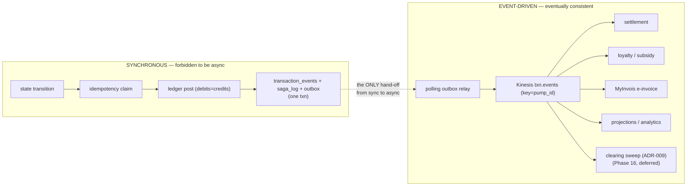

The **outbox is the one and only bridge** from the synchronous money world to the asynchronous everything-else world. Everything to its left is a continuous invariant inside one transaction; everything to its right is at-least-once delivery made safe by idempotent, deduplicating consumers. That single hand-off — and the discipline of never letting it run the other direction — is the whole design.

---

### 8. The acquirer leg as an explicit saga: one `saga_log` row + one reconciler

The acquirer call is the *one* place saga discipline genuinely helps, precisely because the acquirer is **already outside the ACID boundary** (ADR-005) — so we can't get atomicity, and must get *compensation* instead. We make this explicit, but deliberately **not** with a saga engine or framework: it's **one `saga_log` row per step plus one reconciler** (ADR-012).

The canonical schema is:

```sql
CREATE TABLE saga_log (
  txn_id       uuid        NOT NULL,
  step         text        NOT NULL,   -- authorize | capture | void | reversal
  state        text        NOT NULL,   -- pending | succeeded | indeterminate | compensated
  attempt      int         NOT NULL,
  acquirer_ref text,
  request_hash text        NOT NULL,
  updated_at   timestamptz NOT NULL,
  PRIMARY KEY (txn_id, step)
);
```

- Each acquirer step writes a `saga_log` row transactionally with the local state change.
- The forward path is `authorize → (dispense) → capture`. Each step's compensation is defined: `authorize`'s compensation is `void`/`reversal`; an indeterminate `capture` (deadline-exceeded, §2) drives a **reconcile-against-acquirer-status** step, never a blind retry that could double-charge. The `request_hash` makes a retried step idempotent at the acquirer boundary; `acquirer_ref` is the only acquirer-side identifier we persist.
- The Expiry Reaper (core doc §3) is the saga's timeout driver: a hold past its window triggers the compensating reversal.

This is not event-sourcing the money path and it's not a distributed-transaction coordinator — it's a durable log of an inherently-non-atomic external interaction plus a single reconciler that, on crash-recovery, can always answer "what was in flight with the acquirer, and what's the compensating action?" The saga lives entirely in the gap ADR-005 created; it does not leak into the in-ACID-boundary work.

**PCI note (ADR-018):** the card PAN is tokenized at the edge/acquirer boundary and **never** enters `transactions`, `ledger_entries`, `transaction_events`, `saga_log`, `outbox`, or the S3 Parquet archive. Only `acquirer_ref` is stored — which keeps the entire event backbone and its archive out of PCI scope.

---

### Section ADRs (transport)

These extend, not contradict, ADR-006.

**ADR-T1 — REST/JSON north-south, gRPC/protobuf east-west, with end-to-end idempotency-key forwarding.** *Why:* the edge faces heterogeneous, long-lived, partly-untrusted clients that need debuggability and proxy-friendliness; internal hops are owned end-to-end and need deadlines, cancellation, typed contracts, and mTLS. The edge's `Idempotency-Key` is forwarded inward as gRPC metadata and resolved once, atomically, in the money txn (ADR-001). *Rejected:* gRPC at the public edge (debuggability tax for no domain benefit) and REST internally (hand-rolled marshalling, no first-class deadline propagation in the hot path).

**ADR-T2 — Kinesis as the v1 bus, partitioned by `pump_id`; MSK + Debezium is a deferred, measured-trigger upgrade (ADR-013).** *Why:* Kinesis is serverless and, with the polling outbox relay, teaches the outbox pattern leanly (ADR-007) with per-pump ordering and cross-pump parallelism. *Upgrade trigger:* migrate to MSK (Kafka) + Debezium CDC only when multi-consumer replay depth measurably earns it; the Debezium replication-slot-lag SLI/runbook applies only after that upgrade. *Rejected for v1:* standing up MSK + Kafka Connect + Debezium speculatively — broker and connector ops with no measured consumer-replay need yet.

**ADR-T3 — Polling outbox relay (v1), with a single drop-safety predicate and age-based SLO.** *Why:* at ~5,000 writes/sec a polling relay is the lean default (ADR-013); `FOR UPDATE SKIP LOCKED` lets workers drain concurrently. *Operational guardrails:* time range-partition the outbox and `DROP` a partition **IFF every row is published AND `max(created_at)` is past the bus retention horizon AND the partition is archived to S3 Parquet** (no `DELETE` churn); aggressive per-table autovacuum; and the SLI is *oldest-unpublished-row age* — SLO `< 5s @ 99.9%`, ticket `p99 > 2s/10m`, PAGE (sev-2) `> 30s for 2m`. *Rejected for v1:* Debezium CDC (ships only with the deferred MSK upgrade) and `DELETE`-based cleanup (vacuum-bloat on the hottest table).

**ADR-T4 — Exactly-once *effect* via idempotent consumers, with an ADR-019 DLQ money-class split.** *Why:* the bus is at-least-once; safety comes from a per-consumer `processed_events` unique-constraint claim committed atomically with the business effect, and committing the Postgres effect *before* the Kinesis checkpoint. *Money-class split:* money-moving consumers (the clearing sweep) **halt-and-page** on poison and never skip-to-DLQ (skipping silently shorts the global account); convenience consumers (loyalty, analytics) **skip-to-DLQ** so one poison record can't wedge the shard. *Rejected:* bus-Postgres distributed transactions / "exactly-once delivery" — a fragile, slow swamp the idempotency pattern already solves; and a one-size DLQ policy that would silently short money.

**ADR-T5 — The acquirer interaction is one `saga_log` row + one reconciler, not a saga framework (ADR-012).** *Why:* the acquirer is already outside the ACID boundary (ADR-005), so compensation — not atomicity — is the tool; a durable `(txn_id, step)` log plus one reconciler answers "what's in flight, what's the compensation?" on crash-recovery. *Schema:* `PRIMARY KEY (txn_id, step)`; columns `(txn_id, step, state, attempt, acquirer_ref, request_hash, updated_at)`. PAN never enters `saga_log` (ADR-018). *Rejected:* a saga engine/orchestration framework — operational weight for a single, well-bounded external interaction.

---

## Data Storage & Schema Evolution

Storage is where this architecture either keeps its promises or quietly breaks them. The money-correctness invariants from §8 are *storage* invariants first and application invariants second — a `version`-CAS, a partial unique index, a same-transaction outbox write. This section makes the storage layer explicit: what runs on Aurora, what gets partitioned and why, where the read traffic actually lands, how schema changes ship against append-only partitioned tables under load, and the deferred path from one primary to a pump-sharded fleet — with a blunt accounting of what breaks at each step.

The throughline: **the write primary is a scarce, defended resource.** Every design choice below is in service of keeping ~5,000 money-writes/sec on a single ACID boundary for as long as possible, and offloading the ~15,000 cacheable reads/sec everywhere *else* — the 20,000 req/sec sustained target split honestly into its two halves. We never claim a million-per-second writer; that number was explicitly rejected.

---

### Storage at a glance

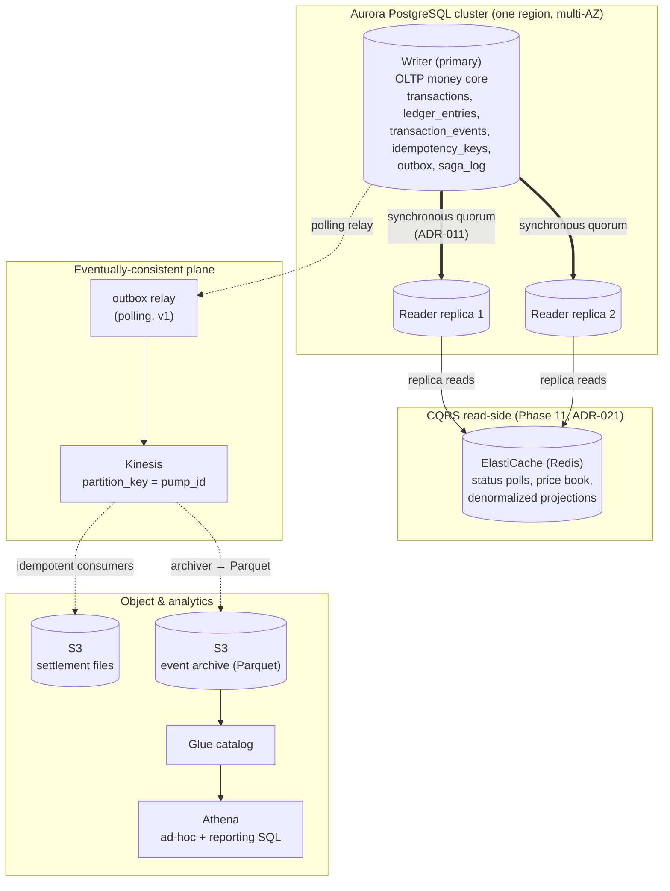

Three tiers, three consistency contracts:

1. **OLTP money core** — Aurora writer, strong consistency, the only place the debits=credits invariant is *defined*. Reads here only for the narrow read-your-write money-confirmation carve-out.
2. **CQRS read-side** — Aurora readers + ElastiCache, bounded-stale, serves the 15k/sec. Never the writer.
3. **Object + OLAP** — S3 + Athena, fed off the outbox stream, arbitrarily stale, for reporting/audit/disputes.

---

### 1. The OLTP money core on Aurora PostgreSQL

**Why Aurora, not vanilla RDS.** Two properties earn it here. First, the storage layer replicates at the *volume* level across three AZs (six copies, 4-of-6 write quorum) — which is exactly the substrate ADR-011 needs to keep the money invariant continuous across AZ loss without us hand-rolling synchronous streaming replication. Second, reader endpoints share that same storage with near-zero replica lag (typically single-digit ms, occasionally tens of ms under load), which makes the CQRS read-side honest rather than a stale-by-seconds liability. We pay for this: Aurora is pricier per-IOPS than RDS, and we are locked into its replication model. For a money core where the alternative is writing our own quorum logic, that trade is correct.

**The existing tables (§5) stand unchanged in shape**: `transactions`, `idempotency_keys`, `ledger_entries`, `outbox`, `pump_state`, `totalizer_readings`. What changes is (a) two new tables, (b) partitioning. All DDL below is the *production* shape; local dev (Docker Compose Postgres 16 + LocalStack) runs the identical DDL minus Aurora-specific knobs — partitioning, indexes, and constraints are stock Postgres, which is the point of the prod/local duality (same images, ADR-007).

> The cross-shard `clearing_accounts` machinery and its sweep live in a **Phase 16, deferred** block (§4) — *built only against a measured ceiling per ADR-007*. The two tables added here, `transaction_events` and `saga_log`, ship in v1.

#### 1a. `transaction_events` — the append-only aggregate (ADR-010)

The `transactions` row is mutated in place via `version`-CAS (§4 of the v1 doc). That is correct for *current state* but throws away *history* — and chargebacks, MyInvois disputes, and subsidy/tax claw-backs (ADR-014, all first-class money flows) are "what did this transaction look like at time T?" questions. ADR-010 closes that gap by writing a `transaction_events` row in the **same transaction** as every state change and the outbox insert.

This is the *safe half* of event-sourcing: we keep the in-place aggregate as the authoritative current state (fast reads, the partial unique index still works), and add an immutable causal log *alongside* it. We are not rebuilding state from events on the hot path — that's the part of event-sourcing that bites. We're keeping a receipt.

Be honest that this is **not free** (ADR-010 says so): it adds extra WAL on the hot path, and it creates a *drift-detection burden* between the event log and the version-CAS aggregate — two things that must agree, so something has to assert they do. The `jsonb` payload *defers* schema governance for the event body; it does not eliminate it (see §3, Schema Evolution).

```sql
CREATE TABLE transaction_events (
    txn_id        uuid        NOT NULL,
    seq           integer     NOT NULL,           -- per-txn monotonic, gap-free
    event_type    text        NOT NULL,           -- 'Authorized','Captured','Reversed','Refunded',...
    payload       jsonb       NOT NULL,           -- the delta + acquirer_ref, amounts, actor
    occurred_at   timestamptz NOT NULL DEFAULT clock_timestamp(),
    PRIMARY KEY (txn_id, seq)
) PARTITION BY RANGE (occurred_at);
-- Append-only. No UPDATE, no DELETE granted to the app role.
REVOKE UPDATE, DELETE ON transaction_events FROM pos_app;
```

Notes that matter:

- **`(txn_id, seq)` PK, not a surrogate.** `seq` is derived from the aggregate's `version` (which we already CAS), so it's gap-free per transaction and the PK doubles as the optimistic-concurrency witness — you cannot append event N+1 unless the aggregate genuinely advanced to version N+1. Two racing writers can't both write `seq=4`.
- **Written under the same `BEGIN…COMMIT` as the `transactions` UPDATE and the `outbox` INSERT.** One transaction, three tables: in-place state, causal event, outbox. If the commit fails, none happened. This is the same atomicity argument as ADR-001/002, extended.
- **No card PAN, ever (ADR-018).** The PAN is tokenized at the acquirer boundary; only `acquirer_ref` lands in the payload. This is what keeps `transaction_events` — and its S3 Parquet archive — *out of PCI scope*.

**The free upgrade this unlocks — invariant as a fold.** Once a complete ordered event log exists, the debits=credits invariant is no longer *only* a synchronous-SQL property (`SUM(debit) = SUM(credit)` over `ledger_entries`). It is also an **associative fold over an ordered log**: replay `ledger`-affecting events in `(account, seq)` order, accumulate signed amounts, assert the running total nets to zero per balanced transaction and the global fold is conserved. We keep this fold framing **from day 1** — it's cheap correctness insurance — and it pre-pays for the Phase 16 shard migration, because a `SUM` over one table stops being meaningful once ledger rows live on different shards, whereas a fold over a *merged ordered log* survives the shard boundary by construction.

```
balanced(txn)  ≡  fold(+debit, −credit over events of txn) == 0
conserved(all) ≡  fold over the full merged ordered ledger log == 0   -- shard-independent
```

This invariant is **necessary but not sufficient.** A balanced-but-wrong posting (`+500 / −500` to the wrong accounts) passes the fold cleanly; only the totalizer 3-way reconciliation (ADR-008) catches that. The fold has **no error budget** — any non-zero result is always a sev-1 page, because it means money was created or destroyed.

#### 1b. `saga_log` for the acquirer leg (ADR-012)

The acquirer call is *already* outside the ACID boundary (ADR-005: never hold the pump serialization point across it). That is the one place saga discipline genuinely helps — and the only place, because everything *inside* the boundary is a real ACID transaction and doesn't need saga compensation. ADR-012 is deliberate about *how much* machinery this deserves: **one `saga_log` row + one reconciler, not a saga engine or framework.**

```sql
CREATE TABLE saga_log (
    txn_id        uuid        NOT NULL,
    step          text        NOT NULL,      -- 'authorize','capture','void','reversal','refund'
    state         text        NOT NULL,      -- 'PENDING','SUCCEEDED','FAILED','COMPENSATED'
    attempt       smallint    NOT NULL DEFAULT 0,
    acquirer_ref  text,
    request_hash  text        NOT NULL,      -- idempotency toward the acquirer
    updated_at    timestamptz NOT NULL DEFAULT now(),
    PRIMARY KEY (txn_id, step)
);
```

The reconciler (and the reaper, §3 of the v1 doc) scans for `PENDING` rows past a deadline and drives them to terminal — `authorize` PENDING-too-long → compensate with `void`/`reversal`; `capture` PENDING → reconcile against acquirer status, *never assume success* (§9). The `request_hash` makes acquirer retries idempotent on their side. This is strictly the *out-of-boundary* compensation machinery; it does not touch the synchronous money write path.

This is also where **ADR-017's admission control** belongs conceptually: the bounded in-flight semaphore on the money path plus the acquirer circuit breaker keep an idempotency-deduped retry storm from melting the writer. When the writer is saturated we shed *reads* to protect *writes* — writes that can't be admitted get a `429 + Retry-After`, never a silent stall.

---

### 2. Table partitioning

Partitioning here is not a performance afterthought — it's the mechanism that keeps the write primary's hottest tables from accumulating dead tuples and bloating indexes into the slow lane. It is also the thing that makes online schema change *survivable* at load (§3).

#### 2a. `outbox` — the hidden write-primary bottleneck

**The outbox is co-equal to the money write itself.** Every money-write inserts an outbox row; the relay later stamps `published_at`. That's an INSERT followed by an UPDATE on *every* transaction — and a naive outbox becomes the bottleneck nobody profiled for: a high-churn table where published rows pile up, autovacuum falls behind, the `WHERE published_at IS NULL` index bloats, and the relay's own "find unpublished rows" scan slows down — which *backs up into write latency on the primary*. The fix is partition-by-time and **drop**, not delete.

```sql
CREATE TABLE outbox (
    id            bigint GENERATED BY DEFAULT AS IDENTITY,
    aggregate_id  uuid        NOT NULL,
    partition_key text        NOT NULL,      -- pump_id (ordering, §6 of v1 doc)
    event_type    text        NOT NULL,
    payload       jsonb       NOT NULL,
    created_at    timestamptz NOT NULL DEFAULT now(),
    published_at  timestamptz,
    PRIMARY KEY (id, created_at)
) PARTITION BY RANGE (created_at);

-- Hourly partitions; pg_partman maintains the rolling window.
CREATE TABLE outbox_2026_06_25_14 PARTITION OF outbox
    FOR VALUES FROM ('2026-06-25 14:00') TO ('2026-06-25 15:00');

-- Relay scans only the live (newest) partitions for unpublished rows:
CREATE INDEX ON outbox_2026_06_25_14 (created_at) WHERE published_at IS NULL;
```

Operational rules (each is a deliberate defense):

- **Partition hourly, DROP whole partitions; never DELETE.** `DROP TABLE` reclaims space instantly with no vacuum; `DELETE` generates dead tuples that autovacuum must chase — the exact failure mode we're avoiding. **The DROP-safety predicate (one rule everywhere):** a partition is droppable **iff (a)** every row has `published_at` set, **and (b)** `max(created_at)` is past the bus retention horizon, **and (c)** the partition is archived to S3 Parquet. All three, or it stays.
- **Aggressive per-partition autovacuum on live partitions.** Per-table override: `autovacuum_vacuum_scale_factor = 0.01`, low `autovacuum_vacuum_cost_delay`. The live partition churns hard (insert → update `published_at`); it must be vacuumed near-continuously or the partial index bloats within minutes at 5k writes/sec.
- **The SLI is unpublished-row AGE, not count.** Count is a red herring — 50k unpublished rows during a burst is fine if they're milliseconds old. What kills you is a *stuck* relay leaving rows unpublished for *seconds*, because that's lost/delayed settlement, loyalty, e-invoice.

| SLI | Definition | SLO | Alert |
|---|---|---|---|
| Outbox unpublished age | `now() − min(created_at) WHERE published_at IS NULL` | < 5s @ 99.9% | ticket when p99 > 2s over 10m; **page (sev-2)** when oldest-age > 30s sustained 2m |
| Outbox live-partition bloat | dead-tuple ratio on current partition | < 20% | warn at 30% |

**The relay is a polling outbox worker for v1 (ADR-013).** Kinesis is the bus; the relay polls the live partitions and publishes, partition-keyed by `pump_id` so per-pump order survives. This is the lean choice (ADR-007) and it *teaches the outbox pattern* without standing up Kafka Connect/Debezium. MSK + Debezium CDC are a **deferred, measured-trigger upgrade** — taken only when multi-consumer replay depth earns it; the Debezium replication-slot-lag SLI and runbook apply *only after* that MSK upgrade, not now.

#### 2b. `ledger_entries` — partition by time, sub-route by account

Append-only and never updated (ADR-003), so the only growth concern is *size* — and audit/reporting queries are overwhelmingly time-bounded ("entries for shift X", "this settlement window"). Range-partition by `created_at`; it keeps the active partition small (hot in cache), makes old partitions trivially archivable to S3, and lets reconciliation scans hit one partition instead of a table that grows forever.

```sql
CREATE TABLE ledger_entries (
    id              bigint GENERATED BY DEFAULT AS IDENTITY,
    transaction_id  uuid        NOT NULL,
    account         text        NOT NULL,
    direction       text        NOT NULL CHECK (direction IN ('DEBIT','CREDIT')),
    amount_minor    bigint      NOT NULL CHECK (amount_minor > 0),
    created_at      timestamptz NOT NULL DEFAULT now(),
    PRIMARY KEY (id, created_at)
) PARTITION BY RANGE (created_at);

CREATE INDEX ON ledger_entries (account, created_at);     -- balance folds, per-account scans
CREATE INDEX ON ledger_entries (transaction_id);          -- per-txn balance check
```

`amount_minor` is sen; there is no `currency` column — **MYR-only (ADR-016)**, multi-currency dropped as YAGNI. The single line on how it would re-enter: add a `currency char(3)` to `ledger_entries`/`transactions`, make every balanced-entry and fold scope `(account, currency)` instead of `account`, and never cross-rate inside the ledger. We are not building that.

Daily partitions in prod (a shift fits inside a day). Account is *not* the partition key — it's an index — because balance-fold queries are `(account, time-range)` and time is the dominant filter; partitioning by account would explode the partition count and fragment time-range scans.

#### 2c. `transactions` — by time

Range-partition `transactions` by `created_at` so terminal/old transactions roll into cold partitions and the partial unique index (§5, ADR-004) stays small and fast on the live partition. The serialization index is `WHERE status NOT IN (...terminal...)` — almost all rows are terminal almost all the time, so this index *should* be tiny, and time-partitioning keeps it that way.

> *(Phase 16, deferred — built only against a measured ceiling per ADR-007.)* When the single writer is measurably the ceiling, the *physical distribution* key becomes `hash(pump_id) % N`, and *within* each shard `transactions` stays time-partitioned. Pump-hash is the right shard key because per-pump serialization (ADR-004) is the natural concurrency boundary — all of one pump's transactions live on one shard, so the partial unique index stays a single-shard local constraint. Do **not** build this until Phase 15 measures the ceiling (§4).

---

### 3. Schema Evolution

The title promises this, so it gets first-class treatment: how schema changes ship against append-only, partitioned, hot tables — at 5k writes/sec, with zero money-path stalls.

**The hazard.** `ledger_entries`, `transaction_events`, and `outbox` are the three highest-churn tables and they sit *on the synchronous money path*. A naive `ALTER TABLE … ADD COLUMN … DEFAULT …`, an index build, or a constraint validation that takes an `ACCESS EXCLUSIVE` lock for more than a few milliseconds stalls every concurrent capture behind it — a self-inflicted write outage. Migrations here are a correctness concern, not a convenience.

**Online-migration rules on partitioned append-only tables:**

- **Add columns nullable, backfill in batches, then constrain.** `ADD COLUMN … NULL` with no volatile default is metadata-only on modern Postgres (no table rewrite). Backfill historical partitions in bounded batches off the hot path. Only after backfill completes do we `ADD CONSTRAINT … NOT VALID` then `VALIDATE CONSTRAINT` in a separate transaction — `VALIDATE` takes a `SHARE UPDATE EXCLUSIVE` lock that does **not** block writes.
- **Build indexes `CONCURRENTLY`, partition by partition.** On a partitioned parent, create the index on the parent `ON ONLY`, build each child index `CONCURRENTLY`, then `ATTACH PARTITION` index. This never holds a long exclusive lock on the live partition where the 5k writes are landing.
- **The append-only tables migrate the cheapest.** Because nothing is ever `UPDATE`d on `ledger_entries`/`transaction_events`, the *old* partitions are immutable and frozen — a schema change only has to teach the writer the new shape for the *current and future* partitions. Old partitions can keep the old shape; the reader/fold tolerates both. This is a quiet payoff of append-only: schema evolution is mostly a forward-only concern.
- **`statement_timeout` + `lock_timeout` on every migration.** A migration that can't acquire its lock in (say) 2s aborts and retries rather than queueing behind in-flight captures and head-of-line-blocking the writer. Non-negotiable on the money path.
- **Expand/contract, never rename-in-place.** Add the new column/table, dual-write, cut reads over, drop the old in a later release. A blue-green rename is a stall and a rollback hazard.

**`jsonb` as the event-body escape hatch — not a governance eliminator.** The `transaction_events.payload` (and `outbox.payload`) being `jsonb` means a new event field — a loyalty enrichment, a subsidy line, a MyInvois attribute — ships *without a migration*. That is real leverage: the saga participants (loyalty, subsidy, tax, MyInvois) evolve their event vocabulary on their own cadence. But schema-on-read **defers** governance, it does not remove it (ADR-010 is explicit): something still has to version the payload, reject malformed bodies, and migrate readers when a field's meaning changes. The discipline that would have lived in a column `ALTER` now lives in a payload schema-version field and consumer-side validation. The rigid *envelope* (`txn_id, seq, event_type, occurred_at`) stays columns precisely because we query, partition, and order on it — only the *body* is `jsonb`.

> *(Phase 16, deferred — built only against a measured ceiling per ADR-007.)* **Coordinating DDL across N Aurora shards.** Once sharded by pump-hash, a schema change is no longer one `ALTER` — it's the *same* migration applied to N independent Aurora clusters, which can't share a transaction. The rule: every migration must be **shard-independent and order-tolerant** (a shard mid-migration and a shard pre-migration both serve traffic correctly), rolled out shard-by-shard with the expand/contract discipline above, and gated on a per-shard schema-version registry so the router knows which shape each shard is on. There is no global DDL lock and we never want one. This machinery does not exist until §4's ceiling is measured.

---

### 4. The migration: single primary → read-replica fan-out → shard-by-pump

This is the part the architecture panel cared about most: not the end state, but the *path*, and exactly what breaks at each step. Each stage is a conscious decision triggered by a *measured* ceiling (ADR-007's discipline), not a calendar.

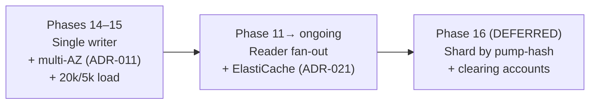

#### Stage 1 — Single writer, multi-AZ (ADR-011, Phases 14–15)

One Aurora writer, synchronous-quorum replication across 3 AZs. **All invariants are local and continuous**: debits=credits is a `SUM` over one `ledger_entries` table (and the equivalent fold); the partial unique index is one constraint; idempotency, ledger, outbox, `transaction_events` all commit in one transaction. This is the simplest correct state and we stay here as long as the writer holds — the **20k/sec sustained, ~5k money-writes/sec** load belongs to **Phases 14–15**, which is where we *measure* the single-writer ceiling before contemplating anything more exotic.

**ADR-011 lands here.** Active-active durability = Aurora multi-AZ **synchronous-quorum write**: every money-write is durable across AZs *before ack* (RPO = 0 in-region). This accepts a small inter-AZ RTT per capture to keep the invariant continuous. We **reject** single-AZ commit + async replication with a documented RPO — the entire thesis of this system is a continuous invariant, and buying a documented data-loss window to shave a few ms off capture latency would undercut the one property we're practicing. HA is **active-active across AZs in one region**, with **warm cross-region DR** (not multi-region active-active): RPO ≤ 60s, RTO ≤ 30min, human-gated, and promotion **fences the old region first** so there is never a dual-leader.

*What breaks:* nothing yet. This is the baseline.

#### Stage 2 — Reader fan-out + ElastiCache (Phase 11, ADR-021)

Add Aurora reader replicas and ElastiCache; route per §5. The writer now does *only* writes plus the read-your-write carve-out.

**ADR-007 reconciliation, stated once, here at first ElastiCache use:** v1 *deferred* Redis on purpose (ADR-007 — don't add a store without a measured bottleneck). We introduce ElastiCache at **Phase 11** specifically against the **measured 15k/sec read requirement** (ADR-021). This is a *conscious retirement* of the v1 deferral earned by a real number — not a speculative add. That number is the trigger; nothing about the cache exists before it.

*What breaks / changes:*
- **Replica lag becomes a visible contract.** Reads can now be stale. Mitigated by Aurora's shared-storage low lag + the explicit staleness rules in §5. The bug class introduced: read-your-write violations if a "confirm my capture" read accidentally hits a replica or cache. Fix is the connection-pool/IAM split — make the wrong thing *impossible*, not merely discouraged.
- **Projection consumers join the outbox stream.** More consumers on the bus; the outbox-age SLI (§2a) now also guards projection freshness.
- **No change to money invariants.** The writer is still one ACID boundary. debits=credits is still a single-database `SUM`/fold. This stage is purely additive on the read side — which is why it comes *before* sharding. Squeeze every drop out of one writer first.

#### Stage 3 — Shard by pump-hash *(Phase 16, deferred — DO NOT BUILD until Phase 15 measures the single-writer ceiling per ADR-007)*

> Everything in this stage — shard-by-pump, `clearing_accounts`, `clearing_sweep_state`, sweep workers, the sweep-lag tripwire, the two-line trial balance, ADR-020's striped global destination, and the `shared_account_storm` simulator scenario — is **Phase 16 machinery**. It exists *only against a measured ceiling*. The descriptions below are the design we will reach for *if and when* Stages 1–2 are exhausted; we are not building it speculatively.

Split the writer into N Aurora clusters, one per `hash(pump_id) % N`. Per-pump serialization (ADR-004) means a pump's entire lifecycle lives on one shard — the partial unique index stays a single-shard local constraint, no cross-shard coordination for the core money path. Routing by pump-hash happens at the data-access layer (or a thin proxy keyed on `pump_id`).

*What breaks — and this is the whole reason ADR-009 exists:*

- **Shared counter-accounts are no longer one ACID boundary.** The shared legs — **cash-clearing, fuel-revenue, subsidy-receivable, tax-payable** — are credited by sales on *every* shard, and there is no cross-shard transaction to make a leg atomic with its sale. **This is the break.** Per ADR-009 the shared leg posts to a **shard-local clearing account** (atomic with the sale on that shard), and an async sweeper rolls shard-local clearing → global with a **sweep-lag tripwire**. This **qualifies ADR-002** to *"synchronous per-shard, eventually-true globally within a monitored window."*
- **Striping (ADR-003) does not solve this.** Striping fixes *hot-row contention* within one box by spreading a balance across N sub-rows summed on read; all N still live in one database, so a balanced insert is still one local transaction. Cross-shard atomicity is a *different problem* — the legs are on different *databases*. Striping is "one account, many rows, one box"; clearing is "one logical account, one row per shard, many boxes, reconciled asynchronously."

```sql
-- (Phase 16, deferred.) Shard-local sub-ledger: clearing legs are just ledger_entries
-- rows whose `account` is a clearing account, e.g. 'clearing:fuel-revenue:shard-07'
-- — so the existing append-only ledger machinery (ADR-003) carries them unchanged, NO balance column.

-- Sweep bookkeeping: how far each (shard, account) has been rolled up,
-- and per-entry swept_at so the lag SLI can find the oldest UNSWEPT entry.
CREATE TABLE clearing_sweep_state (
    shard_id        smallint    NOT NULL,
    global_account  text        NOT NULL,    -- 'cash-clearing','fuel-revenue','subsidy-receivable','tax-payable'
    swept_through   timestamptz NOT NULL,    -- watermark: ledger entries <= this are rolled up
    last_swept_at   timestamptz NOT NULL,
    PRIMARY KEY (shard_id, global_account)
);
```

The sweep is itself a balanced double-entry move (`DEBIT clearing:fuel-revenue:shard-07`, `CREDIT fuel-revenue-global`) posted on whatever holds the global account, idempotent on the watermark, and it stamps `swept_at` on each entry it rolls up.

**ADR-020 — the global-sweep DESTINATION accounts are STRIPED.** The async sweep credits *global* fuel-revenue / subsidy-receivable / tax-payable / cash-clearing. If those global accounts were single rows, the sweep would just *recreate the single-writer hot-row bottleneck downstream* — every shard's sweeper contending on one global row. So the destination accounts are striped (ADR-003's technique, applied to the sweep target): each global account is N sub-rows written by hash and summed on read. Striping doesn't fix cross-shard atomicity (the clearing accounts do that) — here it fixes the *downstream* hot row the sweep would otherwise manufacture.

**The sweep-lag tripwire (canonical SLI):** sweep lag is the **age of the oldest UNSWEPT entry** —

```sql
EXTRACT(EPOCH FROM now() - MIN(occurred_at)) WHERE swept_at IS NULL
```

| SLI | Definition | SLO | Alert |
|---|---|---|---|
| Clearing sweep lag *(Phase 16 only)* | `EXTRACT(EPOCH FROM now() − MIN(occurred_at)) WHERE swept_at IS NULL` | < 60s @ 99.9% | **ticket** > 60s; **page (sev-2)** > 300s sustained 5m |

Sweep lag is a money-trust metric: while a sale sits in shard-local clearing, the global balance *understates* reality by exactly that amount. The window is *expected* and *bounded* — but if the sweeper stalls, that understatement grows, and reporting reads stale global numbers. The tripwire converts "eventually-true" from a hope into a contract. The accompanying **two-line trial balance** is `Σ(global) + Σ(unswept clearing) == Σ(per-shard postings)` — the standing assertion that nothing is lost in the sweep window.

- **The clearing sweep is a MONEY-MOVING consumer, so its DLQ policy is HALT-AND-PAGE, never skip-to-DLQ (ADR-019).** Silently skipping a sweep message to a DLQ would *short the global account* — it would permanently under-credit the destination. Money-moving consumers halt and page a human. Convenience consumers (loyalty, analytics) skip-to-DLQ; the sweep does not get that latitude.
- **Legally-binding documents carry the shard-local synchronous figure (ADR-015).** MyInvois e-invoices, SST, and subsidy packs are generated from the **shard-local synchronous** number — correct per-shard and available immediately — and **never wait for the async sweep.** The sweep reconciles the *global* roll-up; it is not on the critical path for a document that must be legally correct at point of sale.
- **The debits=credits `SUM` stops being a single statement.** It becomes a **fold over merged shard logs plus in-flight clearing** (§1a). The §1a fold framing was kept from day 1 exactly so this isn't a rewrite — adding shards just adds logs to merge.
- **Cross-pump reports go cross-shard.** EOD network totals fan out across shards or — better — read from the OLAP path (§5), which already aggregates the full outbox stream and is *shard-transparent*. That is why the OLAP path is fed off the outbox, not off the writers.
- **The `shared_account_storm` simulator scenario** (ADR-008 family) is the chaos test that *earns* this stage: hammer the shared accounts across shards and assert the trial balance holds and sweep lag stays inside SLO. It is built alongside the sweep, in Phase 16, not before.

The honest cost: Stage 3 trades a continuous *global* money invariant for a *monitored-window* global invariant, and adds the sweeper + tripwire as new things that can fail. We do **not** take this step until the writer is measurably the ceiling.

---

### 5. The CQRS read-side (Phase 11, ADR-021)

The 15k/sec reads — status polls, forecourt dashboards, price-book lookups, reporting tiles — **must never touch the writer.** They are bounded-stale by nature (a status poll that's 50ms behind is fine; nobody's money depends on it). Making this an *explicit* CQRS read-side is the single biggest lever for protecting the 5k/sec write path, and per ADR-021 it lands at **Phase 11** against the measured 15k requirement (the ADR-007 reconciliation in §4, Stage 2).

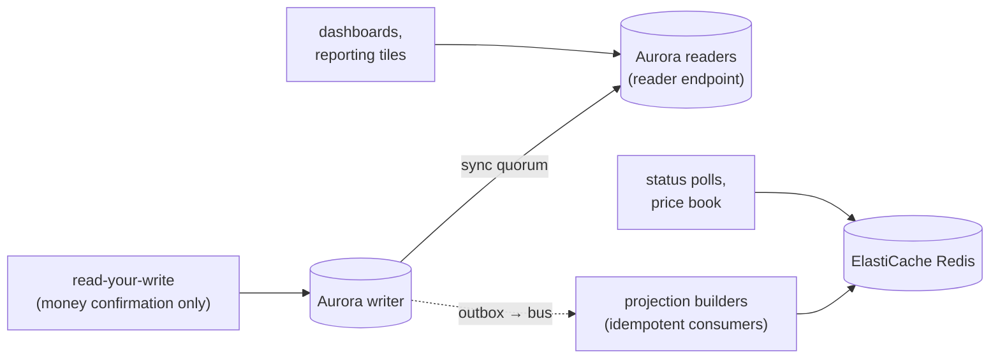

Routing rules (enforced at the data-access layer, not by convention):

- **Status polls + price book → ElastiCache.** A pump status poll fires every second or two during a dispense; at 4–5k pumps that's the bulk of the 15k/sec. These hit Redis, keyed by `pump_id` / `txn_id`, populated by a projection builder consuming the outbox stream. Sub-millisecond, zero primary load. Price book is read-mostly reference data — cache it with a short TTL and bust on price-change events.
- **Dashboards + reporting tiles → Aurora reader endpoint.** Slightly heavier, tolerant of single-digit-ms replica lag. The reader endpoint load-balances across replicas; Aurora Auto Scaling adds readers under load.
- **Read-your-write carve-out → writer.** The **only** reads allowed on the Aurora *writer* are the narrow money-confirmation read-your-write reads ("show me the capture I just made"). **ALL 15k cacheable reads and ALL reports go to readers/cache, never the writer.** Everything else is forbidden from the writer by policy *and* by the connection-pool split (separate pools, separate IAM, so a stray read *can't* land on the writer). This carve-out is also where ADR-017's shed-reads-protect-writes lives: under writer pressure, reads are shed (429 + Retry-After) so the writer stays up.

**Denormalized projections** (forecourt grid state, today's-sales-by-pump, shift totals) are built by idempotent consumers off the outbox stream and stored in Redis or in dedicated read-model tables on the readers. They're rebuildable from the event archive (§6 / §1a) — a corrupted projection is a replay, not an incident.

Trade-off, stated honestly: this introduces a *staleness contract* the UI must respect. A dashboard tile can lag the writer by tens of ms (replica) to a second-ish (projection). For a forecourt operations view that's invisible; for anything that *gates money* it's forbidden — which is why money state is only ever read through the read-your-write carve-out, never from the projections.

---

### 6. Object storage + the OLAP / warehouse path

#### 6a. S3 — settlement files + event archive

- **Settlement files** (existing): EOD batches written by the Settlement Service, S3 with object-lock/versioning for the immutable-financial-record requirement. Lifecycle to Glacier after the regulatory retention window.
- **Event archive (ADR-010 payoff):** the outbox stream and `transaction_events` are continuously archived to S3 as **Parquet**, partitioned `s3://…/events/dt=YYYY-MM-DD/`. This is the durable home of the full causal log — the thing that makes "reconstruct state as-of T" cheap for chargebacks, MyInvois disputes, and subsidy/tax claw-backs. Once a `ledger_entries` / `outbox` / `transaction_events` partition satisfies the DROP-safety predicate (§2a) — fully published, past the bus retention horizon, **and archived here** — the on-Aurora partition becomes droppable. Aurora stays lean; history lives cheaply in S3. **No card PAN ever lands here (ADR-018)** — only `acquirer_ref` — which is what keeps the archive *out of PCI scope*.

#### 6b. OLAP — S3 + Glue + Athena is the default warehouse

**S3 + Glue + Athena is the warehouse.** Redshift is a *gated, reversible fallback*, not a co-equal option — and the gate is a measured number.

| | S3 + Athena (default) | Redshift (gated fallback) |
|---|---|---|
| Cost model | Pay-per-query-scanned; **zero idle cost** | Provisioned cluster; pay 24/7 |
| Fit for this workload | Bursty reporting (EOD batches, ad-hoc dispute lookups, subsidy/tax audits) | Continuous high-concurrency BI |
| Coupling to OLTP | Reads Parquet off the outbox-fed archive — **fully decoupled, shard-transparent** | Same decoupling, heavier to run |
| Operational weight | Glue catalog + S3; serverless | A cluster to size, vacuum, manage |

Our reporting is **bursty and batch-shaped** (end-of-day settlement reporting, periodic subsidy/tax reconciliation, occasional dispute forensics), not a 24/7 BI fleet with hundreds of concurrent analysts. Athena's pay-per-scan with zero idle cost fits that shape exactly; a provisioned Redshift cluster would burn money sitting idle between EOD runs. Partitioned Parquet keeps scan costs bounded (queries prune by `dt=`). This honors ADR-007's lean-footprint discipline: don't provision a warehouse cluster until a *measured* reporting-concurrency need justifies it.

**The fallback is genuinely reversible — that's why it's safe to defer.** If reporting concurrency later genuinely outgrows Athena, **Redshift Spectrum reads the *same* S3 Parquet** — so adopting it re-plumbs nothing in the pipeline; it's a query-engine swap against an unchanged archive, gated on a concurrency measurement, and reversible back to Athena just as cleanly. That reversibility is precisely why S3 + Athena is the right *default* rather than a corner we paint ourselves into.

The OLAP path is fed **off the outbox stream**, never off the writers: an archiver consumer lands events as Parquet, Glue catalogs them, Athena queries them. Because it consumes the bus, it is *indifferent* to whether there's one writer or N shards — which is what makes cross-pump network reporting survive the Phase 16 shard migration unchanged.

---

### Summary of storage decisions

- **Aurora PostgreSQL** for the OLTP money core: multi-AZ synchronous quorum gives ADR-011 its continuous in-region invariant (RPO = 0); reader endpoints give the CQRS read-side honest freshness; warm cross-region DR is RPO ≤ 60s / RTO ≤ 30min, human-gated, old region fenced first.
- **`transaction_events`** (ADR-010): same-transaction append-only causal log; the safe half of event-sourcing; not free (extra WAL + drift-detection burden); reframes debits=credits as a *mergeable, associative fold* — necessary but not sufficient, no error budget, always a sev-1 page. PAN never enters it (ADR-018).
- **`saga_log`** (ADR-012): one row + one reconciler for the out-of-boundary acquirer leg — not a saga engine.
- **Schema Evolution**: online migrations on partitioned append-only tables (nullable-add → batch-backfill → `VALIDATE`, `CONCURRENTLY` index builds, `lock_timeout`, expand/contract); `jsonb` is the event-body escape hatch that *defers* governance, not eliminates it; cross-shard DDL coordination is Phase 16, shard-independent and order-tolerant.
- **Partitioning**: outbox hourly (DROP per the three-part safety predicate, never DELETE; SLI on unpublished *age*: < 5s @ 99.9%, page at 30s); `ledger_entries` and `transactions` by time. MYR-only (ADR-016).
- **CQRS read-side** (Phase 11, ADR-021): 15k/sec on ElastiCache + Aurora readers, a conscious ADR-007-compliant retirement of v1's Redis deferral against a measured number; writer reserved for writes + the **read-your-write money-confirmation carve-out only**, enforced by pool/IAM split; shed-reads-protect-writes (ADR-017).
- **S3 + Glue + Athena** is the **default** warehouse, fed off the outbox — shard-transparent, zero idle cost; **Redshift is a gated, reversible fallback** (Spectrum on the same Parquet) behind a concurrency measurement.
- **Migration path** is explicit and ceiling-triggered: 20k/5k load and ADR-011 are Phases 14–15; **sharding, clearing accounts, the sweep, the sweep-lag tripwire, ADR-020 striped destinations, and the `shared_account_storm` scenario are Phase 16 — DO NOT BUILD until Phase 15 measures the single-writer ceiling.**

---

## Observability & SLOs

Observability for a money system is not a dashboard you glance at — it is the **second source of truth** that catches what the code's own assertions cannot. Every signal here exists to answer one of three questions: *Is money being lost or double-counted right now?* (correctness), *Is the write path keeping its promise?* (latency), *Is an eventually-consistent plane falling behind its allowed window?* (lag). Everything else is diagnostics for those three.

A guiding principle, consistent with ADR-007's lean footprint: **we instrument the seams and the invariants first, the internals second.** We do not ship a metric until we know which question it answers and whether it pages or tickets.

**This section owns the canonical SLO/threshold table.** §"SLOs and the page-vs-ticket policy" below is the **single source of truth** for the outbox-age, sweep-lag, and ledger-fold numbers. Every other section that mentions a threshold (the data-model, communication, DR, and Phase-16 sharding sections) references *these* numbers rather than restating them — there is exactly one place a number can drift, and it is here.

### The metric taxonomy

Three tiers, deliberately separated so a noisy diagnostic never drowns a correctness alarm.

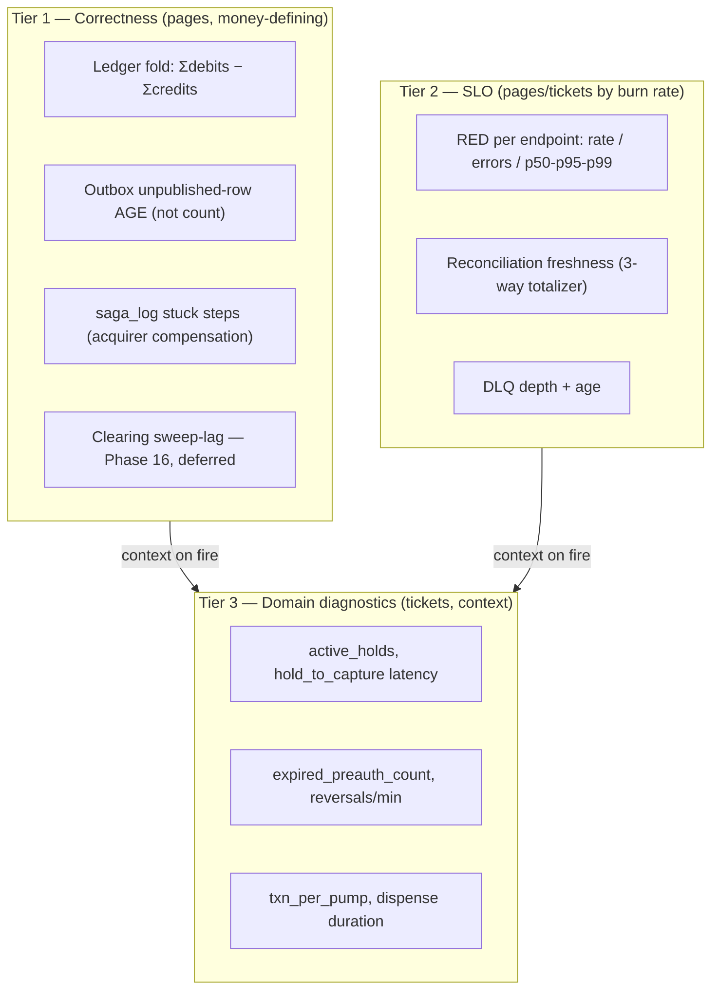

The split matters operationally: **Tier 1 signals can fire even when Tier 2 is green.** A perfectly fast, perfectly available write path that is silently leaking a sen per capture is the exact failure a money system must catch — and only the correctness tier sees it.

### RED per endpoint

Standard RED (Rate, Errors, Duration), but with the write/read split from the throughput section baked into the labels so the ~5,000 money-writes/sec never get averaged together with the ~15,000 cacheable reads/sec — averaging them hides the only latency that matters.

**Prometheus instrumentation (Go, `promhttp` + a thin middleware):**

```go
var httpDuration = prometheus.NewHistogramVec(
    prometheus.HistogramOpts{
        Name: "pos_http_request_duration_seconds",
        // Buckets tuned for the WRITE path — we care about the 50ms–2s band
        // where the acquirer leg dominates, plus a fast bucket for cache reads.
        Buckets: []float64{.005, .01, .025, .05, .1, .25, .5, 1, 2, 5},
    },
    []string{"endpoint", "method", "path_class", "status_class"},
    // path_class ∈ {money_write, cqrs_read}  -- the write/read split, a first-class label
)
```

| Endpoint | path_class | Why it is watched separately |
|---|---|---|
| `POST /authorize` | money_write | Preauth latency = acquirer leg + fast commit; p99 owns the SLO |
| `POST /capture` | money_write | The ledger-posting transaction; the contended path |
| `POST /void`, `/reverse`, `/refund` | money_write | Low rate, high blast radius; refunds/reversals are first-class money flows (ADR-014) |
| `GET /transaction/:id` (status poll) | cqrs_read | Served from reader/cache, never the write primary (see CQRS read-side below) |
| `GET /dashboard/*`, `/reporting/*` | cqrs_read | The 15k/sec bulk; must not appear in write-path percentiles |

We export **p50/p95/p99 per `path_class`**, computed with `histogram_quantile` over the native histogram. The p99 of `money_write` is an SLI; the p99 of `cqrs_read` is a capacity signal, not a money signal.

**Honest trade-off:** percentiles from Prometheus histograms are interpolated within a bucket, so a p99 reported as 480ms might really be 410–500ms. For SLO accounting that is fine; for chasing a specific tail bug, pull the OTel trace once the saga lands (see Structured logging and tracing). Do not over-trust two significant figures from a histogram.

### Domain metrics

These are the business-truth gauges. They are diagnostics (Tier 3) **except** where a domain metric is also a correctness signal — those get promoted.

| Metric | Type | What it tells you | Healthy range (synthetic load) |
|---|---|---|---|
| `pos_active_holds` | Gauge | Preauths placed but not yet captured/expired. The "money in flight" count. | Bounded by live pumps; a monotonic climb = reaper is dead |
| `pos_hold_to_capture_seconds` | Histogram | Authorize→capture latency. The real dispense duration plus system overhead. | Minutes (it's fuel); a *short* tail spike = drive-offs/voids |
| `pos_expired_preauth_total` | Counter | Reaper-driven `EXPIRED`. | Tracks drive-off chaos knob; a flat-line at zero under chaos = reaper not running |
| `pos_reversals_total` | Counter | Post-auth reversals/min. | Low and stable; a spike = acquirer or capture-path trouble |
| `pos_txn_per_pump` | Counter (by `pump_id`) | Throughput per pump; the per-pump contention unit. | Physically rate-limited per pump |
| `pos_dlq_depth` / `pos_dlq_oldest_age_seconds` | Gauge | Poison-message backlog **and its age**. | 0; any sustained non-zero pages |

**Why `active_holds` and `dlq_oldest_age` are quietly correctness signals, not just gauges:**

- `active_holds` climbing without bound means the **Expiry Reaper is down** — and a dead reaper means real money stays held on customer cards indefinitely. We alert on `rate` of the gauge, not the absolute value (the absolute value scales with pump count; the *slope* does not lie).
- DLQ **depth** alone is misleading: 10 stuck messages that arrived 3 hours ago is a worse incident than 200 that arrived 2 seconds ago and are about to drain. We page on **age**, ticket on depth — same age-not-count philosophy as the outbox SLI.
- **DLQ routing is money-class-split (ADR-019).** A money-moving consumer (the Phase-16 clearing sweep) **HALTS-AND-PAGES** — it never skips-to-DLQ, because silently skipping a money leg shorts the global account. Convenience consumers (loyalty, analytics) skip-to-DLQ. The DLQ metrics above are the *convenience* path; the money path has no DLQ to depth-watch, only a halt-and-page tripwire.

### The ledger-invariant alert as a fold over the log

The v1 doc (§8, ADR-002) states the invariant as a *continuously-true SQL property*: `SUM(debits) = SUM(credits)`. That framing is correct **today**, while everything lives in one ACID boundary. But ADR-009's eventual shard-by-pump migration breaks the "one boundary" premise. So we keep the invariant in a form that survives sharding **from day 1** (it is cheap correctness insurance): **an associative fold over the ordered ledger / `transaction_events` log.**

The invariant is not "a query returns zero." It is: *folding the signed amounts of an ordered, append-only log yields zero at the global level, and yields zero per-transaction at every prefix that closes a transaction.*

```go
// Conceptually — the invariant as a left-fold, NOT a point-in-time SQL aggregate.
// signed(entry) = +amount for CREDIT, -amount for DEBIT  (or the reverse; pick one)
func ledgerBalance(log iter.Seq[Entry]) int64 {
    var acc int64
    for e := range log { acc += signed(e) }   // associative fold over ordered entries
    return acc // MUST be 0 globally; MUST be 0 over every per-transaction slice
}
```

Why the fold framing is not pedantry:

1. **It is shard-portable.** A SQL `SUM` over one table assumes one table. A fold is associative — `fold(shardA) + fold(shardB) + … + fold(clearing) = 0` is the same statement, whether the entries live in one Postgres or fifty shards plus the global account. When (and only when) we migrate in Phase 16, the invariant's *definition* does not change; only the input streams do.
2. **It is replayable.** Per ADR-010 we already write a `transaction_events` row in the same txn as the `transactions` UPDATE and the outbox insert. The fold can run over the **event log**, not just the live `ledger_entries` rows — so we can assert "the books balanced as-of timestamp T" for a chargeback, refund, or subsidy claw-back audit (all first-class money flows, ADR-014) by folding the prefix up to T. A point-in-time `SUM` cannot do that; the rows have moved on. This replayability is not free: ADR-010 costs extra WAL on the hot path and a drift-detection burden between the event log and the version-CAS aggregate.

**The alert, in practice (Prometheus + a SQL exporter):**

```sql
-- Exported every 30s as pos_ledger_fold_imbalance_minor.
-- v1: one ACID boundary, so this is a single-table fold.
SELECT COALESCE(SUM(CASE WHEN direction='CREDIT' THEN amount_minor
                         ELSE -amount_minor END), 0) AS imbalance_minor
FROM ledger_entries;   -- Phase 16: UNION across shard exporters + global + clearing.
```

Alert: `pos_ledger_fold_imbalance_minor != 0` for any single scrape → **PAGE immediately, sev-1.** There is no "warning" tier and **no error budget**. One sen of imbalance in a money system is a code bug, full stop.

#### Why the fold is NECESSARY but NOT SUFFICIENT

This is the most important honesty in the section, and the v1 doc gestures at it (§8: "a tripwire for code bugs, not a normal-operations gauge"). Made explicit:

The fold proves **internal consistency** — that our double-entry bookkeeping is self-coherent. It says *nothing* about whether our books match reality. A bug that posts a perfectly balanced debit/credit pair for the **wrong amount**, or for a fuel volume that was never dispensed, balances to zero and sails straight past the fold. `+500 / −500` is balanced; it is also wrong if the customer pumped RM 50, not RM 5.

The fold is necessary (a non-zero fold is *always* a bug) but insufficient (a zero fold does *not* prove correctness). The second guard is the **three-way reconciliation** (§9, ADR-008): transaction log vs `ledger_entries` vs the independent `totalizer_readings`. Only the totalizer — an independent truth that does not derive from our writes — can catch a balanced-but-wrong posting. So:

- **Fold (continuous, internal):** catches "the books don't balance." Cheap, runs every 30s.
- **Totalizer 3-way reconciliation (periodic, external):** catches "the balanced books don't match physical fuel." Expensive, runs per settlement window; freshness is itself an SLO (see the canonical table).

A money system needs **both**. Reporting only the fold is a classic false sense of safety.

### The outbox-lag SLI: the hidden write-primary bottleneck

The outbox is named plainly as the trap: **the `outbox` table is a write-primary co-conspirator, and its failure mode is invisible if you watch the wrong number.** Every money-write inserts an outbox row in the same transaction. That means:

1. The outbox shares the write primary's I/O budget with the ledger. It is not "free async plumbing."
2. Published rows that are never cleaned up turn the table into a bloated, append-mostly heap that **slows the relay's `WHERE published_at IS NULL` scan** — which slows publication — which grows the table further. A feedback loop on the *write* path.

**Three operational disciplines, each with a metric:**

**(a) SLI on AGE, not count.** A backlog of 50,000 rows that are 200ms old is healthy (a traffic burst, draining). A backlog of 12 rows where the oldest is 90 seconds old is an **incident** — the relay is stuck or the bus is rejecting. Count hides this; age exposes it.

```sql
-- pos_outbox_oldest_unpublished_age_seconds  -- THE outbox SLI
SELECT COALESCE(EXTRACT(EPOCH FROM now() - MIN(created_at)), 0)
FROM outbox WHERE published_at IS NULL;
```

**(b) Partition-and-DROP, never `DELETE`.** Published rows are dead weight. We time range-partition `outbox` by `created_at` (e.g. hourly), and **DROP published partitions** — instant, no vacuum churn, no bloat. A `DELETE` of millions of published rows would itself hammer the write primary and leave dead tuples for autovacuum to chase. A partition is droppable **IFF** (a) every row has `published_at` set, **AND** (b) `max(created_at)` is past the bus retention horizon, **AND** (c) the partition is archived to S3 Parquet. We export `pos_outbox_unpublished_in_partition` per partition so the drop is provably safe against predicate (a). (The S3 Parquet archive deliberately never carries PAN — only `acquirer_ref` — keeping the event archive out of PCI scope, ADR-018.)

**(c) Aggressive, table-local autovacuum.** The hot (current) partition needs autovacuum tuned far more aggressively than the global default, because it churns `published_at` updates constantly:

```sql
ALTER TABLE outbox_current SET (
  autovacuum_vacuum_scale_factor = 0.01,   -- vacuum at 1% dead tuples, not 20%
  autovacuum_vacuum_cost_delay   = 0,      -- don't throttle on the hottest table
  fillfactor                     = 70      -- leave room for HOT updates of published_at
);
```

We watch `pg_stat_user_tables` for `n_dead_tup` and `last_autovacuum` on the current partition; rising dead tuples + a stale `last_autovacuum` = bloat building = the relay scan is about to degrade. This is a **leading** indicator, fired before the outbox-age SLI even moves.

The outbox SLO and its alert thresholds live in the canonical table below.

### The acquirer saga-log signal

The acquirer leg is the one place saga-with-compensation earns its keep, precisely because it is *already* outside the ACID boundary (ADR-005: never hold the pump serialization point across the acquirer call). Per ADR-012 this is **one `saga_log` row plus one reconciler — not a saga engine.** The canonical schema is `PRIMARY KEY (txn_id, step)` with columns `(txn_id, step, state, attempt, acquirer_ref, request_hash, updated_at)`. It gives us a Tier-1 signal:

```sql
-- pos_saga_stuck_steps  -- steps that entered but never reached a terminal state
SELECT count(*) FROM saga_log
WHERE state IN ('AUTH_PENDING','CAPTURE_PENDING','COMPENSATING')
  AND updated_at < now() - interval '120 seconds';
```

A stuck `COMPENSATING` step is a reversal that did not complete — real money potentially held on a card. **Page (sev-2)** on any stuck compensation; **ticket** on stuck pending steps (often just acquirer slowness, which the capture-path retry handles). This signal stays cheap and Postgres-local until the saga formally lands; only then does it gain trace context.

### The CQRS read-side, made explicit

The 15k/sec read path is an **explicit CQRS read-side**, and observability enforces that boundary. We assert it with a metric, not a code comment:

- All `cqrs_read` endpoints carry a label `served_from ∈ {reader, cache, primary}`. A reader that hits the **write primary** is a defect — a status poll has no business on the money primary. We alert: `sum(rate(pos_http_requests_total{path_class="cqrs_read", served_from="primary"}[5m])) > 0` → **ticket**, because it is a slow leak of read load onto the write primary that erodes write-path headroom before it ever shows up as a latency regression. The **only** reads permitted on the Aurora writer are the narrow money-confirmation read-your-write reads; every one of the 15k cacheable reads and every report goes to a reader or cache, never the writer.
- **Replica lag** (`aws_rds_replica_lag` via CloudWatch → Prometheus, or `pg_last_wal_replay_lag`) is its own SLI: a status poll served from a 30s-lagged reader can show `AUTHORIZED` for a sale that already `CAPTURED`. Acceptable for dashboards, **not** for the poll the pump uses to gate dispense — that one takes the read-your-write carve-out on the writer deliberately. We ticket on replica lag > 5s.
- **Projection freshness** for denormalized read models (forecourt grid, EOD reporting) is exported as `pos_projection_lag_seconds` per projection — the same age-not-count discipline as the outbox.

The CQRS read-side store (ElastiCache/Redis) is itself introduced **against the measured 15k/sec read requirement at Phase 11** (ADR-021) — a conscious, ADR-007-compliant retirement of v1's Redis deferral, not a speculative add. Until then `served_from=cache` simply does not appear, and these alerts watch `reader` vs `primary` only.

### Structured logging and tracing

**Structured logging — `slog`, correlation on `txn_id` + `idempotency_key`.** These two fields are the spine that stitches a single sale's records across services without a tracer:

```go
logger := slog.With(
    slog.String("txn_id", txn.ID),
    slog.String("idempotency_key", req.IdempotencyKey),
    slog.String("pump_id", txn.PumpID),
)
// flows through: gateway -> txn service -> acquirer mock -> reaper -> settlement
logger.Info("capture posted",
    slog.Int64("captured_minor", txn.CapturedMinor),
    slog.Int64("auth_minor", txn.AuthMinor),
    slog.String("acquirer_ref", txn.AcquirerRef))
```

`txn_id` joins the lifecycle; `idempotency_key` is what lets us reconstruct **retry storms** — every duplicate request carries the same key, so a `count by idempotency_key` over the logs immediately surfaces a pump hammering us (the same storm that ADR-017's write-tier admission control — bounded in-flight semaphore, acquirer circuit breaker, shed-reads-to-protect-writes — exists to absorb). We never log card PAN; only `acquirer_ref` ever appears, keeping logs out of PCI scope (ADR-018). We log JSON to stdout, ship via the standard EKS/Fluent Bit → CloudWatch Logs (or OpenSearch) path. Money-defining state transitions log at `INFO`; the fold-imbalance and stuck-saga conditions log at `ERROR` with the full `txn_id` so the page links straight to the offending record.

**Tracing — OTel → Jaeger, deferred until the saga lands (ADR-007).** This is a *correct* deferral, not laziness, and the reasoning is worth stating because it is a real trade-off:

- In v1, a sale lives inside **one** service and **one** Postgres transaction. A distributed trace of a single-process, single-transaction operation tells you almost nothing that the `slog` correlation + the RED histogram don't already. The span would be one box.
- The trace earns its keep at the moment the saga fan-out (loyalty, RON95 subsidy, MyInvois) makes one sale span **multiple services and the bus**. *Then* "where did the 400ms go, and which participant compensated" is a question only a trace answers.

So we wire the `slog` correlation IDs now in a trace-compatible shape (the `txn_id` becomes the trace's baggage/root attribute) so that turning on OTel later is a configuration change, not a re-instrumentation. We pre-pay the cheap part, defer the expensive part until it pays off — same discipline as ADR-007.

### Bus SLIs, and the deferred MSK/Debezium upgrade (ADR-013)

For v1 the bus is **Amazon Kinesis plus a polling outbox relay** — lean (ADR-007), and it teaches the outbox pattern without Kafka Connect/Debezium. The partition key is `pump_id`, so per-pump order survives a partitioned bus. The bus-side SLIs in v1 are therefore the **outbox-age SLI** (above) and the convenience-consumer **DLQ depth+age** — there is no replication slot to watch, because there is no CDC.

> **Deferred — built only against a measured ceiling (ADR-007/ADR-013).** MSK + Debezium CDC are a measured-trigger upgrade, taken **only** when multi-consumer replay depth earns it. **The Debezium replication-slot-lag SLI and its runbook apply ONLY after that MSK upgrade** — until then, a slot-lag panel would monitor a component that does not exist. When MSK lands, slot-lag joins the Tier-1 async signals alongside outbox-age; it is intentionally absent from the v1 canonical table for exactly this reason.

### Cross-shard clearing sweep-lag

> **(Phase 16, deferred — built only against a measured ceiling per ADR-007.)** Everything in this subsection is Phase-16 machinery: it is **NOT BUILT** until Phase 15 measures the single-writer ceiling. Do not stand up the sweep-lag panel, the sweep workers, or `clearing_accounts` / `clearing_sweep_state` before that measurement exists.

ADR-009 trades a hard cross-shard ACID boundary for a **shard-local clearing account swept asynchronously to the global account**, with a monitored window — qualifying ADR-002 to "synchronous per-shard, eventually-true globally within a monitored window." (Striping, ADR-003, fixes the hot-row problem; it does **not** give cross-shard atomicity — a different problem.) That monitored window is a first-class Tier-1 signal once it exists, because an unbounded sweep lag means the global accounts (fuel-revenue, RON95 subsidy-receivable, tax-payable, cash-clearing) are stale by an unknown amount — and someone may be making decisions off stale globals.

Note one thing the sweep-lag does **not** gate: legally-binding documents (MyInvois e-invoice, SST, subsidy packs) carry the **shard-local synchronous** figure, which is correct per-shard and available immediately — they never wait for the async sweep (ADR-015). The sweep-lag protects the *global rollups*, not the documents.

```sql
-- pos_sweep_lag_seconds, exported per shard. (Phase 16.)
-- age of the oldest UNSWEPT clearing entry — NOT the swept count or the dollar amount.
SELECT EXTRACT(EPOCH FROM now() - MIN(occurred_at)) AS sweep_lag_seconds
FROM ledger_entries
WHERE account LIKE 'shard_%.clearing' AND swept_at IS NULL;
```

The global-sweep **destination** accounts (global fuel-revenue/subsidy/tax/cash-clearing) are themselves **STRIPED** (ADR-020) so the async sweep doesn't recreate the single-writer hot-row bottleneck downstream. The sweep-lag thresholds are in the canonical table below, fenced as Phase-16. The tripwire **is** the monitoring of ADR-009's window: without it, ADR-009 is "we gave up the invariant globally and hoped"; with it, the give-up is bounded, observed, and pageable.

### SLOs and the page-vs-ticket policy

**This is the canonical SLO/threshold table — the single source of truth.** All numbers below are authoritative; other sections reference them. SLOs are commitments with error budgets, and we alert on **burn rate** rather than raw threshold crossings — except the ledger fold, which has no budget and always pages.

| SLO | Target | SLI source | Window |
|---|---|---|---|
| **Ledger integrity** | fold-imbalance == 0, **100% of the time** (**no error budget**) | `pos_ledger_fold_imbalance_minor` | continuous |
| **Outbox freshness** | oldest-unpublished-age **< 5s @ 99.9%** | `pos_outbox_oldest_unpublished_age_seconds` | 7-day rolling |
| **Money-write availability** | 99.95% of `authorize`+`capture` succeed (non-5xx, non-timeout) | RED `errors` on `path_class=money_write` | 30-day rolling |
| **Write-path latency** | p99 of `capture` < 800ms (acquirer leg dominates; commit is <20ms of it) | `pos_http_request_duration_seconds{path_class="money_write"}` | 30-day rolling |
| **Read-path latency** | p99 of `cqrs_read` < 50ms | same histogram, `cqrs_read` | 30-day rolling |
| **Reconciliation freshness** | 3-way totalizer reconcile completes within 15m of each settlement-window close | `pos_reconciliation_age_seconds` | per-window |
| **Clearing sweep freshness** *(Phase 16, deferred)* | sweep-lag **< 60s @ 99.9%** | `pos_sweep_lag_seconds` | 7-day rolling |

**Page (wake a human, sev-1/sev-2):**

| Condition | Sev | Why it cannot wait |
|---|---|---|
| `pos_ledger_fold_imbalance_minor != 0` (any scrape) | 1 | Books don't balance — money lost/created. No budget, no delay, always a page. |
| Money-write availability burning budget > 14.4×/h (2% in 1h) | 1 | Customers cannot buy fuel; revenue + reputation bleeding now. |
| `pos_outbox_oldest_unpublished_age_seconds` oldest-age **> 30s sustained 2m** | 2 | Whole async plane (settlement, loyalty, MyInvois) going dark. |
| Money-moving consumer halted (clearing sweep, ADR-019) *(Phase 16)* | 2 | Halt-and-page by policy; skipping would silently short the global account. |
| `pos_sweep_lag_seconds` **> 300s sustained 5m** *(Phase 16, deferred)* | 2 | Global rollups drifting; subsidy/tax decisions on stale data. |
| `pos_dlq_oldest_age_seconds > 600` (convenience consumers) | 2 | Poison messages aging past recoverability. |
| `pos_active_holds` slope > 0 for 15m with `expired_preauth` flat | 2 | Reaper is dead; real holds stranded on customer cards. |
| `pos_saga_stuck_steps` with `state='COMPENSATING'` | 2 | A reversal didn't complete; money held. |

**Ticket (next business day, no page):**

| Condition | Why it can wait |
|---|---|
| `pos_outbox_oldest_unpublished_age_seconds` **p99 > 2s over 10m** (under the 5s SLO) | Relay sluggish; tune before the budget burns. |
| `pos_sweep_lag_seconds > 60s` *(Phase 16, deferred)* | Sweeper hiccup inside the documented window; investigate, don't wake. |
| Write-path p99 > 800ms but availability green | Slow, not broken; usually acquirer latency. Investigate, don't wake. |
| `cqrs_read` served_from=primary > 0 | Architecture leak eroding write headroom; fix before it becomes a page. |
| Replica lag > 5s | Dashboards stale; dispense-gating poll already takes the read-your-write carve-out. |
| `n_dead_tup` rising + stale `last_autovacuum` on `outbox_current` | Leading bloat indicator; re-tune autovacuum before the SLI moves. |
| DLQ depth > 0 but oldest-age < 600s | Draining; watch, don't wake. |

The policy is deliberately asymmetric: **anything touching the continuous money invariant has no error budget and always pages; everything else gets a burn-rate budget and tickets until the budget is genuinely at risk.** That asymmetry is the whole point of separating Tier 1 from Tiers 2–3. (Disaster-recovery objectives — warm cross-region DR at RPO ≤ 60s, RTO ≤ 30min, human-gated, promotion fencing the old region first — live in the DR section and reference the freshness numbers here.)

### The two dashboards

Two audiences, two dashboards — and they are not the same data reskinned. They answer different questions and they update at different cadences.

**Grafana — System & SLO (for the on-call engineer).** Provisioned-as-code, Prometheus-backed. Top-to-bottom severity order so the eye lands on correctness first:

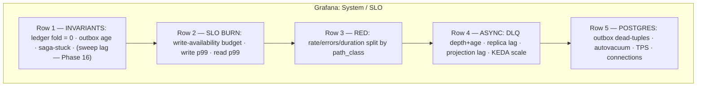

Row 1 is the money conscience; if it is green the system is *correct* even if it is slow. Rows 2–3 are *performance*. Rows 4–5 are *plumbing/diagnostics* — where you go once Row 1 or 2 has told you something is wrong. (The sweep-lag tile on Row 1 stays dark until Phase 16 builds it.)

**Custom forecourt dashboard — Business & simulator control (for the operator / the practitioner driving chaos).** Not Grafana — a purpose-built view that mirrors the physical forecourt:

- A live **pump grid**: each pump's current state (`AUTHORIZED`/`DISPENSING`/`CAPTURED`/`EXPIRED`…), color-coded, fed from the CQRS read-side (reader / cache), never the write primary.
- **Money-in-flight**: `active_holds` and their aggregate held amount (MYR — multi-currency is dropped as YAGNI, ADR-016), hold-to-capture distribution, reversals/refunds and expiries as they happen.
- **Reconciliation panel**: the 3-way totalizer match status per settlement window, with discrepancies flagged — the business-facing face of the "necessary-but-not-sufficient" pairing above.
- **Simulator control**: the live chaos knobs (decline rate, drive-off rate, acquirer-latency injection — and in Phase 16, the `shared_account_storm` scenario) wired straight to the simulator, so the practitioner can *induce* a failure and watch it land on the Grafana invariant row in real time. This closes the deliberate-practice loop: cause → observe → correct.

The forecourt dashboard reads exclusively from the CQRS side. It is allowed to be a few seconds stale; it is never allowed to add load to the money write primary. That constraint is enforced by the `served_from=primary` alert above — the dashboard's correctness as an *architecture boundary* is itself observed.

---

## High Availability, Kubernetes on AWS, Admission Control & Failure Handling

This section answers five blunt operational questions: **how does this stay up (HA)?**, **how does Kubernetes lay it out?**, **how does the writer survive a retry storm without melting (admission control)?**, **what is the Docker story?**, and **when a transaction fails — exactly what happens?** The bias is unchanged from the rest of the doc: the money write path is a single Postgres ACID boundary, everything else is eventually consistent at the seams. HA does not relax that — it makes the *primary* survivable without inventing a second write authority.

The headline contract everything below serves: **read-anywhere, write-to-one-leader.** There is exactly one Aurora writer per region at any instant. "Active-active" here means *every AZ runs live, traffic-serving service pods* and *any AZ can serve reads* — it does **not** mean two AZs accept conflicting money-writes. A second concurrent write authority is the one thing we never build, because it would reintroduce exactly the cross-boundary atomicity problem ADR-001/002 exist to kill.

A second contract, equally load-bearing at 20,000 req/sec sustained (~1.2M/min = ~5,000 money-writes/sec + ~15,000 cacheable reads/sec): **the writer is a finite resource and we admit work to it on purpose.** ADR-017 (§below) is how we keep an idempotency-deduped retry storm — exactly what an open-model load test induces — from converting "the writer is busy" into "the writer is dead."

---

### 8.1 Target shape: 3 AZs, one region, warm DR

```mermaid
graph TB
  subgraph region["AWS Region (e.g. ap-southeast-1)"]
    subgraph azA["AZ-a"]
      A1["EKS nodes<br/>txn / payment / gateway pods"]
      AURW[("Aurora WRITER<br/>(leader)")]
    end
    subgraph azB["AZ-b"]
      B1["EKS nodes<br/>txn / payment / gateway pods"]
      AURR1[("Aurora reader")]
    end
    subgraph azC["AZ-c"]
      C1["EKS nodes<br/>consumer / settlement / reaper pods"]
      AURR2[("Aurora reader")]
    end
    NLB["AWS LB Controller<br/>NLB/ALB → Ingress"]
    EC[("ElastiCache Redis<br/>CQRS read-side, multi-AZ<br/>(Phase 11, ADR-021)")]
    KIN["Kinesis<br/>multi-AZ, partition key = pump_id"]
  end

  subgraph dr["DR Region (warm)"]
    AURDR[("Aurora cross-region<br/>replica (read-only)")]
    EKSDR["EKS cluster<br/>scaled to floor / paused"]
  end

  NLB --> A1 & B1 & C1
  A1 -->|writes| AURW
  B1 -->|writes| AURW
  A1 & B1 -.->|reads| AURR1 & AURR2
  A1 & B1 -.->|cache reads| EC
  C1 <--> KIN
  AURW ==>|sync quorum (Phase 14, ADR-011)| AURR1 & AURR2
  AURW -.->|async ship| AURDR
```

- **3 AZs, one region.** Survives a full-AZ loss with zero in-region RPO and seconds-of-RTO failover (Aurora promotes a reader). This is the LOCKED HA posture — active-active across AZs in ONE region plus warm cross-region DR — **not** multi-region active-active.
- **Warm cross-region DR.** A cross-region Aurora replica plus a scaled-to-floor EKS cluster, promoted by runbook only for a region-kill event (§8.6).
- **Stateful services are AWS-managed, not in-cluster.** Aurora, Kinesis, ElastiCache, S3 all live outside Kubernetes. The EKS cluster runs **only stateless Go pods**. We do not run Postgres in a StatefulSet — Aurora's storage-layer multi-AZ replication is the entire point of choosing it (ADR-011), and reproducing that in-cluster would be strictly worse.

---

### 8.2 EKS topology

One regional EKS cluster, managed node groups (or Karpenter) spanning all 3 AZs. Pods are stateless; the only durable state is in Aurora/Kinesis/S3.

**Workload classes and how each scales:**

| Workload | Scaler | Signal | Why |
|---|---|---|---|
| API Gateway, Transaction, Payment | **HPA** | CPU + **RPS** (requests/sec via custom metric from Prometheus Adapter) | Synchronous, latency-bound; scale on demand pressure, not queue depth. CPU alone lags on I/O-bound Go services, so RPS is the primary trigger. Bounded by ADR-017 admission control, not unbounded fan-in to the writer. |
| Settlement, saga reconcilers, projection builders | **KEDA** | **stream / consumer lag** (Kinesis iterator-age / consumer lag) | These are pull-based off the bus. Scaling on lag is the correct control variable; KEDA can even scale-to-zero off-peak. **KEDA is for consumers ONLY.** |
| Expiry Reaper, outbox relay | **Singleton via leader election** (no autoscaling) | n/a | A sweeper/relay must not run N copies racing the same rows. `client-go` lease lock; exactly one active, others hot-standby. |

**Why HPA-on-RPS for the write tier and not KEDA:** the write path has no queue to measure — it is synchronous request/response. Its backpressure shows up as RPS, latency, and in-flight depth (§8.3), not as a growing topic. Using queue-depth there would be measuring the wrong thing. Conversely, autoscaling a consumer on CPU under-reacts because a lag backlog can grow while CPU looks calm (consumer is blocked on a slow downstream). Match the scaler to the actual control variable.

**Resilience primitives (the unglamorous correctness glue):**

- **PodDisruptionBudgets.** `minAvailable` per service (e.g. Transaction `minAvailable: 75%`) so a node drain / cluster upgrade / AZ scale-in can never voluntarily evict the write tier below quorum-of-capacity. Without this, a routine `kubectl drain` during a deploy can brown out captures.
- **`topologySpreadConstraints`** with `topologyKey: topology.kubernetes.io/zone` and `maxSkew: 1`. Forces even spread across the 3 AZs so losing one AZ removes ~1/3 of pods, not 2/3. Paired with `whenUnsatisfiable: ScheduleAnyway` so a degraded cluster still schedules.
- **`terminationGracePeriodSeconds` + `preStop` drain.** On SIGTERM the pod flips readiness to NotReady, lets the NLB/ALB deregister it (~5–15s), finishes in-flight requests, *then* exits. A money-write must never be killed mid-flush. Combined with §8.8's outbox re-derivation, even an ungraceful kill is safe — but graceful is cheaper than recovery.
- **Readiness vs liveness, distinct.** Readiness gates on "can I reach the Aurora writer endpoint and have a warm pool *with headroom*?" so a pod that loses its DB path or has saturated its in-flight semaphore (§8.3) is pulled from rotation but not killed (killing it loses nothing and thrashes). Liveness only catches true deadlock.
- **`PreferNoSchedule`-style anti-affinity** keeps writer-tier and noisy consumer pods off the same nodes so a settlement-batch CPU spike can't starve captures.

---

### 8.3 ADR-017 — Admission control & backpressure: protect the single writer

> **Decision.** The money write path is governed by an explicit, layered admission-control regime so that load *above* the writer's safe capacity is **shed deterministically at the edge** rather than absorbed into an ever-growing queue of connections that eventually melts the writer. Four cooperating mechanisms: (1) a **bounded in-flight semaphore** on the money path, (2) **connection-pool saturation that fails fast, not waits forever**, (3) an **acquirer circuit breaker**, and (4) **shed-reads-to-protect-writes** with `429 + Retry-After`. None of these is a new subsystem — they are guardrails around the one resource (the Aurora writer) that cannot be horizontally scaled.

**Why this exists.** The writer carries ~5,000 money-writes/sec plus the outbox insert that rides each one (§8.8). It is the one tier that does not scale by adding pods — there is exactly one leader (read-anywhere, write-to-one-leader). An **open-model** load test (arrivals independent of completions, which is the realistic model: pumps and the simulator do not wait politely) plus **idempotency-deduped retries** (ADR-001 — a client that doesn't get an ack re-sends the *same* key) is a recipe for a retry storm: every slow response spawns a retry, retries pile onto an already-busy writer, latency climbs, more retries fire. Without admission control this is a textbook congestion collapse. ADR-001 makes those retries *safe* (exactly-once outcome); it does **not** make them *free* — each one still consumes a connection and a writer slot. Admission control is what stops "safe but expensive" from becoming "fatal."

**The four layers, from outermost to the writer:**

1. **Bounded in-flight semaphore on the money path.** Each Transaction/Payment pod holds a fixed-size semaphore (sized to its connection-pool allotment, *not* larger) for write-path work. Acquire-with-timeout on entry to a capture/authorize handler:
   - acquired → proceed;
   - timeout / would-block → **immediately return `429 Too Many Requests` with `Retry-After`**, never park the request indefinitely.

   This converts "unbounded goroutines all blocked on a saturated DB pool" (which buries the writer and burns memory) into "bounded concurrency, with overflow rejected cheaply." The semaphore size × pod count is sized so aggregate in-flight writes stay at or below the measured single-writer ceiling (Phase 15). The semaphore depth is the write-tier's true backpressure signal and is exported for HPA context (§8.2).

2. **Connection-pool saturation fails fast.** The Go write-path pool targets *only* the Aurora writer endpoint with a **bounded** `max_conns` and a **short acquire timeout** (low single-digit seconds, not infinite). A pool checkout that can't be satisfied in the budget returns the same `429 + Retry-After` rather than queueing behind a long line of waiters. Bounded pool + bounded semaphore are belt-and-suspenders: the semaphore keeps us from *reaching* pool exhaustion in the common case; the pool timeout is the floor if it does. We deliberately do **not** let an arbitrarily deep wait queue form in front of the writer — a deep queue is just latency the client will time out on and retry, amplifying the storm.

3. **Acquirer circuit breaker.** The acquirer call already lives *outside* the ACID boundary (ADR-005 — never hold the pump serialization point across it). A per-acquirer circuit breaker (closed → open → half-open) trips on a sustained error/timeout rate so that when the card network is sick we **stop spending writer slots and goroutines blocking on a doomed call**. Open-circuit behavior: fail the capture leg fast, leave the transaction in `CAPTURING`, and let the saga reconciler (ADR-012 — one `saga_log` row + one reconciler, *not* a saga engine) drive resolution asynchronously. Half-open probes a trickle before fully reopening. This keeps a sick acquirer from tying down the in-flight semaphore that protects the writer.

4. **Shed-reads-protect-writes.** The ~15,000 cacheable reads/sec do **not** share the writer — by rule, all 15k cacheable reads and all reports go to readers/cache, never the writer; the *only* reads allowed on the Aurora writer are the narrow money-confirmation read-your-write reads (the canonical read-your-write carve-out). Under writer stress the admission-control regime therefore **prioritizes writes over any incidental read pressure**: cacheable reads are served from ElastiCache / readers (Phase 11, ADR-021) and shed there with `429 + Retry-After` if *that* tier is saturated, independently, so a read surge can never starve the money path. The principle: degrade reads, preserve writes — reads are retriable and cacheable, a money-write is the thing we exist to get right.

**Behavior under the idempotency-deduped retry storm (the load-test scenario, explicitly):**

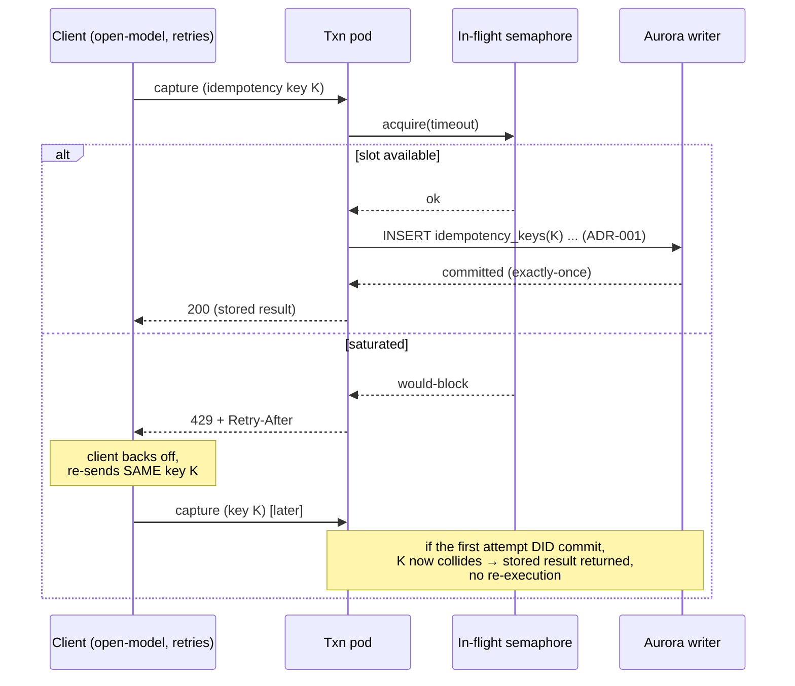

The combination is what makes the storm survivable: the **`429 + Retry-After`** pushes backpressure *back to the client* (turning an open-model arrival pattern into a self-limiting one) instead of absorbing it; **idempotency (ADR-001)** guarantees that whichever retry eventually wins produces exactly-once money movement; and the **bounded semaphore + bounded pool** guarantee the writer only ever sees as much concurrent work as it can safely commit. We shed load at the cheapest possible point (a semaphore check, before a connection is even taken) and we shed it *honestly* — the client is told to retry, not silently dropped. Admission thresholds are tuned against the **measured** single-writer ceiling established in Phase 15, per ADR-007: we do not guess the limit, we measure it and admit just under it.

---

### 8.4 Aurora multi-AZ + the ADR-011 durability choice

Aurora PostgreSQL, one writer + ≥2 readers, readers in the *other two* AZs. Storage is a single logical volume replicated 6 ways across 3 AZs at the storage layer — this is what makes "single write leader, zero data loss on AZ failure" achievable without us building synchronous app-level replication.

**The single-leader model, stated precisely:**

- All writes go to the **cluster writer endpoint**. The Go write-path connection pool targets *only* that endpoint, with the bounded sizing ADR-017 requires. There is one leader; there is never a second.
- All cheap reads go to the **cluster reader endpoint** (round-robins across reader replicas) or to ElastiCache (§8.7, Phase 11). The 15k/sec read tier never touches the writer; the sole writer-side read is the money-confirmation read-your-write carve-out.
- On writer failure, Aurora promotes a reader and repoints the writer endpoint DNS. Pods reconnect on the next pool acquisition. We size the pool's `max_conn_lifetime` and DNS TTL low (e.g. 5s) so failover propagates fast, and the Go client treats a "read-only transaction" / connection error as retryable on a fresh pool member.

#### ADR-011 — Active-active durability: synchronous multi-AZ quorum write

> **(Phase 14 — built and proven against the 20k/5k load in Phases 14–15; the FOLD-over-log invariant framing below is kept from day 1 as cheap correctness insurance.)**
>
> **Decision.** Every money-write is durable across AZs **before ack**. We use Aurora's storage-layer **synchronous quorum** (a write acks only after a write-quorum of the 6 copies, spanning ≥2 AZs, persists). We accept the small inter-AZ RTT tax on every capture in exchange for a **continuously true global invariant** with **RPO = 0 in-region**.
>
> **Why.** ADR-002 says the ledger invariant holds at all times and money captured-but-unbooked is a correctness gap. That guarantee is only real if a committed-and-acked capture *cannot* vanish in an AZ loss. The two honest options were:
> 1. **Single-AZ commit + async replication** — lowest write latency, but a non-zero RPO: an AZ-kill between commit and ship loses acked captures. That turns ADR-002's "continuously true" into "true except across an unbounded failure window," which contradicts the whole money-correctness thesis. **Rejected.**
> 2. **Synchronous cross-AZ quorum (chosen)** — every ack means "durable in ≥2 AZs." RPO = 0 in-region. Cost: the inter-AZ RTT (low single-digit ms within a region) is now on the capture critical path.
>
> **Trade-off accepted.** A few ms added to each capture is cheap relative to a fuel dispense measured in minutes (the domain is not actually latency-starved). We pay latency to keep the invariant *continuous*, which is the project's stated #1 goal. *Rejected:* async single-AZ commit, because a documented RPO on the money core is exactly the kind of "small window of lost money" this architecture refuses elsewhere.
>
> **Interaction with ADR-009 (Phase 16).** ADR-011 makes the *per-shard* commit durable across AZs. It does **not** make cross-shard shared-account posting atomic — that is ADR-009's shard-local-clearing-then-async-sweep problem, a different axis (atomicity across boundaries, not durability within one). The two are orthogonal: ADR-011 = "this shard's commit survives an AZ"; ADR-009 = "the global shared-account view is eventually true within a monitored window."

**The invariant as a fold (kept from day 1).** Today debits=credits is a synchronous-SQL property of one Aurora boundary. To survive the eventual shard-by-pump migration (Phase 16, where shared legs go through ADR-009 clearing accounts), we express it from day 1 as an **associative fold over the ordered `transaction_events` log** (ADR-010): `foldl applyEntry zeroBalance (events ordered by (shard, seq))` must yield Σdebits = Σcredits. This definition is replication-topology-agnostic — it holds whether the log lives in one Aurora cluster or is reassembled across shards plus in-flight sweeps. It is **necessary but not sufficient**: a balanced-but-wrong +500/−500 posting passes it; only the totalizer 3-way reconciliation (ADR-008) catches that. There is **no error budget** on this invariant — any divergence is a sev-1 page.

---

### 8.5 How active-active actually behaves on AZ loss

> **(Phase 14 — the cross-AZ behavior below is exercised in a real multi-AZ AWS environment, not in Compose; see §8.9.)**

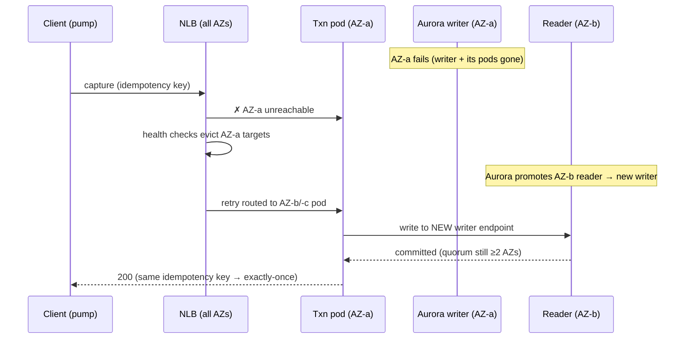

The pieces that make this non-scary:

- **Idempotency (ADR-001) makes failover retries safe.** The client (or the LB-level retry) re-sends the same capture with the same idempotency key. Whether the original committed-then-lost-its-ack or never committed, the unique-constraint insert resolves it to exactly-once. **AZ failover correctness is downstream of idempotency, not a new mechanism** — the same machinery that survives the §8.3 retry storm survives an AZ flip.
- **No split-brain on writes** because there is only ever one writer endpoint; Aurora won't have two writers. Stale pods pointing at the old writer get connection errors (not silent dual-writes) and reconnect to the promoted endpoint.
- **Read tier degrades gracefully, not hard.** Losing an AZ removes one reader; the reader endpoint simply stops routing to it. ElastiCache is multi-AZ with auto-failover. Reads keep flowing.

**Honest RTO/RPO for AZ loss:** RPO = 0 in-region (synchronous quorum, ADR-011), RTO ≈ Aurora failover time (typically tens of seconds) + pod reschedule + LB re-health-check. In-flight captures at the instant of failure either already committed (durable, idempotent retry returns the stored result) or didn't (idempotent retry re-executes cleanly).

---

### 8.6 Warm cross-region DR

DR is a **deliberate, declared, human-initiated** action — not automatic — because a false region-failover is far more dangerous than a few minutes of regional downtime (it risks two regions both believing they're the writer).

- **Data:** Aurora cross-region replica, asynchronously shipped. **RPO target: ≤ 60s** (bounded by replication lag, which is an SLI with an alert). This is the one place we accept a non-zero RPO — a *whole region* dying is rare enough and recovery-coordinated enough that synchronous cross-region replication's latency tax on every write is not worth it. (Contrast ADR-011: cross-*AZ* is synchronous / RPO-0 in-region; cross-*region* is async / bounded-RPO. Different blast radius, different trade-off — and this is **warm DR, not multi-region active-active**.)
- **Compute:** DR EKS cluster kept warm at floor capacity (or core controllers only), GitOps-synced to the same manifests so it's never stale.
- **RTO target: ≤ 30 min**, gated on the runbook.

**Promotion runbook (abridged):**
1. **Declare** the region lost (two on-call approvers; this is a one-way door).
2. **Fence the old region first** — revoke its write path / disable its Aurora writer endpoint to guarantee it cannot resume as a writer (prevents dual-leader on region recovery). Promotion fences the old region *before* anything else proceeds.
3. **Promote** the DR Aurora replica to standalone writer.
4. **Scale up** DR EKS to production capacity (Cluster Autoscaler/Karpenter; pre-pulled images make this minutes, not tens of minutes).
5. **Repoint** global DNS (Route 53 health-checked failover record) to the DR region's LB.
6. **Replay outbox** — any events shipped to DR before the cut resume publishing; idempotent consumers dedupe replays (ADR-001 semantics at the consumer).
7. **Reconcile** post-promotion: run the 3-way reconcile (ADR-008) over the RPO window to surface any transactions lost in the ≤60s tail, flag for manual review.

The DR target is **survive a region** (RPO ≤ 60s, RTO ≤ 30min, human-gated, old-region fenced first), not match in-region RPO. We say so plainly rather than pretend warm DR is zero-loss.

---

### 8.7 The 15k/sec read path is an explicit CQRS read side

> **(Phase 11 — ADR-021: ElastiCache/Redis is introduced *here*, against the MEASURED 15k/sec read requirement — a conscious, ADR-007-compliant retirement of v1's Redis deferral, NOT a speculative add.)**

Of the 20k/sec target, ~15k/sec are cheap cacheable reads (status polls, dashboards, reporting). **None of them touch the Aurora writer.** This is a hard architectural rule, not a tuning preference, and it is what makes the ADR-017 "shed-reads-protect-writes" rule even *possible* — reads and writes ride different infrastructure.

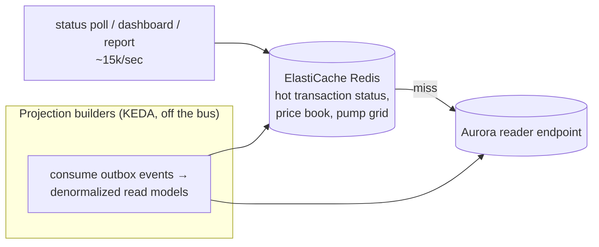

- **Read models are projections**, built by consumers off the same outbox/bus that already exists and the `transaction_events` log (ADR-010). A "transaction status" poll reads a denormalized projection, not a join across the write tables.
- **ElastiCache (Redis)** fronts the hottest reads (current pump/transaction status, price book, forecourt grid). Cache miss falls through to the **Aurora reader endpoint**, never the writer.
- **This is what makes 5k write / 15k read decompose.** The writer only ever carries the ~5k/sec money-writes plus the outbox writes (and the narrow read-your-write carve-out). The read tier scales by adding reader replicas and cache nodes — horizontally, independently, with no contention on the money boundary.
- **ADR-007 still governs.** ElastiCache and the projection consumers are added against the measured 15k/sec read requirement at Phase 11 — not speculatively. They earn their place because the read target is explicit and large; they do not creep into the write path.

---

### 8.8 The outbox is the hidden write-primary bottleneck

The outbox table is on the **write-primary critical path** — every money-write inserts an outbox row in the same transaction (alongside the `transactions` UPDATE and the `transaction_events` append, ADR-010). Under sustained ~5k writes/sec it is a high-churn, insert-then-publish table, and if neglected it becomes the silent ceiling: bloat, autovacuum falling behind, index degradation, and a relay that slowly lags.

The v1 bus is **Amazon Kinesis + a polling outbox relay** (ADR-013 — lean per ADR-007; teaches the outbox pattern without Kafka Connect/Debezium). MSK + Debezium CDC are a deferred, measured-trigger upgrade (when multi-consumer replay depth earns it); the Debezium replication-slot-lag SLI/runbook applies **only after** that MSK upgrade — not now.

Treatment:

- **Aggressive per-partition autovacuum** (`autovacuum_vacuum_scale_factor` driven near 0 with a low threshold) so dead tuples from published-row cleanup don't accumulate.
- **Time range-partition and DROP published partitions (never DELETE).** Partition `outbox` by time; the relay stamps `published_at`, and we **`DROP`/`DETACH` whole published partitions** instead of row-by-row `DELETE` (a `DROP` is instant and bloat-free; mass `DELETE` is the thing that kills these tables). The unpublished/recent partition stays small and hot. A partition is droppable **iff** (a) every row has `published_at` set, **and** (b) `max(created_at)` is past the bus retention horizon, **and** (c) the partition is archived to S3 Parquet — one rule, everywhere.
- **The right SLI is unpublished-row AGE, not count.** A count spike can be benign (a burst); what signals a stuck relay is the **oldest unpublished row's age**. Canonical thresholds: **SLO < 5s @ 99.9%; ticket when p99 > 2s over 10m; PAGE (sev-2) when oldest-age > 30s sustained 2m.** That catches a wedged relay or a poisoned partition — failure modes a row *count* hides. Alert on age; chart count for context.
- **Relay co-located with HA.** The polling relay is leader-elected like the reaper (§8.2) and reconnects to the promoted Aurora writer on failover; its progress is part of what the DR runbook (§8.6 step 6) resumes.
- **PCI scope (ADR-018).** Card PAN is tokenized at the edge/acquirer boundary and **never** enters `transactions`, `ledger_entries`, `transaction_events`, the `outbox`, or the S3 Parquet archive — only `acquirer_ref` is stored. This is what keeps the event archive *out* of PCI scope.

---

### 8.9 Failure-handling matrix

This extends the core failure table with the admission-control, AZ/region, and shard cases. Every "fix" below is an existing mechanism, not a new subsystem — that is the point.

| # | Failure | What happens | Mechanism / ADR |
|---|---|---|---|
| 1 | **Client / network retry** | Idempotency key resolves to the stored result; no re-execution. Same path makes LB-level and AZ-failover retries exactly-once. | `idempotency_keys` unique insert in the same txn (ADR-001). |
| 2 | **Writer overload / retry storm** | In-flight semaphore + bounded pool shed overflow at the edge with `429 + Retry-After`; client backs off; idempotency makes the eventual retry exactly-once. Writer never sees more concurrent work than it can commit. | Admission control (ADR-017): semaphore + bounded pool + shed-reads-protect-writes. |
| 3 | **Acquirer timeout / outage on capture** | Circuit breaker opens, capture leg fails fast (no writer slot held). Transaction **stays `CAPTURING`**; one `saga_log` row records the leg, one reconciler drives `→ CAPTURED` (ledger posted in one txn) or `→ reversal`. | ADR-017 breaker + ADR-005 (acquirer outside ACID) + ADR-012 (one `saga_log` row + one reconciler, schema `PK (txn_id, step)`). |
| 4 | **Dangling preauth** (drive-off / abandoned) | Expiry Reaper (leader-elected singleton, §8.2) finds preauths past the hold window → `EXPIRED` + issues reversal. | Reaper + state machine `HoldTimeout` transition. |
| 5 | **Customer cancels pre-dispense** | `→ VOIDED`, hold released, no capture. | State machine `Cancel` transition. |
| 6 | **Refund / partial refund / post-SETTLED chargeback / subsidy-tax claw-back** | First-class money flows, not exceptions: each posts balanced compensating ledger entries through the same synchronous boundary, idempotently. | ADR-014 (refunds et al. are first-class money flows) + ADR-001/002. |
| 7 | **Consumer poison message** | DLQ policy splits by money-class: **MONEY-MOVING consumers HALT-AND-PAGE** (never skip — skipping silently shorts the global account); **CONVENIENCE consumers (loyalty, analytics) skip-to-DLQ + alert**. KEDA does **not** scale on DLQ depth. | ADR-019 DLQ policy by consumer money-class; bus eventually-consistent only (ADR-006). |
| 8 | **Books vs physical fuel mismatch** | **3-way reconcile**: transaction log vs `ledger_entries` vs independent `totalizer_readings` (ADR-008 — simulator emits independent totalizer readings). Discrepancy → flagged for review, not auto-corrected. The fold invariant (§8.4) is necessary but not sufficient; this is what catches balanced-but-wrong. | Settlement service; reconcile also re-runnable post-DR (§8.6 step 7). |
| 9 | **Partial crash mid-flight** | DB state is always internally consistent (single-txn commits of `transactions` + `ledger_entries` + `transaction_events` + `outbox`). Un-acked work is **re-derived from the committed log** on restart — nothing replayed from volatile memory. `preStop` drain (§8.2) makes the common case graceful; this covers the ungraceful tail. | Outbox + single-txn re-derivation; `transaction_events` log (ADR-010) reconstructs state as-of any point. |
| 10 | **AZ failure** *(Phase 14)* | RPO = 0 in-region. Aurora promotes a reader to writer (single leader preserved); LB evicts dead-AZ pods; `topologySpread` means ~1/3 capacity lost, not 2/3; in-flight requests retried idempotently. | ADR-011 synchronous quorum + ADR-001 + §8.2 spread/PDB. |
| 11 | **Region failure** | Human-declared DR promotion: fence old region first, promote DR replica, scale DR EKS, repoint Route 53, replay outbox, reconcile the RPO tail. RPO ≤ 60s, RTO ≤ 30 min, human-gated. | Warm cross-region DR runbook (§8.6). |
| 12 | **Clearing sweep-lag breach** *(Phase 16, deferred — built only against a measured ceiling per ADR-007)* | Shared legs (cash-clearing, fuel-revenue, subsidy-receivable, tax-payable) post to a **shard-local clearing account**, swept async to the global (striped, ADR-020) account. A tripwire alerts on sweep lag = age of oldest unswept entry (`EXTRACT(EPOCH FROM now() - MIN(occurred_at)) WHERE swept_at IS NULL`). Canonical thresholds: **SLO < 60s @ 99.9%; ticket > 60s; PAGE (sev-2) > 300s sustained 5m.** Money-moving sweep consumers HALT-AND-PAGE (ADR-019), never skip-to-DLQ. The fold invariant (§8.4) still holds globally including in-flight clearing; the alert means the *monitored window* widened, not that money is lost. | ADR-009 shard-local clearing + async sweep + lag tripwire; consistency is "synchronous per-shard, eventually-true globally within a monitored window." Legally-binding documents (ADR-015) carry the shard-local synchronous figure and never wait for the sweep. |

Two cross-cutting notes:
- **Rows 1, 2, 9, 10 are the same idea applied at different blast radii:** never trust an ack you didn't get, make every retry idempotent and bounded, and re-derive truth from the committed log. AZ failover (10) is just client-retry (1) with a bigger trigger; the retry storm (2) is client-retry at scale, handled by ADR-017.
- **Rows 11 and 12 are the two places we openly hold a non-zero window** (DR RPO; sweep lag) — and both are *monitored windows with alerts at the canonical thresholds*, consistent with ADR-009/011/019 rather than hidden assumptions.

---

### 8.10 The Docker / dev story (prod ↔ local parity)

The same container images run in local dev and in prod. What changes is **only the endpoints behind interfaces**, never the application code or the image.

| Concern | Local dev | Production |
|---|---|---|
| Orchestration | **Docker Compose** | **EKS** (same images, K8s manifests) |
| Postgres | Postgres container | **Aurora PostgreSQL** (multi-AZ, ADR-011, Phase 14) |
| Bus / DLQ | **LocalStack** (Kinesis) | **Kinesis** + polling outbox relay (ADR-013) |
| Object store | **LocalStack S3** | **S3** (incl. outbox Parquet archive) |
| Cache (read side) | Redis container | **ElastiCache** (Phase 11, ADR-021) |
| Autoscaling | n/a (fixed compose scale) | **HPA (writers) + KEDA (consumers only)** |
| Admission control | **same code path** (semaphore + bounded pool + breaker) | **same code path** |

Why this duality is worth maintaining:

- **Same image, prod and local** — the artifact you load-test and fuzz against the simulator is bit-for-bit the artifact you deploy. No "works in the container, breaks in EKS" class of bug, because it is the same container. Critically, **ADR-017's admission control is in the application code**, so the retry-storm behavior you exercise locally is the exact behavior that runs in prod.
- **LocalStack is for correctness, not throughput** — validate the outbox→bus→consumer path and the failure-matrix *behaviors* locally at modest volume; run the actual 20k/sec (5k-write/15k-read) throughput test against the **synchronous core on real local Postgres**, because LocalStack will not sustain the async top end and would mislead the numbers.
- **AWS edges sit behind narrow Go interfaces** (a `Publisher`, an `ObjectStore`, a `Cache`), with a LocalStack-backed impl and an AWS-backed impl. This is the seam that lets the prod/local split exist without `if env == "prod"` scattered through the money code — the write path doesn't know or care which AZ, region, or backing service it's on.
- **Compose models the topology, not the scale** — one of each dependency so a developer can exercise every failure-matrix row (kill the bus, kill the DB, inject acquirer latency, *flood the writer to trip the semaphore*) on a laptop. It deliberately does **not** model 3 AZs; AZ/region behaviors (§8.5–8.6, Phase 14) are validated in a real multi-AZ AWS test environment, because faking AZ failure in Compose would test the fake, not the system. The MYR-only stance (ADR-016) means no currency field complicates any of these flows; multi-currency would re-enter only as an explicit per-leg currency column plus FX-account postings, and only against a real requirement.

---

## Reporting & Analytics

Reporting is **not** a money concern, so by ADR-006 it lives entirely on the eventually-consistent plane. The discipline that makes this section work is one rule, stated once and never violated:

> **No report ever queries the Aurora money-write primary.** Every number on every dashboard, EOD pack, tax export and subsidy claim is served from a **read-side CQRS projection** folded off the event stream. The writer's only reporting obligation is to emit events durably (it already does, via `outbox` + `transaction_events`).

This is the explicit CQRS read-side from the locked decisions: read-side and CQRS **only**, never in the money write path. The write model (`transactions`, `ledger_entries`, append-only `transaction_events`) is optimized for correctness under contention; the read model is optimized for fan-out, slice-and-dice, and cheap re-derivation. They share *events*, not *tables*. And reports specifically never need read-your-write — the only read-your-write carve-out on the writer is the narrow money-confirmation read at capture time (locked decisions). A report is, by definition, a fold over the *past*; it has no business touching the writer.

### 1. Where reporting sits in the topology

```mermaid
graph LR
  subgraph write["Money write plane (ACID, never queried for reports)"]
    PG[("transactions<br/>ledger_entries (append-only)<br/>transaction_events (ADR-010)<br/>outbox")]
  end

  subgraph bus["Event plane"]
    KIN["Kinesis (ADR-013)<br/>partition_key = pump_id"]
    DLQ["DLQ (ADR-019)"]
  end

  subgraph hot["Hot read-side (seconds-fresh)"]
    PROJ["Projection workers (Go)<br/>idempotent, replayable"]
    RR[("Aurora readers<br/>operational projections")]
    EC["ElastiCache/Redis<br/>dashboard counters (ADR-021)"]
  end

  subgraph cold["Warehouse read-side (minutes/hours-fresh)"]
    S3DL[("S3 data lake<br/>raw events + Parquet")]
    GLUE["Glue / Spark<br/>denormalized marts"]
    ATH["Athena<br/>SQL marts (default)"]
    RS["Redshift<br/>(gated fallback)"]
  end

  subgraph consumers["Report modules"]
    EOD["EOD settlement & batch close"]
    SALES["Sales/volume by grade·pump·site·shift"]
    RECON["3-way reconciliation & variance"]
    FIN["Trial balance (fold)"]
    FRAUD["Fraud / exception"]
    REG["MyInvois · SST · RON95 subsidy"]
    BI["BI dashboard"]
  end

  PG -.->|outbox relay (poll)| KIN
  KIN -.-> PROJ
  KIN -.->|firehose / sink| S3DL
  KIN -.-> DLQ
  PROJ --> RR
  PROJ --> EC
  S3DL --> GLUE --> ATH
  ATH -.->|only against a measured cost ceiling| RS

  RR --> EOD & SALES & RECON & FRAUD
  EC --> BI
  ATH --> SALES & FIN & REG & BI
```

Two read tiers, chosen by freshness need, **not** by report importance:

- **Hot tier** — Go projection workers consume the Kinesis stream (ADR-013) and maintain denormalized tables in **Aurora readers** plus counters in **ElastiCache/Redis**. This serves the measured ~15k/sec cacheable read path (status polls, live forecourt dashboards, operational EOD progress) **off readers/cache, never the writer**. Seconds of staleness.
- **Cold tier** — the stream is also sunk to an **S3 data lake** (Kinesis Data Firehose, or an outbox-relay sink) as raw append-only event Parquet, partitioned `dt=/site_id=/grade=`, catalogued in **Glue**, and queried by **Athena**. **S3 + Athena is the default warehouse**: it is serverless, cheap-at-rest, replayable, and audit-grade, and it scales with the lake rather than with a provisioned cluster. Minutes to hours of staleness.

**On Redshift — gated fallback, not a default.** We do **not** stand up a provisioned Redshift financial mart speculatively; that would violate ADR-007 (add infrastructure only against a *measured* bottleneck). Redshift enters **only** when a specific cold-tier workload demonstrably outgrows Athena economics — e.g. a high-concurrency BI mart whose per-query Athena scan cost, measured, exceeds a reserved-cluster break-even. Until that measurement exists, every mart in this section materializes as partitioned Parquet over Athena. The trigger is a number, not a preference.

**ElastiCache is also a gated add (ADR-007 → ADR-021).** v1 of the core doc *deferred* Redis on purpose (ADR-007). The CQRS read-side cache is **not** that deferral being quietly reversed on a hunch — it is its **conscious retirement at Phase 11, against the MEASURED 15k/sec read requirement** (ADR-021). The reasoning is explicit and on the record: 15,000 cacheable reads/sec is the locked read-tier target, it is the dominant cost on the read path, and a counter/tile cache is the cheapest thing that satisfies it without touching the writer. That measurement is the entry ticket; absent it, the hot tier is Aurora readers alone.

`local dev = Docker Compose + LocalStack` mirrors this exactly, same images as prod: Kinesis for the bus, S3 for the lake, DuckDB-over-Parquet standing in for Athena, plain Postgres for the reader projections, Redis for ElastiCache. The prod/local duality from the locked decisions holds — only managed-vs-local engines swap.

### 2. The append-only event stream is the substrate (ADR-010)

ADR-010 gives reporting its foundation. In the *same* money transaction that mutates the `transactions` row (version-CAS) and writes the `outbox` row, we also append `transaction_events (txn_id, seq, event_type, payload jsonb, occurred_at)`. That row is the **canonical, ordered, causal history** of every sale.

This is not free, and the section owes that honesty (ADR-010): it costs extra WAL on the hot write path and creates a drift-detection burden between the event log and the version-CAS aggregate; `jsonb` defers — does not eliminate — schema governance. We pay it because reporting's substrate is worth a single clean source of truth.

For reporting this is decisive:

- The lake's raw layer is just `transaction_events` (and ledger-entry events) streamed out — already append-only, already ordered per `txn_id` by `seq`, already partitioned per pump on the bus by `partition_key = pump_id` (ADR-013). No CDC of mutable tables, no fighting with `UPDATE`s, no "did I capture the intermediate state" gaps.
- Every projection is a **left fold over this ordered log**: `state₀ → applyEvent → state₁ → … → stateₙ`. This is the same fold that computes the ledger invariant (§6). Projections and the debits=credits invariant are the *same shape of computation* over the *same log* — which is why both survive a future shard-by-pump migration: a fold over an ordered log doesn't care whether the log was one shard or sixteen, as long as per-`txn_id` order is preserved (it is — `partition_key = pump_id`).

### 3. Projections are rebuilt by replay (the operational superpower)

Because projections are pure folds over an immutable log, a projection is **disposable**. This is the single most valuable property of the whole read side:

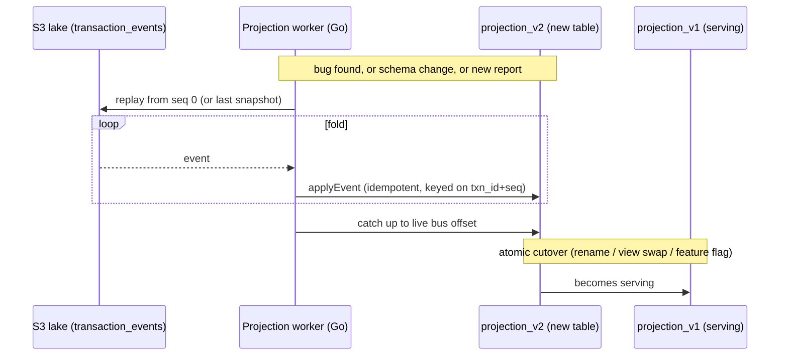

Rules that make replay safe:

- **Idempotent apply.** Each event carries `(txn_id, seq)`; the projection upserts keyed on that pair, so replaying an already-applied event is a no-op. Same discipline as ADR-001's idempotency, one tier out. A duplicate bus delivery and a full replay are indistinguishable to the projection — both converge to the same state.
- **Snapshot + tail.** Cold projections checkpoint a snapshot (e.g. daily Parquet marts in S3) and replay only the tail since the last snapshot offset, so a rebuild is bounded by retention-since-snapshot, not all-time history.
- **Shadow-and-cutover.** A new report version is built in a shadow table from replay, validated against the live one, then swapped atomically. No money-path involvement, no downtime, no migration of the write model.
- **Honest trade-off:** replay cost scales with event volume and lake retention. We bound it with snapshots and partition pruning, and accept that a full-history rebuild of a year-old high-cardinality mart is a *minutes-to-hours* batch job — fine, because nothing money-defining waits on it.

### 4. Time-travel / as-of reporting (ADR-010)

`transaction_events` makes "reconstruct state as-of T" a first-class, near-zero-cost query rather than a forensic project. To answer *"what did the books say at 14:03:00 on the day of this chargeback?"* you fold the event log up to `occurred_at ≤ T` and stop. No mutable history to mistrust, no "we overwrote the row." This directly serves ADR-014's first-class refund / partial-refund / post-`SETTLED` chargeback / claw-back flows: each compensating money flow is reconstructed against the exact state it acted on.

Concretely:

- **As-of a transaction** — `SELECT … FROM transaction_events WHERE txn_id = ? AND seq <= ? ORDER BY seq` then fold. Full causal replay of one sale for a **MyInvois dispute** or **acquirer chargeback**.
- **As-of a wall-clock T** — partition-pruned Athena scan `WHERE occurred_at <= T`, fold per aggregate. Powers **subsidy audits** ("prove the RON95 volume claimed for date D used the gazetted price in force at dispense time") and point-in-time trial balances (§6).
- **Bitemporal honesty** — we keep both `occurred_at` (business time) and the event's ingest/bus-arrival time (system time). Late-arriving events (offline forecourt store-and-forward) can land with an old `occurred_at`; as-of-business-time and as-of-system-time are *different questions* and both are answerable. This is the audit property regulators actually want.

### 5–11. The report modules

Each module is a projection family. Storage and a **freshness SLO** are named per class; the SLO is the contract, measured as **event lag** (now − latest applied `occurred_at`), the same SLI family as outbox age in §13.

#### 5. End-of-Day settlement & batch close

The reporting *view* of the Settlement Service, not a re-implementation. Settlement still does the authoritative batch close and writes the file to S3; the reporting module projects **batch-close progress and outcome**: per-batch totals by tender (card/cash/mobile/fleet), acquirer-batch acceptance, open vs closed shifts, unsettled-`CAPTURED` aging.

- **Storage:** Aurora reader (live close progress) + S3/Athena (the immutable EOD pack: PDF/CSV settlement summary alongside the raw settlement file).
- **Freshness SLO:** operational close view **≤ 30 s**; the signed EOD financial pack **≤ 15 min after batch cutover**.
- **Trade-off:** the report shows close *progress* continuously, but "the day is closed" is asserted only by the Settlement Service's authoritative run — the dashboard never declares closure on its own.

#### 6. Financial / ledger reports — trial balance as a fold

The marquee fold. Trial balance = group the ledger-entry event stream by `account`, sum `DEBIT` as positive and `CREDIT` as negative (in minor units, MYR sen — ADR-016, MYR-only), and assert the grand total is zero.

```
trialBalance(events) =
  events
    |> filter(isLedgerEntry)
    |> groupBy(.account)
    |> foldEach((acc, e) => acc + signed(e.direction, e.amount_minor))
  -- global invariant: Σ over all accounts == 0
```

This is the **debits=credits invariant expressed as an associative FOLD over the ordered log**, not a synchronous `SUM` against the writer. The canonical framing applies in full: the invariant has **no error budget — it is always a sev-1 page** — and it is **necessary but not sufficient**. A balanced-but-wrong `+500 / −500` posting passes the fold; only the totalizer 3-way reconciliation (§8, ADR-008) catches that. We keep this fold framing **from day one** as cheap correctness insurance, because it composes across shards the moment we ever need to shard.

> **(Phase 16, deferred — built only against a measured ceiling per ADR-007.)** Everything in this call-out is **DO NOT BUILD until Phase 15 measures the single-writer ceiling.** Under ADR-009's cross-shard shared-account posting, the *per-shard* trial balance is continuously balanced, but the *global* trial balance carries a documented sweep window: shard-local **clearing** accounts (cash-clearing, fuel-revenue, subsidy-receivable, tax-payable) hold legs not yet swept to their global counterparts. The reporting trial balance then presents a **two-line clearing trial balance** per swept account — `…-clearing (in-flight)` and `…-global (swept)` — whose sum is the true position. This makes ADR-009's "synchronous per-shard, eventually-true globally within a monitored window" *visible in the report itself*, not hidden. The Phase-16 **clearing sweep-lag tripwire** annotates the report: a non-zero clearing balance older than its SLA is flagged, never silently summed away. The sweep-lag SLI is the canonical one — age of oldest UNSWEPT entry, `EXTRACT(EPOCH FROM now() - MIN(occurred_at)) WHERE swept_at IS NULL`, SLO < 60s @ 99.9%, ticket > 60s, PAGE (sev-2) > 300s sustained 5m — and it exists **only in Phase 16**. None of this two-line machinery exists in the v1 single-writer report; there, one global trial balance line per account is correct and sufficient.

- **Storage:** Athena over partitioned Parquet for period trial balance, GL detail, account ledgers, snapshotted daily; Athena for as-of-T point-in-time trial balance via the §4 fold. (Redshift only if this mart's measured Athena cost crosses the §1 break-even.)
- **Freshness SLO:** intraday trial balance **≤ 5 min**; period-close GL **≤ 30 min after EOD**; as-of-T historical **on-demand (batch)**.

#### 7. Sales / volume by grade · pump · site · shift

The high-fan-out operational projection and the bulk of the 15k/sec read path. A Go worker folds capture/complete events into a denormalized fact table keyed by `(site_id, pump_id, grade, shift_id, hour)` with `volume_ml`, `gross_minor`, `tender_mix`, `txn_count`.

- **Storage:** **ElastiCache** (ADR-021) for live tiles (current-shift litres, $/grade, throughput) refreshed by the worker — the cacheable read served off the hot tier; **Aurora reader** for drill-down by shift/cashier; **Athena** for historical trend and cross-site rollups.
- **Freshness SLO:** live forecourt tiles **≤ 5 s**; shift/cashier drill-down **≤ 1 min**; historical rollups **≤ 15 min**.
- **Why it scales:** pumps are independent (ADR-004), events are pump-partitioned, so this projection parallelizes per partition with no cross-pump contention — the read side inherits the write side's sharding cleanly.

#### 8. Three-way reconciliation & variance (ADR-008)

The correctness heart of reporting, and the part the trial-balance fold can't do alone (§6). Reconcile the **three independent truths** so they cannot collude:

1. **Transaction log** — `transaction_events` (what we *intended*: captured amounts/volumes).
2. **Ledger** — `ledger_entries` events (what we *booked*).
3. **Totalizer** — `totalizer_readings`, the independent forecourt-controller stream (what *physically* flowed), which by ADR-008 derives from *different writes*.

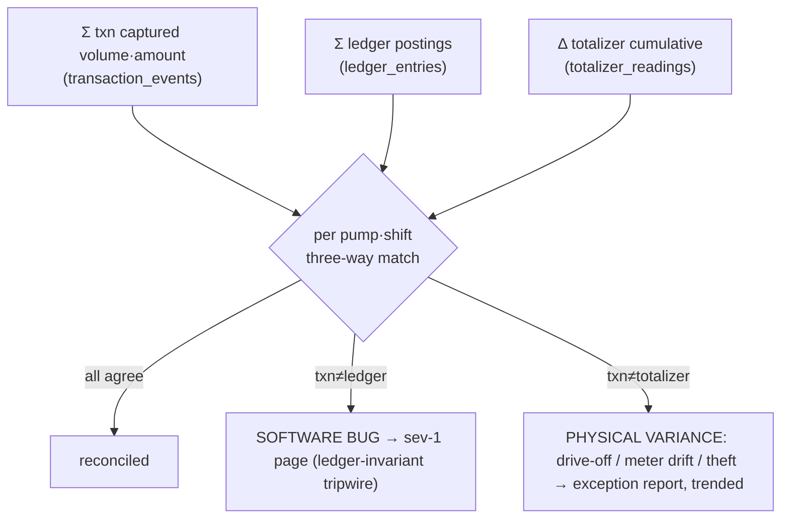

Two variance classes, deliberately separated because they mean different things — this split *is* the value of the report:

- **txn ≠ ledger is a SOFTWARE defect** (we booked something other than what we captured). This is the ledger-invariant tripwire of §6 / §13 — **no error budget, sev-1 page**, should be ~always zero.
- **txn ≠ totalizer is a PHYSICAL-WORLD variance** (drive-off, meter drift, evaporation, shrinkage, theft) — expected small-but-nonzero, trended not paged, and feeds the fraud module (§9).

Keeping these two on separate tracks is what stops a physical drive-off from paging an on-call engineer at 3am, and stops a posting bug from being shrugged off as "probably evaporation."

- **Storage:** Aurora reader (per-shift recon worksheet, exception queue) + Athena (historical variance trend, meter-drift-over-time per pump).
- **Freshness SLO:** per-shift reconciliation **≤ 2 min after shift close**; daily site reconciliation **≤ 15 min after EOD**.

#### 9. Fraud / exception reports

A projection that folds the event stream into behavioral counters per pump, cashier, shift, card BIN, and fleet account, flagging:

- **Drive-offs** — `AUTHORIZED`/`DISPENSING` → `EXPIRED` with totalizer movement but no capture (cross-checked against §8's txn≠totalizer variance).
- **Excessive reversals** — reversal rate per cashier/pump above a baseline (`REVERSED`/`Reverse` events; these are first-class money flows under ADR-014).
- **Decline clustering** — `DECLINED` bursts per BIN/terminal (skimming, BIN attack, terminal fault).
- **Velocity / fleet anomalies** — same fleet card across implausible sites/times.

> **PCI scope (ADR-018):** these fraud projections key on `acquirer_ref` and **tokenized** card references only. The card PAN is tokenized at the edge/acquirer boundary and never enters `transaction_events`, the outbox, or the S3 Parquet archive — so the entire reporting lake stays **out of PCI scope**. BIN-level clustering uses the non-sensitive BIN prefix carried on the token, never a full PAN.

- **Storage:** ElastiCache sliding-window counters (live velocity rules) + Aurora reader exception queue + Athena (historical pattern mining, baseline computation).
- **Freshness SLO:** live velocity alerts **≤ 10 s** (the one report class where staleness has real cost — a skimming run must trip fast); analytical fraud reports **≤ 1 h**.
- **Trade-off:** live rules run on the seconds-fresh hot tier and accept some false positives; precise baselines are recomputed on the cold tier where completeness beats latency.

#### 10. Regulatory — MyInvois e-invoice, SST/tax, RON95 subsidy

The reports with legal teeth, and the strongest argument for the ADR-010 audit trail. **ADR-015 governs this entire module** and splits it cleanly in two by latency class:

**Real-time, never waits for the sweep — MyInvois e-invoice.** A legally-binding e-invoice carries the **shard-local SYNCHRONOUS figure** (ADR-015): the per-shard number is correct per-shard and available *immediately*, so the e-invoice **never blocks on the async global sweep**. It projects per-sale e-invoice payloads (LHDN/IRBM MyInvois format) from `transaction_events`. Because each sale's full causal history is replayable (§4), a dispute or rejected submission is reconstructed **exactly as-of submission time**, not approximated. Submission state (submitted/validated/rejected/cancelled) is itself an idempotent projection with retry + DLQ. The 5-minute SLO below is a regulator-submission-window obligation that the shard-local figure can always meet because it has no cross-shard dependency.

**Batch, may wait for a sweep-complete checkpoint — SST/tax and RON95 subsidy.**

- **SST / tax reporting** — period tax liability folded from ledger `tax-payable` postings. As a *batch period* document, an SST return cut during an unswept window would understate the global account, so the period SST pack is generated **only after a sweep-complete checkpoint** for the period. (Per-shard SST figures, where a per-shard legally-binding artifact is needed intraday, follow the MyInvois rule and use the shard-local synchronous figure — ADR-015.)
- **RON95 subsidy claims** — the per-litre subsidy fold: for each claim period, `Σ subsidized_litres × gazetted_rate_at_dispense_time`. This **requires** as-of-business-time (§4): the rate in force is keyed to dispense `occurred_at`, and the once-at-line-item-finalization rounding rule means the claim must fold the *finalized* line items, never recompute from estimates. The independent totalizer (ADR-008) is the corroborating volume truth that makes a subsidy claim defensible against audit. The subsidy claw-back path (ADR-014) folds the same way, against the as-of state. As a batch statutory pack, it is likewise generated **only after a sweep-complete checkpoint**.

> **(Phase 16, deferred — built only against a measured ceiling per ADR-007.)** The "sweep-complete checkpoint" gate, and the tripwire that *blocks* batch SST/subsidy-pack generation when sweep lag exceeds its threshold, exist **only after the Phase-16 clearing sweep is built**. In the v1 single-writer world there is no sweep, no clearing window, and therefore no checkpoint to wait on — the batch packs fold directly off the one global ledger. The principle to bank now is the *policy*: a real-time legally-binding artifact (MyInvois) takes the shard-local synchronous figure and never waits; a batch statutory pack waits for global consistency. Better to delay a pack than file an imbalanced claim.

- **Storage:** S3 (immutable submitted e-invoice artifacts + subsidy claim packs, WORM / Object-Lock for retention) + Athena (period tax/subsidy marts and audit as-of-T). Redshift only if a specific tax/subsidy mart's measured Athena cost crosses the §1 break-even.
- **Freshness SLO:** **MyInvois e-invoice generation ≤ 5 min after capture** (shard-local synchronous figure, never sweep-gated); SST period reports **≤ 1 h after period close** (post sweep-complete checkpoint, Phase 16); subsidy claim packs **batch, on the statutory claim cycle** (post sweep-complete checkpoint, Phase 16).

#### 11. Business-intelligence dashboard

The executive read surface: site rankings, grade margin, peak-hour throughput, loyalty redemption, tender mix, fuel-vs-c-store basket. Pure consumer of the projections above — it owns no new truth, and as a CONVENIENCE consumer (ADR-019) its DLQ policy is skip-to-DLQ, never halt-and-page.

- **Storage:** ElastiCache (live KPI tiles, ADR-021) over Aurora-reader / Athena marts; QuickSight or the custom forecourt dashboard as the embed surface. (Redshift only against the §1 measured BI-concurrency trigger.)
- **Freshness SLO:** live KPI tiles **≤ 30 s**; analytical BI **≤ 1 h** — and explicitly *not* tighter, because nothing here is operationally time-critical and chasing seconds-freshness on BI wastes the hot tier on low-value reads.

### 12. Freshness SLO summary

| Report class | Hot/Cold | Storage | Freshness SLO (measured as event lag) |
|---|---|---|---|
| Live forecourt / sales tiles | Hot | ElastiCache + Aurora reader | ≤ 5 s |
| Fraud live velocity | Hot | ElastiCache | ≤ 10 s |
| EOD close progress | Hot | Aurora reader | ≤ 30 s |
| BI KPI tiles | Hot | ElastiCache | ≤ 30 s |
| Shift drill-down / sales | Hot | Aurora reader | ≤ 1 min |
| 3-way reconciliation (per shift) | Hot | Aurora reader | ≤ 2 min |
| Intraday trial balance | Warm | Athena | ≤ 5 min |
| **MyInvois e-invoice** | Warm | S3 + projection | **≤ 5 min (shard-local synchronous figure, never sweep-gated — ADR-015)** |
| EOD financial pack | Cold | S3/Athena | ≤ 15 min after cutover |
| Historical sales / recon / GL close | Cold | Athena | ≤ 15–30 min |
| SST / tax period | Cold | Athena | ≤ 1 h (post sweep-complete checkpoint — Phase 16) |
| Analytical fraud / BI | Cold | Athena | ≤ 1 h |
| RON95 subsidy claim pack | Cold | S3 + Athena | Batch, statutory cycle (post sweep-complete checkpoint — Phase 16) |
| As-of-T time-travel (any) | Cold | Athena over lake | On-demand batch |

Redshift is absent from this table on purpose: it is a **gated fallback** (§1), materialized for a specific mart only when that mart's measured Athena cost crosses the reserved-cluster break-even.

### 13. The outbox is the hidden bottleneck this whole section leans on

Every report above is downstream of the outbox relay, so **outbox health is a reporting SLI, not just a write-path SLI**. The outbox is the hidden write-primary bottleneck. If the relay stalls, *all* freshness SLOs miss simultaneously and silently — reports keep serving, just stale. Therefore, using the canonical thresholds verbatim:

- **SLI on unpublished-row AGE, not count.** A backlog of 10k rows clearing fast is fine; one row stuck is the signal. The SLI is `now − min(created_at) WHERE published_at IS NULL`, and it is the **leading indicator for every freshness SLO in §12**. Canonical SLO: **< 5s @ 99.9%**; ticket when **p99 > 2s over 10m**; **PAGE (sev-2) when oldest-age > 30s sustained 2m**.
- **Time range-partition `outbox`, and DROP published partitions** (never `DELETE`) so the relay's `WHERE published_at IS NULL` scan stays cheap and bloat-free, with **aggressive per-partition autovacuum** on this high-churn table. A partition is droppable **IFF** (a) every row has `published_at` set, **and** (b) `max(created_at)` is past the bus retention horizon, **and** (c) the partition is archived to S3 Parquet — the same one drop-safety predicate used everywhere.
- **`transaction_events` is append-only and never updated**, so it has none of the outbox's bloat problem — but it *is* the lake's source, so its relay/sink lag is the second reporting SLI to watch alongside outbox age.

> **On Debezium / replication-slot-lag:** v1's bus is **Kinesis + a polling outbox relay** (ADR-013) — the outbox-age SLI above is the one that applies. The MSK + Debezium CDC upgrade is a deferred, measured-trigger change (earned only when multi-consumer replay depth justifies it); the Debezium replication-slot-lag SLI and its runbook apply **only after** that MSK upgrade, not to the v1 relay.

If those two lags are green, every report in this section is within SLO. If either is red, no projection can be fresher than the lag — and the dashboards say so, rather than lying.

---

## The Scale Story: Path to 20k/5k

The headline is **20,000 req/sec sustained (~1.2M/min)**. Taken at face value that number lies to you, because it bundles two workloads with nothing in common except a load balancer. The whole point of this section is to refuse the bundled number and tell the staged, honest story underneath it: what each phase actually costs, where the single-primary cliff is, and exactly what we pay to cross it.

We rejected 1M/sec deliberately (it is forecourt-physics nonsense — see §7). 20k is the number we defend.

### Request ≠ transaction (decompose the 20k)

A single fuel sale is not a single request. It is `authorize → (poll, poll, poll…) → complete → capture`, plus a dashboard somewhere refreshing a forecourt grid and a reporting query for the shift manager. The polls and the grid and the report **dominate the request count** and **define none of the money**.

So the 20k splits cleanly along the only axis that matters — *does this request mutate the ledger?*

| Class | Rate | What it is | Where it is served |
|---|---|---|---|
| **Money-writes** | ~5,000/sec | `authorize`, `capture`, `void`, `reverse` — every state transition that touches `transactions` + `ledger_entries` + `transaction_events` + `outbox` | **Write primary only** (one Aurora writer per shard) |
| **Cacheable reads** | ~15,000/sec | status polls, forecourt-grid refresh, dashboards, reporting, ledger explorer | **CQRS read-side** — readers / ElastiCache / projections, **never the writer** |

```mermaid
graph LR
  GW["API Gateway<br/>classifies on route + verb"]

  subgraph wr["WRITE path (~5k/s) — the hard problem"]
    TXN["Transaction Service"]
    WRITER[("Aurora WRITER<br/>single primary per shard")]
  end

  subgraph rd["READ path (~15k/s) — trivially scalable"]
    RSVC["Read / Query Service"]
    CACHE[("ElastiCache<br/>status, grid")]
    REPL[("Aurora READERS<br/>+ denormalized projections")]
  end

  GW -->|"POST authorize/capture/void"| TXN --> WRITER
  GW -->|"GET status/grid/report"| RSVC
  RSVC --> CACHE
  RSVC --> REPL
  WRITER -.->|"outbox → bus → projector"| REPL
```

**This split is the single highest-leverage move in the entire scale story.** If polls hit the writer, you have a 20k-write problem and you will fail. If they hit readers and cache, you have a 5k-write problem and a 15k-read problem — and the 15k-read problem is *easy* (it is stateless fan-out over readers; add nodes). Everything below is therefore about the 5k writes.

The one carve-out: the **only** reads allowed on the Aurora *writer* are the narrow money-confirmation read-your-write reads (a client confirming its own just-committed capture). Every one of the 15k cacheable reads and every report goes to readers/cache — never the writer. That carve-out is a hard rule, not a guideline: the moment a dashboard query "just this once" hits the writer, the 5k-write budget starts leaking.

> **The headline-number discipline:** never let a cheap read inflate the number you optimize against. The contended, fsync-bound, correctness-critical thing is the 5k writes. That is where all the attention goes.

### Why a single Aurora primary does low-tens-of-thousands write-TPS — and where the cliff is

One capture is *not* one row-write. Count what a single `capture` commits inside one ACID boundary:

1. `UPDATE transactions … WHERE id=? AND version=?` — the optimistic CAS (§4)
2. `INSERT idempotency_keys` — the dedupe claim, same txn (ADR-001)
3. `INSERT ledger_entries` (debit leg)
4. `INSERT ledger_entries` (credit leg) — *minimum* two; subsidy/tax legs push this to 3–4
5. `INSERT transaction_events` — the append-only causal record (ADR-010), in the same txn
6. `INSERT outbox` — the event to publish (ADR-002)
7. **plus index maintenance** on every one of those: the partial unique index on `transactions` (ADR-004), the unique index on `idempotency_keys`, the outbox relay's `(published_at, id)` index, FK indexes on `transaction_events`

That is realistically **6–10 row-writes + B-tree updates per capture, terminated by one fsync** (group-commit amortizes the fsync across concurrent committers, which is exactly why we *want* concurrency here — but WAL still has to hit durable storage before ack).

So the arithmetic that sets the ceiling is not "5,000 transactions/sec" — it is **5,000 × ~8 = ~40,000 row-mutations/sec, each fsync-gated and index-maintained, on one writer.** A well-tuned Aurora `db.r6g/r7g` writer does **low-tens-of-thousands write-TPS**; at 5k captures/sec we are deliberately operating *inside* that envelope, not at its edge — but the headroom is finite and the cliff is real.

**Where the cliff is — three failure modes, in the order you hit them:**

- **WAL / fsync throughput.** Past the group-commit sweet spot, commit latency climbs and the writer's IOPS saturate. This is the *floor* of the cliff — it is a hardware-and-write-amplification wall, not a tuning bug.
- **Hot-row serialization** on any shared counter-account. **This one we already removed** — see next subsection — but it is worth naming because it is the cliff people hit *first* and mistake for the fsync cliff.
- **The outbox table itself** becoming the hidden write-primary bottleneck (its own subsection below). Every write path goes through it; it is the one table that *all 5k/sec* touch.

Vertical scaling buys you the first doublings cheaply (bigger writer, faster NVMe-backed storage, more provisioned IOPS) — and that is genuinely the right first move. But it asymptotes. One writer is one writer.

### Admission control keeps the cliff from being a cliff (ADR-017)

The fsync ceiling above is not approached gracefully by default — under an idempotency-deduped retry storm, a flaky acquirer plus client retries can pile far more than 5k in-flight captures onto the writer and melt it past the cliff. So the write tier is admission-controlled, not just sized:

- a **bounded in-flight semaphore** on the money path caps concurrent captures at the writer's healthy envelope — excess requests wait or shed rather than dogpile WAL;
- an **acquirer circuit breaker** stops feeding a dependency that is already failing (the source of most retry storms);
- **shed-reads-protect-writes**: under pressure we return `429 + Retry-After` on writes before the writer browns out, and reads (already off the writer) are the first thing dropped.

This is why "5k sustained" is a number the writer holds *under adversarial load*, not just on a clean bench run.

### The append-only ledger removes the hot-row ceiling (ADR-003)

The naive version of cliff #2 above: every capture does `UPDATE account_balances SET balance = balance + ? WHERE account='fuel_revenue'`. That single row serializes **every concurrent capture in the system** behind one row lock. It does not matter how many writer cores you have; throughput on that account is `1 / row-lock-hold-time`. That is the true ceiling, and it bites at hundreds of TPS, not tens of thousands.

ADR-003 deletes the row. `ledger_entries` is **append-only**: a capture *inserts* its debit and credit legs and never touches a shared mutable balance. Inserts to an append-only table do not contend — they land at the tail, each transaction touches its own rows. Balances become a `SUM` (or a periodic snapshot, or N striped sub-balances summed on read). **This is what makes ADR-002's synchronous posting affordable at 5k/sec:** "post the ledger inside the capture txn" and "sustain 5k captures/sec" only stop fighting because the post is a contention-free insert, not a hot-row update.

**Express the invariant as a fold, not a SQL property.** Today `Σ debits = Σ credits` reads like a property of the current table. The honest framing — the one that survives any future shard-by-pump migration — is:

> The balance of any account is a **left-fold over its ordered entry log**: `balance = foldl (+/-) 0 entries`. The debits=credits invariant is `fold(all_debits) == fold(all_credits)` over the union of all logs.

This invariant carries **no error budget — it is always a sev-1 page**. We keep this fold framing from day 1 precisely because it is cheap correctness insurance and it is what lets the *same statement* re-evaluate over a distributed log later, with no redefinition. (This is the safe half of event-sourcing, and ADR-010's `transaction_events` is the same idea applied to the aggregate: full causal history at near-zero marginal cost, because we are already paying for the outbox insert in the same txn.)

One caveat stated up front: the fold invariant is **necessary but not sufficient**. A balanced-but-wrong `+500 / −500` posting passes it cleanly. Only the totalizer three-way reconciliation (§9, ADR-008) catches a posting that balances against itself but disagrees with physical fuel. The fold tripwire and the reconciliation are two different guards; neither subsumes the other.

### Active-active durability sets the per-capture latency floor (ADR-011)

> *(Phases 14–15 — the cross-AZ quorum and the 20k/5k load test are built and proven here, before any sharding is contemplated.)*

One cost lives *under* every capture, sharded or not: **does a money-write have to be durable across AZs before we ack?** We choose **Aurora's multi-AZ synchronous-quorum write** — the writer does not ack until the write is durable across a quorum of AZ-spanning storage replicas. This keeps the durability invariant *continuous* (**RPO = 0 in-region**, no "acked but lost on AZ failure" gap) at the cost of **inter-AZ RTT on every capture's commit**. We explicitly rejected the alternative — single-AZ commit + async replication with a documented RPO — because a fuel-money platform that can lose acked captures on an AZ blip is not a money platform. At 5k/sec that RTT is folded into commit latency and amortized by group-commit, but it is a real tax on the p99 of every write and it tightens the fsync-cliff math above. We pay it on purpose.

This is in-region active-active across AZs. Cross-region is **warm DR only** (not multi-region active-active): RPO ≤ 60s, RTO ≤ 30min, human-gated, and promotion fences the old region first — no dual-leader.

### The shard-by-pump step — and exactly what it costs

> **(Phase 16, deferred — built only against a measured ceiling per ADR-007.)** Everything in this subsection and the next — shard-by-pump, `clearing_accounts`, `clearing_sweep_state`, the sweep workers, the sweep-lag tripwire, the two-line trial balance, the `shared_account_storm` simulator scenario, and ADR-020's striped global destination — is **DO NOT BUILD** until Phase 15 has *measured* the single-writer ceiling and shown we are actually hitting it. We design it now so the seams are right; we do not write a line of it speculatively.

When vertical scaling on the single writer asymptotes (or when we *choose* to prove the distributed invariant for the deliberate-practice value), we shard. Pump is the natural shard key — pumps are physically independent, per-pump serialization (ADR-004) is already the contention boundary, and outbox ordering is already keyed by `pump_id` (§6). Sharding by pump is *mechanically* clean.

It is **not** free. The bill arrives at the shared counter-accounts.

**The cross-shard shared-account problem (ADR-009).** A capture posts two kinds of legs:

- a **pump-local leg** (this transaction, this pump) — naturally lives in the pump's shard
- a **shared-account leg**: `cash-clearing`, `fuel-revenue`, `subsidy-receivable`, `tax-payable` — these are **global**, touched by every shard

Before sharding, debit-leg and credit-leg were in one ACID transaction, so debits=credits was *continuously* true by construction (ADR-002). After sharding, a capture in shard-7 wants to credit the global `fuel-revenue` account that physically lives… where? **There is no single ACID boundary that contains both the pump-7 debit and the global credit.** A 2PC across shards on the money path is exactly the kind of cross-shard lock that ADR-005's philosophy forbids — you'd be holding a distributed lock across the hottest accounts in the system at 5k/sec.

> Note: **striping (ADR-003) does not solve this.** Striping fixes *hot-row contention* on a balance within one writer. The cross-shard problem is *atomicity across ACID boundaries* — a different problem. Striping the global account just gives you N hot rows in a place you still can't reach atomically.

**ADR-009's answer: shard-local clearing + async sweep.**

```mermaid
graph TB
  subgraph s1["Shard 1 (Aurora writer 1)"]
    L1["capture: pump-local debit<br/>+ credit SHARD-1 fuel-revenue CLEARING"]
  end
  subgraph s2["Shard 2 (Aurora writer 2)"]
    L2["capture: pump-local debit<br/>+ credit SHARD-2 fuel-revenue CLEARING"]
  end
  subgraph s3["Shard N"]
    L3["…"]
  end

  G[("GLOBAL fuel-revenue / subsidy-receivable<br/>tax-payable / cash-clearing<br/>— STRIPED destination (ADR-020)")]

  L1 -->|"async SWEEP<br/>(outbox → bus → idempotent sweeper)"| G
  L2 -->|"async SWEEP"| G
  L3 -->|"async SWEEP"| G

  TRIP["TRIPWIRE: alert on sweep LAG<br/>(SLI = age of oldest UNSWEPT clearing entry)"]
  G -.->|"watches"| TRIP
```

The shared leg posts to a **shard-local clearing account** — fully inside the shard's ACID boundary, so *per-shard* the books still balance synchronously and atomically. A background **sweep** (its own idempotent consumer off the outbox/bus seam) drains each shard's clearing balance into the true global account.

**Where does the sweep land without recreating the bottleneck? (ADR-020).** The obvious failure here is subtle: you partition 5k captures across N shard-local writers, then sweep them all into one global `fuel-revenue` row — and you have *rebuilt the single-writer hot-row bottleneck downstream*, just moved it from the capture path to the sweep path. ADR-020 is the fix: the **global-sweep destination accounts are themselves striped** (N sub-balances written by hash, summed on read). The async sweep lands on a striped global account, so convergence at full N-shard throughput does not serialize behind one row. The striping that ADR-003 used to kill the hot row on the *write* path is reused to kill it on the *sweep* path.

**What this costs, stated honestly:**

1. **The "continuously true" invariant is qualified.** ADR-002 said debits=credits is *continuously* true with no in-flight window. After ADR-009 the precise statement is: **synchronous and continuously true *per shard*; eventually-true *globally*, within a monitored sweep window.** There is now a real (small, bounded, alarmed) interval where money is booked in a shard-local clearing account but not yet reflected in the global account. The fold-over-log framing above is what lets us state the global invariant cleanly across that window.
2. **The sweep lag is a first-class SLI with a tripwire.** Not a count — an **age**. Precisely: `EXTRACT(EPOCH FROM now() - MIN(occurred_at)) WHERE swept_at IS NULL`. **SLO < 60s @ 99.9%; ticket > 60s; PAGE (sev-2) > 300s sustained 5m.** If the sweeper stalls, clearing balances grow and the global account drifts stale; the tripwire fires on *lag*, because lag is the thing that turns a healthy async window into a reconciliation incident.
3. **Money-class DLQ policy on the sweep.** The clearing sweep is a **money-moving consumer**, so it **HALTs-and-PAGEs** on a poison message — it must never skip-to-DLQ, because silently skipping a sweep entry shorts the global account by exactly that amount (ADR-019). Convenience consumers (loyalty, analytics) skip-to-DLQ; the sweep does not get that luxury.
4. **Reconciliation gets a new leg.** Three-way reconciliation (§9) now also has to prove a two-line trial balance: `Σ shard-clearing + global = expected`. The clearing accounts are a designed-in, reconcilable holding area — not a leak — but they *are* new surface.

This is the central honest trade in the whole document: **we trade a continuous global invariant for a continuous per-shard invariant plus a monitored eventual global one, in exchange for crossing the single-writer cliff.** We make that trade *consciously*, against a measured ceiling — not by discovering it under k6.

### The load-testing rule (this is where the section earns its keep)

The existing §7 rule — "throughput-test the synchronous core, watch coordinated omission" — stands, but the moment sharding is on the table it adds a rule that is easy to get catastrophically wrong:

> **Test the *contended shared-account axis*, not just the per-pump-parallel axis.**

Per-pump-parallel load is a **trap**: spawn 5,000 virtual pumps, each doing one capture/sec, and everything sails — because per-pump work is *embarrassingly parallel by design* (ADR-004). You will measure a beautiful number and learn nothing, because you never stressed the thing that actually breaks. The shared counter-accounts and the sweep are where 5k captures/sec *converge*.

Concrete rules:

1. **Drive 5,000 captures/sec that all post to the same handful of shared accounts** (`fuel-revenue`, `cash-clearing`, `subsidy-receivable`, `tax-payable`) simultaneously — the `shared_account_storm` simulator scenario *(Phase 16, deferred — built only against a measured ceiling per ADR-007)*. This is the real test. Pre-shard it proves the append-only/striping design holds the hot-row line; post-shard it proves the clearing-account write path and the striped sweep keep up at full convergence.
2. **Validate the async path for *correctness*, not throughput, at modest volume.** The sweep, the outbox relay, the projectors — LocalStack/Kinesis at dev scale cannot sustain 5k/sec, and that is fine (this is the §7 stance, unchanged). What you assert at modest volume: *no double-sweep* (idempotent), *clearing fully drains*, *global account converges exactly*, *fold-over-log invariant holds across the window*. Correctness at low volume + throughput on the sync core = the honest, separable test matrix.
3. **Watch the sweep-lag SLI under load,** not just request latency. The capture path can look perfectly healthy while the sweeper silently falls behind — that is the failure ADR-009's tripwire exists to catch, so the load test must assert the tripwire stays green (oldest unswept entry under the 60s SLO).
4. **Watch coordinated omission in the load tool** (k6/vegeta open-model, not closed-loop) — unchanged from §7, but now doubly important: a sweeper stall manifests as latency the load tool will *under-report* if it backs off, and the admission-control 429s (ADR-017) must be counted as the load they are, not silently dropped.

### Honest TPS budget per phase

The number to optimize is **writes**. Reads are listed for completeness and never gate a phase. The phase numbers below map to the program's build order — sharding genuinely does not begin until Phase 16, against a measured ceiling.

| Phase | Writer topology | Money-write budget (sustained) | What removes the prior ceiling | Cost paid | Read path |
|---|---|---|---|---|---|
| **0 — Naive (anti-pattern)** | 1 writer, **mutable balance row** | **hundreds/sec** | — (this is the ceiling) | hot-row lock serializes all captures | reads on writer too — *also wrong* |
| **Phase 1 — Append-only, single writer** | 1 Aurora writer | **low-thousands → ~5k/sec captures** (≈40k row-mutations/sec) | ADR-003 deletes the hot row; debits=credits continuously true | fsync/WAL is now the wall; one writer is one writer | readers + ElastiCache absorb the 15k reads (CQRS) |
| **Phases 14–15 — Vertical scale + cross-AZ + load proof** | 1 bigger Aurora writer, provisioned IOPS, group-commit tuned, **aggressive outbox hygiene**, multi-AZ quorum, admission control | **upper end of low-tens-of-thousands write-TPS, proven under the 20k/5k load** | bigger writer + outbox no longer the bottleneck; ADR-017 holds it under retry storm | asymptotes; **+inter-AZ RTT tax on every commit (ADR-011, RPO=0)** | same 15k path, more readers |
| **Phase 16 — Shard by pump** *(deferred; built only against the Phase-15 ceiling)* | **N Aurora writers**, sharded on `pump_id` | **5k/sec is comfortable; scales ~linearly with N writers** | partitions the write load across ACID boundaries | **cross-shard shared accounts** → shard-local clearing + async sweep onto a **striped global destination** (ADR-009/ADR-020); global invariant becomes eventual-within-window (sweep-lag SLO < 60s); new reconciliation leg; HALT-and-PAGE sweep DLQ | read-side now folds over **N** logs; projection lag becomes the read-consistency knob |

**Honest summary:** the 5k-write target is reachable on **one** correctly-designed Aurora writer — ADR-003 is what makes that true, and most of the engineering value is in getting that single-writer phase genuinely correct under chaos (Phases 1 through 15). Sharding (Phase 16) is the headroom-and-deliberate-practice step, **deferred until Phase 15 measures the writer ceiling and confirms we need it**, and its price is precisely the ADR-009/ADR-020 trade: **a continuous global money invariant downgraded to a per-shard-synchronous, globally-eventual, monitored one, landing on a striped destination so the sweep doesn't recreate the bottleneck.** We name that price up front, alarm it, and reconcile it — rather than discover it in production.

### The outbox is the hidden write-primary bottleneck

Every single one of the 5k captures/sec writes an outbox row. The outbox is therefore the **one table the entire write workload converges on** — and naively it degrades faster than anything else, because it is a high-churn insert-then-update-then-(never)-delete table that bloats and whose indexes turn to swiss cheese. Treated casually, *the outbox becomes the writer's true ceiling* well before fsync does. (For v1 the relay is a polling outbox worker pushing to **Kinesis**, ADR-013 — MSK + Debezium CDC is a deferred, measured-trigger upgrade, so the replication-slot-lag runbook does not apply yet; what applies now is the row-age SLI below.)

Three non-negotiables:

1. **Aggressive autovacuum, tuned per-table.** The outbox needs far more aggressive `autovacuum_vacuum_scale_factor` / cost limits than the database default — it churns orders of magnitude faster than `transactions`. Default autovacuum will fall behind and the table will bloat into a latency cliff.
2. **Time range-partition; DROP published partitions, never `DELETE`.** Partition the outbox by time and **`DROP` whole partitions** of already-published rows. `DELETE`-ing millions of published rows generates exactly the dead-tuple churn autovacuum then has to chase — `DROP PARTITION` is O(1) and bypasses the whole problem. A partition is droppable **iff (a) every row has `published_at` set, AND (b) `max(created_at)` is past the bus retention horizon, AND (c) the partition is archived to S3 Parquet** — one predicate, applied everywhere, no exceptions.
3. **SLI on unpublished-row *age*, not count.** Count is a red herring — 50k unpublished rows during a traffic spike with a healthy relay is fine; *10 rows that are 5 minutes old* is a relay outage and a brewing data-loss incident. The signal is `max(now − created_at) WHERE published_at IS NULL`, with hard numbers: **SLO < 5s @ 99.9%; ticket when p99 > 2s over 10m; PAGE (sev-2) when oldest-age > 30s sustained 2m.** It is the outbox's exact analogue of ADR-009's sweep-lag tripwire — and not coincidentally, because both are the same pattern: **the health of an async drain is the age of its oldest undrained item, never its depth.**

> PCI note (ADR-018): the card PAN is tokenized at the acquirer boundary and **never** enters `transactions`, `ledger_entries`, `transaction_events`, the `outbox`, or the S3 Parquet archive — only `acquirer_ref` is stored. That is what keeps the entire event archive, including the dropped-and-archived outbox partitions above, *out of PCI scope*.

---

## Money Rules & Lifecycle Beyond the Happy Path

The v1 doc (§8) got the happy path right: integer minor units, synchronous double-entry, `captured_amount ≤ auth_amount`. But a fuel platform does not live on the happy path. Customers demand refunds. Card networks raise chargebacks *days* after a sale `SETTLED`. A reversed RON95 sale drags an already-**filed** subsidy and SST claim back with it. None of these are exceptions to bolt on later — they are **first-class money flows** (ADR-014), and every one of them is a *correction to money that has already moved*. That makes them the hardest postings in the system, because the thing being corrected is no longer in flight: it is captured, batched, settled, invoiced, and claimed.

The single rule that governs this entire section, and the reason it belongs in the synchronous money core rather than the saga: **a correction is a new balanced double-entry posting in its own transaction, never a mutation of the original posting, and never a message on the bus.** The ledger is append-only (ADR-003); you do not edit history, you write the compensating contra-entry that nets it out. And because it is money-defining, it posts synchronously inside one Postgres ACID boundary (ADR-002) exactly like the original capture did. The bus carries the *news* that a refund happened (so the read-side, loyalty, and MyInvois projections catch up); it never carries the *money*.

This section pins the rounding rule that makes corrections reconcilable, then walks the four hard flows — refunds, chargebacks, subsidy/tax claw-back — as concrete postings, and states the document-figure rule (ADR-015) and the MYR-only simplification (ADR-016) that bound the whole thing.

---

### 1. Money primitives: integer minor units + rounding pinned once (from v1 §8)

Two rules from v1 §8, restated because every correction below depends on them holding exactly:

- **Integer minor units only.** `amount_minor` is sen (1 MYR = 100 sen). No float touches money — not in Go, not in SQL, not in the JSON on the wire. Floats are formatted *at the edge* for display only. A refund of a RM 50.00 sale moves `5000` sen, full stop; there is no `49.999996` to chase.
- **Subsidy rounding pinned once, at line-item finalization.** RON95 subsidy is per-litre: `subsidy_rate_minor_per_litre × litres` yields fractional sen (e.g. `71 sen/L × 23.847 L = 1693.137 sen`). The fractional sen is rounded **exactly once**, at the moment the line item is *finalized* (on `PumpStopped → COMPLETED`, when the dispensed volume becomes final), using banker's rounding, and the rounded integer is **persisted** on the transaction line. Every downstream figure — the captured amount, the ledger postings, the MyInvois line, the SST base, the subsidy claim, and *every future correction of all of them* — reads that one persisted integer. Nothing recomputes from the rate.

Why this is load-bearing for corrections: a refund or claw-back months later must reverse *the figure that was actually booked*, not a freshly recomputed one. If the gazetted subsidy rate changed between the sale and the refund (it does — it is gazetted weekly), recomputing would reverse the wrong amount and leave a one-sen-to-many-sen scar in the ledger that the debits=credits fold (the §8 invariant, expressed as an associative fold over the ordered log) would *not* catch, because the contra-entry would still be internally balanced — just wrong. The persisted-at-finalization integer, replayable as-of dispense time via `transaction_events` (ADR-010), is what makes a correction *exact* rather than *approximately right*.

> The §8 ledger invariant (Σdebits = Σcredits, as a fold over the ordered log, sev-1 with no error budget) is **necessary but not sufficient**: a balanced-but-wrong +500/−500 reversal passes it. Only the totalizer 3-way reconciliation (ADR-008) catches a correction that is balanced against the *wrong* original. Corrections are exactly where that distinction earns its keep.

---

### 2. Refunds and partial refunds (ADR-014)

A refund returns money for a sale that genuinely completed — wrong grade dispensed, c-store item returned, goodwill, price-dispute resolution. The defining variable is **timing relative to settlement**, because that decides whether the acquirer still holds an open, reversible authorization or whether the money has truly left in a closed batch.

#### New states and events on the v1 machine

The v1 state machine ends a successful sale at `CAPTURED → SETTLED` (both, with `SETTLED` terminal). Refunds add a **refund sub-lifecycle that hangs off `CAPTURED` and `SETTLED`** without reopening the original aggregate — the original transaction stays terminal and immutable; the refund is a *linked transaction* (`refund_of` → original `txn_id`) with its own state machine. New states/events:

| New state | Meaning | Terminal? |
|---|---|---|
| `REFUND_REQUESTED` | A refund (full or partial) has been requested against a `CAPTURED`/`SETTLED` sale | no |
| `REFUNDING` | Acquirer refund/void call in flight | no |
| `REFUNDED` | Acquirer confirmed; compensating ledger entries posted | **yes** |
| `REFUND_DECLINED` | Acquirer rejected the refund (e.g. expired refund window); needs manual review | **yes** |
| `PARTIALLY_REFUNDED` | One or more partial refunds posted; remaining refundable balance > 0 | no (more partials allowed) |

New events: `RequestRefund(amount_minor ≤ remaining_refundable)`, `AcquirerRefunded`, `AcquirerRefundDeclined`. Partial refunds are **multiple refund transactions** against one original, each carrying its own `amount_minor`; a `remaining_refundable_minor` guard (`original_captured − Σ prior refunds`) is enforced the same way auth-vs-capture is — a hard, same-transaction check, so two concurrent partial refunds cannot over-refund (the linked-refund insert and the guard read live in one txn; the loser's `version`-CAS fails and retries against the reduced remainder).

#### Pre-SETTLED refund (the easy case): void, not refund

If the sale is `CAPTURED` but **not yet in a closed settlement batch**, the cleanest correction is to *void/reverse the capture at the acquirer* — the money never finalizes. This is the existing `CAPTURED → REVERSED` transition (v1 §4) with compensating entries. The original capture posted:

```
-- original capture (v1 happy path), RM 50.00 RON95 sale
DEBIT  cash-clearing      5000
CREDIT fuel-revenue       4290     -- pump price net of subsidy
CREDIT subsidy-receivable  710     -- claimable from government (71 sen/L × 10.0 L, finalized)
```

The pre-settlement void posts the exact mirror, in one transaction, referencing the original:

```
-- compensating reversal (CAPTURED → REVERSED), same txn, balanced
DEBIT  fuel-revenue       4290
DEBIT  subsidy-receivable  710
CREDIT cash-clearing      5000
```

Net ledger effect across both: zero. The subsidy-receivable contra (the `DEBIT subsidy-receivable`) is what makes §4's claw-back possible — it removes the claimable amount *at the source* before any claim is filed.

#### Post-SETTLED refund (the real case): the batch is closed, money moved

Once the sale is `SETTLED`, the original capture is in a closed end-of-day settlement batch already sent to the acquirer and reconciled. **You cannot mutate a closed batch** — it is an immutable financial artifact archived to S3, and the acquirer's copy is authoritative. The refund therefore does *not* touch the original batch. It is a **forward correction**: a new refund transaction that posts compensating entries today and rides *today's* (or the next) settlement batch as a negative-direction line.

```
-- post-SETTLED partial refund of RM 20.00 on the RM 50.00 sale, posted today
-- linked: refund_of = <original txn_id>, amount_minor = 2000
DEBIT  fuel-revenue       1716     -- proportional: 2000 × (4290/5000)
DEBIT  subsidy-receivable  284     -- proportional: 2000 × (710/5000), rounded ONCE per §1
CREDIT cash-clearing      2000
```

Effect on the already-closed batch: **none — and that is the point.** The original batch stays correct as a historical record of what settled that day. The refund's compensating entries land in the *current* period's books and the *current* settlement batch as a refund line. The two batches are individually immutable and correct; the *account balance* (a fold over both, §8) reflects the net. This is double-entry doing exactly what it was invented for in the 15th century: you never erase, you post the offsetting entry.

Proportional split note: a partial refund splits across `fuel-revenue` / `subsidy-receivable` / `tax-payable` **in the same ratio as the original sale**, using the §1 persisted finalized figures, with the single rounding applied once to the refund line. This keeps every account's contra exactly traceable to the original — which §4's claw-back and §3's representment both depend on.

---

### 3. Chargebacks: days-later disputes against a closed batch (ADR-014)

A chargeback is a refund the *card network* forces on you, often **30–120 days** after the sale, with no cooperation from the cardholder and a money-movement that the acquirer executes whether you agree or not. It is the most adversarial money flow in the system, and the one where the v1 doc's append-only history and ADR-010 event log stop being a nicety and become the thing that lets you fight back.

#### New states and events

The chargeback also hangs off `SETTLED` (it can only target settled money) as a linked transaction with its own lifecycle:

| New state | Meaning | Terminal? |
|---|---|---|
| `CHARGEBACK_RECEIVED` | Network debited us; compensating entries posted immediately (the money is already gone) | no |
| `REPRESENTING` | We are disputing — assembling and submitting evidence (representment) to the acquirer | no |
| `CHARGEBACK_WON` | Dispute upheld in our favor; the chargeback debit is itself reversed | **yes** |
| `CHARGEBACK_LOST` | Dispute failed (or we chose not to fight); the loss stands | **yes** |

New events: `ChargebackReceived(network_ref, amount)`, `SubmitRepresentment(evidence_ref)`, `ChargebackWon`, `ChargebackLost`. Critically, `CHARGEBACK_RECEIVED` posts the compensating entries **on arrival**, because the network has *already* taken the money — booking it later would create exactly the captured-but-unbooked window ADR-002 forbids. We never hold a "we'll book it if we lose" position; we book the loss now and *un-book it* (a second compensating posting) only if we win.

```
-- ChargebackReceived: network clawed back the full RM 50.00, post immediately, same txn
DEBIT  chargeback-loss     5000    -- expense/contra-revenue, we eat it unless we win
CREDIT cash-clearing       5000    -- the acquirer settlement account is now short
```

(The `subsidy-receivable` and `tax-payable` claw-back this triggers is §4 — a chargeback on a RON95 sale claws back the subsidy and SST just like a refund does, because the sale economically un-happened.)

#### Representment using ADR-010 as-of-T history

When we dispute, we must prove *what the sale actually was at the moment it happened* — pump, grade, volume, gazetted price in force, totalizer reading, EMV/acquirer reference. This is precisely the "reconstruct state as-of T" query ADR-010 was built for: fold `transaction_events WHERE txn_id = ? AND occurred_at ≤ <dispute_T>` to replay the sale's full causal history, then assemble the evidence pack. We are *not* trusting the current `transactions` row (it may have since been refunded or corrected); we replay the immutable event log to the as-of moment, corroborated by the independent totalizer reading (ADR-008) that proves fuel physically flowed. That independent second truth is the single strongest piece of representment evidence — it is not derived from our own transaction writes.

```
-- ChargebackWon: representment upheld, un-book the loss, same txn
DEBIT  cash-clearing       5000    -- money comes back into the settlement account
CREDIT chargeback-loss     5000    -- reverse the expense we provisionally booked
-- and the §4 subsidy/tax claw-back is itself reversed (re-instated) the same way
```

If `CHARGEBACK_LOST`, no further posting — the `CHARGEBACK_RECEIVED` entries already reflect reality. The asymmetry is deliberate: we book the bad outcome immediately and reverse it on a win, never the reverse, so the ledger is never optimistic about money we don't control.

---

### 4. Subsidy / tax claw-back: reversing an already-FILED claim

This is the flow that makes a Malaysian fuel platform genuinely different from a generic POS, and it is the one with a *legal*, not just accounting, dimension. A RON95 sale generates three downstream government-facing artifacts: a **MyInvois e-invoice** (LHDN/IRBM), an **SST** liability, and a **RON95 subsidy claim** (the per-litre subsidy receivable from the government). When that sale is refunded or charged back, all three must reverse — but **the claim or invoice may already have been *filed*** with the regulator. You cannot un-send a filed submission; you must file a *correction*.

#### The principle: the ledger reverses now; the filing reverses by amendment

Two different clocks. The **ledger** correction is synchronous and immediate — the moment a RON95 sale is refunded/charged-back, the same-transaction compensating posting (in §2/§3) **already** debited `subsidy-receivable` and `tax-payable` back out. So the *books* never claim subsidy or owe SST on un-happened fuel for even a moment. The **regulatory filing** correction is a separate, asynchronous, document-producing flow (a saga/read-side projection off the event the refund emits) that issues:

- a **MyInvois credit note / cancellation** referencing the original e-invoice UUID (LHDN allows cancellation within a window, else a credit note), reconstructed as-of submission time via ADR-010;
- an **SST adjustment** in the next return reducing the taxable base by the refunded portion;
- a **subsidy claim reversal / negative line** in the next claim period for the un-dispensed (refunded) litres.

These document corrections are **read-side / saga work, not money-path work** — they ride the bus. The money already moved correctly in the synchronous ledger posting; the filings are catching up to a decision already made and booked.

#### New states / events for the claim-correction sub-flow

Per regulatory artifact, tracked as an idempotent projection with retry + DLQ (the DLQ being a *money-class* concern — see below):

| New state | Meaning |
|---|---|
| `CLAIM_REVERSAL_PENDING` | A refund/chargeback fired; the filed claim/invoice needs a correction submitted |
| `CLAIM_REVERSAL_FILED` | Credit note / SST adjustment / negative subsidy line accepted by the regulator |
| `CLAIM_REVERSAL_REJECTED` | Regulator rejected the correction (e.g. cancellation window expired) → manual finance review |

Events: `SubsidyClawbackRequired`, `TaxClawbackRequired`, `EInvoiceCancellationRequired`, each emitted **from the same refund/chargeback transaction's outbox row** so the trigger is atomic with the money posting — the claw-back can never be lost relative to the refund that caused it.

#### Why this consumer must HALT-AND-PAGE, not skip-to-DLQ (ADR-019)

The subsidy/SST claw-back consumer is **money-moving**: skipping a failed claw-back to a DLQ and moving on would leave a filed government claim for subsidy on fuel that was refunded — i.e. it would *silently overclaim public money*. Per ADR-019, this consumer **halts and pages**; it never skips. Convenience consumers (loyalty reversal, analytics) skip-to-DLQ. The claw-back is on the wrong side of that line and is treated accordingly.

---

### 5. Legally-binding documents carry the shard-local synchronous figure — never the sweep (ADR-015)

A MyInvois e-invoice, an SST return line, and a subsidy claim pack are **legally binding**. They must carry a figure that is *correct and available immediately at the moment of the sale or correction* — a customer standing at the forecourt is owed a valid e-invoice now, not in 60 seconds.

> **(Phase 16, deferred — built only against a measured ceiling per ADR-007.)** The following only matters once we shard by pump and introduce shard-local clearing accounts swept asynchronously to the global account. Until Phase 15 measures the single-writer ceiling, there is one Postgres ACID boundary, the shard-local figure *is* the global figure, and this distinction is latent. Build none of the sweep machinery before then.

ADR-015, stated centrally: **every legally-binding document carries the SHARD-LOCAL SYNCHRONOUS figure** — the amount, subsidy, and tax computed and committed atomically on the sale's own shard at finalization. It is correct *per shard* and available *immediately*. It **never waits for the async clearing sweep** (the sweep that rolls shard-local clearing accounts into the global account, with its < 60s SLO and sweep-lag tripwire). The sweep is an *internal accounting* convenience that makes the global trial balance eventually whole; it is **not** on the critical path of issuing a customer's e-invoice or a period's subsidy claim. A document that waited for the sweep would be hostage to sweep lag — unacceptable for a binding artifact a customer or regulator is holding.

The reconciliation between the immediate shard-local document figures and the eventually-swept global accounts is the global trial balance's job (Phase 16), monitored by the sweep-lag tripwire — not the document's job. The document was correct when issued, because it was sourced from the shard's own synchronous, finalized figure.

---

### 6. MYR-only (ADR-016)

Multi-currency is dropped as YAGNI. The platform is Malaysian fuel retail; every amount is sen, every document is MYR, and the `currency` column is effectively a constant. Removing it deletes a whole class of rounding-and-FX bugs that would otherwise infect exactly the corrections above — a cross-currency refund or chargeback would require pinning an FX rate as-of two different times and reconciling the spread, none of which earns its complexity here.

**How it would re-enter if ever needed:** add a `currency` + an as-of-dispense-time FX rate captured and *persisted* on the line at finalization (same discipline as §1's subsidy rate), and every compensating posting would reverse in the original transaction's currency at the original persisted rate — never re-converted at today's rate. The §1 "pin the figure once, replay it forever" rule is precisely what would make multi-currency corrections tractable; we simply have no reason to pay for it now.

---

### What this section adds, in one breath

New linked-transaction sub-lifecycles off `CAPTURED`/`SETTLED` — `REFUND_REQUESTED → REFUNDING → REFUNDED`/`PARTIALLY_REFUNDED`, `CHARGEBACK_RECEIVED → REPRESENTING → CHARGEBACK_WON`/`LOST`, and the `CLAIM_REVERSAL_PENDING → FILED`/`REJECTED` regulatory sub-flow — with events that fire from the same outbox row as the money posting that caused them. **Every compensating money move is a balanced, same-transaction, append-only double-entry post inside the one Postgres ACID boundary (ADR-002/-003), never a mutation of history and never money on the bus.** The bus carries only the *news* of the correction, so the read-side, loyalty, and the §4/§5 regulatory documents catch up. Closed settlement batches are never touched; corrections are forward postings that the account-balance fold (§8) nets out. And the figure every correction reverses is the one pinned once at finalization (§1) and replayable as-of-T via the event log (ADR-010) — which is what makes a refund, a chargeback, or a subsidy claw-back *exact* rather than merely balanced.

---

## Security, PCI Scope & Operator Authorization

Security here is not a bolt-on chapter — it is two correctness properties the rest of the platform already leans on. **First**, the event archive that makes ADR-010's append-only log and the CQRS read-side (§Reporting) cheap is only cheap *because it contains no cardholder data* — the moment a PAN leaks into `transaction_events` or the S3 Parquet archive, the entire replayable seam falls inside PCI-DSS scope and the architecture's central bet collapses. **Second**, the Fraud reporting module detects skimming, drive-offs, and reversal abuse *after the fact*; this section is the *before-the-fact* counterpart — the authorization gates and audit trail that stop a cashier from voiding their own short-ring in the first place. Detection without prevention is a slower leak; prevention without detection is blind. You need both.

This section is cross-cutting: it states the PCI scope boundary (ADR-018), the operator/cashier authorization model on the classic fraud vectors, and the transport/identity posture. Transport *mechanics* (REST north-south, gRPC/mTLS east-west, deadline budgets) live in §Transport; here we state the **security policy** those mechanics enforce — who authenticates as whom, what may touch a secret, and where the trust boundary is drawn.

---

### 1. PCI scope: the boundary is the whole point (ADR-018)

> **ADR-018 — Card PAN is tokenized at the edge/acquirer boundary and NEVER enters `transactions`, `ledger_entries`, `transaction_events`, `outbox`, or the S3 Parquet archive. Only `acquirer_ref` (an opaque token) is stored.**
> *Why:* PCI-DSS scope follows the data. Every store that can hold a PAN is in scope — audited, segmented, pen-tested, key-rotated, access-logged. Our event log and its Parquet archive are designed to be *widely* readable (settlement, loyalty, analytics, BI, the CQRS read-side). Those two facts are incompatible unless cardholder data never lands in the log. So it doesn't. *Rejected:* storing a PAN (even encrypted) in `transactions` "for reconciliation" — that drags the ledger, the outbox, the bus, and the archive into PCI scope and defeats ADR-010's reason for existing.

**Where the PAN actually lives — and dies.** The card number exists only in the **acquirer leg**, the same slow, flaky, outside-the-ACID-boundary call ADR-005 already isolates. The flow:

```
Pump/terminal PIN-pad ──(P2PE-encrypted PAN)──▶ Acquirer / tokenizer
                                                      │
                                          returns: acquirer_ref (token)
                                                      ▼
        Transaction Service stores ONLY acquirer_ref ──▶ Postgres money core
                                                      │
                          transactions · ledger_entries · transaction_events
                          outbox · saga_log · S3 Parquet archive  ── all PAN-free
```

The PIN-pad performs **point-to-point encryption (P2PE)**: the PAN is encrypted *inside the pad's tamper-resistant boundary* and is only decryptable by the acquirer/tokenizer. Our services never see clear PAN, never see the P2PE key, and store only the returned `acquirer_ref`. This is the same tokenization the `saga_log` schema already assumes — its `acquirer_ref` column (ADR-012) **is** the token; there was never a PAN field to remove.

**The scope boundary, drawn tightly.** PCI scope is contained to three things, and the money core is deliberately *outside* all three:

| Component | In PCI scope? | Why |
|---|---|---|
| PIN-pad / terminal P2PE module | **Yes** (validated P2PE device) | Touches clear PAN inside its tamper boundary. |
| Acquirer / tokenizer boundary (the saga leg) | **Yes** | Sends the encrypted PAN onward; returns the token. |
| Network segment carrying the encrypted PAN to the acquirer | **Yes** (segmented VLAN/subnet) | Carries the (encrypted) cardholder data. |
| `transactions`, `ledger_entries`, `transaction_events`, `outbox`, `saga_log` | **No** | Hold `acquirer_ref` only — a token is not cardholder data. |
| Kinesis `txn.events`, the polling outbox relay, all bus consumers | **No** | Carry token-bearing events, never PAN. |
| **S3 Parquet archive** (the dropped/archived outbox partitions) | **No** | This is the load-bearing win: the archive stays out of scope, so analytics/BI/replay run on it freely. |
| ElastiCache CQRS read-side (Phase 11, ADR-021) | **No** | Projections of token-bearing events. |

A negative test belongs in CI and in the `shared_account_storm`-class simulator scenarios: **assert that no payload on the outbox, the bus, or a Parquet partition matches a PAN-shaped pattern** (Luhn-valid 13–19 digit run). It is cheap, it catches the one mistake that matters most (a future dev adding `card_number` "just for debugging"), and it makes the scope boundary *executable* rather than aspirational. The forecourt totalizer reconciliation (ADR-008) needs no PAN; the Fraud module keys on `card BIN` (the first six digits — explicitly *not* cardholder data under PCI) and fleet-account IDs, never the full number.

**The one honest caveat.** Tokenization shrinks scope; it does not eliminate it. The terminal fleet, the P2PE attestation, and the acquirer connection are still in scope and still get an annual SAQ/ROC. What ADR-018 buys is that scope stops at the acquirer boundary and never metastasizes into the 20k-req/sec data plane we spent the rest of this document making fast.

---

### 2. Operator authorization: the privileged-action gates

The classic fuel-retail shrinkage vectors are not exotic attacks — they are **legitimate POS functions used illegitimately** by the person at the register. Every one of them is a money-affecting state transition or drawer action, so every one gets an authorization gate *and* a row in the privileged-action audit trail. This is the prevention half; the Fraud reporting module (§Reporting) is the detection half, and they share the same event stream.

**The vectors and their gates:**

| Privileged action | What it is | Abuse pattern | Gate |
|---|---|---|---|
| **Void** (pre-capture cancel → `VOIDED`) | Cancel a sale before money moves | Ring a sale, take cash, void it, pocket the cash | Cashier may void **own open** sale on **own terminal**; void of *another* cashier's sale or a **prior shift's** sale requires supervisor step-up. |
| **Refund / partial refund** (ADR-014, first-class money flow) | Post a compensating credit | Refund to an attacker-controlled card; phantom refund with no original sale | **Always** requires supervisor authorization; refund **must reference an original `acquirer_ref`** (no orphan refunds); amount ≤ original. |
| **No-sale drawer open** | Open the cash drawer with no transaction | Open drawer, remove cash, no record | Permitted but **never silent** — emits a `drawer.no_sale` privileged-action event with operator + reason code; the Fraud module trends no-sales/shift per cashier. |
| **Price override / manual price entry** | Override the price-book figure at the line | Discount to an accomplice; under-ring | Bounded override (±X% / below-cost floor) by cashier; beyond the band → supervisor; **the original and overridden price are both recorded** for variance reporting. |
| **Manual reversal** (`CAPTURED → REVERSED`, ADR-014) | Reverse an already-captured sale | Reverse-then-keep-goods; reversal to mask a void window | Supervisor-only; references original `acquirer_ref`; the reversal rate per cashier is the Fraud module's primary tripwire (§Reporting). |
| **Shift close with cash variance** (§POS) | Declare counted cash that differs from expected | Conceal a skim inside an "acceptable" variance | Over-threshold variance requires supervisor acknowledgement *and* an audit row; the declared/expected/delta triple is retained. |

**The model.** Authorization is **role + scope + step-up**, not a flat permission bit:

- **Role** — `cashier`, `supervisor`, `manager`, `auditor` (read-only into the trail), `service` (machine identities). A cashier's role token grants the everyday transitions (`Authorize`, `Capture`, own-sale `Void`).
- **Scope** — a granted action is bounded to *own terminal* and *own open shift*. "Void any sale on any terminal" is a different, higher grant. Scope is what stops a cashier from reaching across the forecourt.
- **Step-up** — privileged actions beyond a role's everyday scope require a **second, stronger authentication at the moment of the action** (a supervisor card-tap + PIN, not a session that was opened hours ago). Step-up is bound to the *specific transaction id and action*, so a supervisor authorizing one refund does not silently bless the next ten.

**Enforcement lives at the money boundary, not the UI.** The gate is checked in the **Transaction Service**, in the same transaction that applies the state change — never only in the Dashboard UI, which an attacker bypasses by calling the API directly. The authorization decision and the resulting transition commit together or not at all; this reuses exactly the atomicity ADR-001/ADR-002 already give us. A void that fails its authorization check fails the `UPDATE ... WHERE version = ?` path and never reaches the ledger.

**The privileged-action audit trail.** Every gated action writes an **append-only** `privileged_action_audit` row in the **same transaction** as the effect — the identical discipline ADR-010 uses for `transaction_events`, for the identical reason: an audit log written *after* the fact, in a separate write, can be lost on the crash that matters most.

```
privileged_action_audit (
  id, occurred_at,
  action_type,                 -- VOID | REFUND | NO_SALE | PRICE_OVERRIDE | MANUAL_REVERSAL | SHIFT_VARIANCE_ACK
  operator_id, role, terminal_id, shift_id,
  target_txn_id,               -- nullable (no-sale has none)
  authorized_by,               -- the step-up supervisor, when one was required
  reason_code,
  before_value_minor, after_value_minor,   -- e.g. price override, variance delta
  request_hash                 -- ties back to the idempotency key
)
```

It is append-only, it is what the `auditor` role reads, and — crucially — it is **PAN-free** like everything else (it references `acquirer_ref`/`target_txn_id`, never a card number), so the audit trail itself stays outside PCI scope. This row is the single artifact that lets the Fraud module's after-the-fact analytics and a human investigator reconstruct *who authorized what, when, and under whose supervisor step-up*.

---

### 3. Authentication: terminals, cashiers, and API clients

Three distinct principals authenticate, with three distinct lifetimes — conflating them is how a stolen terminal becomes a cashier's authority.

- **Terminal / device identity.** Each POS terminal and forecourt controller holds a **client certificate** (provisioned at commissioning, rotated by AWS Private CA) and presents it on every call. This is the *device* — long-lived, hardware-bound, and the thing the gateway's per-terminal token bucket (§Transport) is keyed to. A terminal certificate authenticates the box; it grants **nothing** about who is standing at it.
- **Cashier / operator identity.** The human authenticates *on top of* the terminal — card-tap + PIN at shift open, yielding a **short-lived session token** (minutes-to-shift-length, not days) carrying `operator_id`, `role`, and `shift_id`. Privileged actions demand the **step-up** re-authentication described in §2; the everyday session token is deliberately too weak to authorize a refund on its own. Sessions die at shift close (§POS).
- **API clients (machine-to-machine).** Internal services and back-office integrations authenticate as **`service` principals** — workload identity via **IRSA on EKS** (§4), or short-lived OIDC client credentials for external integrators. No service ever authenticates with a human's or a terminal's credential.

The gateway resolves *terminal cert + operator session token* into a **request principal** and threads it inward (alongside the idempotency key) through the same `context.Context` the deadline budget rides. The Transaction Service makes its authorization decision (§2) on that principal — so the identity that the money boundary enforces against is established at the edge and carried, not re-guessed deep in the stack.

---

### 4. Transport security & secrets (policy, not mechanics)

The wire-level mechanics — TLS termination at the ALB, gRPC/mTLS east-west, deadline budgets, connection pooling — are specified in §Transport. The **security policy** those mechanics enforce:

- **TLS at the edge, terminated at the ALB/API Gateway.** All north-south traffic is TLS-only; plaintext is refused, not redirected. The P2PE-encrypted PAN rides this leg on a **segmented network path** to the acquirer (the in-scope subnet of §1), kept off the general data plane.
- **mTLS east-west, no exceptions.** Every internal hop authenticates both ends with certificates from **AWS Private CA**, rotated short. The threat model is explicit: inside EKS we assume a pod *can* be compromised, so "soft inside, crunchy outside" is rejected — a single popped pod must not be able to forge a ledger write, because it cannot present a valid service certificate for the Transaction Service. This is the same boundary that makes the §2 authorization gate meaningful: there is no unauthenticated back-channel to the money path.
- **Secrets management — never in env vars or images.** Database credentials, the Kinesis/relay credentials, the acquirer API key, and signing keys live in **AWS Secrets Manager**, fetched at runtime via **IRSA (IAM Roles for Service Accounts)** so a pod assumes a narrowly-scoped IAM role and *no static credential is ever baked into an image or a manifest*. Rotation is a Secrets Manager concern, not a redeploy. Locally, the same code path resolves secrets from **LocalStack Secrets Manager**, preserving the "same images, prod and local" rule — the application never branches on environment.
- **Least-privilege IAM per workload.** The Transaction Service's role can write Postgres and the outbox; it **cannot** read the S3 settlement bucket. The Settlement Service can read/write S3 and consume the bus; it **cannot** touch the writer's secret. Each role is scoped to its job, so a compromised workload's blast radius is bounded by its IAM grant, not by network reachability.

---

### 5. ADR summary

- **ADR-018 — PAN tokenized at the acquirer boundary; never in `transactions`/`ledger_entries`/`transaction_events`/`outbox`/Parquet archive; only `acquirer_ref` stored.** Keeps the replayable event seam and its archive *out of PCI scope* — the structural win the whole read-side and analytics story depends on. *Rejected:* PAN-in-ledger "for reconciliation," which drags the entire data plane into scope.

**Net:** the money core authenticates every principal, gates every fraud-prone privileged action at the transaction boundary with an append-only audit trail, encrypts every hop, holds no static secret, and — by never letting a PAN past the acquirer boundary — keeps PCI scope contained to the terminal fleet and the acquirer leg while the 20k-req/sec data plane stays clean.

---

## Phased Delivery Roadmap

This roadmap replaces the four-bullet §14 stub with the real plan. The ordering principle is **local correctness first, scale last** — every concurrency and partial-failure bug should be reproducible on a laptop against a single Postgres before AWS, Aurora, or sharding is allowed to obscure it. Multi-AZ and sharding are deliberately the *last* third: they are the most expensive way to discover you got idempotency wrong.

Each phase is **independently shippable and independently provable**. "Provable" is load-bearing here: an exit criterion is a command you can run and a number you can read, not a feeling. If a phase can't be proven, it isn't done, and the next phase inherits an un-audited assumption — exactly the failure mode this whole project exists to avoid.

A note on what each phase *teaches* vs. what it *delivers*: this is deliberate practice. The "teaches" line is the actual point. The deliverable is just the artifact that forces the lesson.

```mermaid
graph TB
  subgraph correctness["I. Local correctness (single Postgres, laptop)"]
    P0["0 · Skeleton"] --> P1["1 · Txn FSM + version-CAS"]
    P1 --> P2["2 · Atomic idempotency / ADR-001"]
    P2 --> P3["3 · Ledger + invariant fold / ADR-002/003"]
    P3 --> P4["4 · transaction_events / ADR-010"]
    P4 --> P5["5 · Acquirer saga_log / ADR-005/012"]
    P5 --> P6["6 · Expiry reaper"]
    P6 --> P6b["6.5 · Refunds/chargebacks/claw-back / ADR-014"]
  end
  subgraph seams["II. Async seams & operability (still local)"]
    P6b --> P7["7 · Outbox + Kinesis relay / ADR-013, DLQ class split ADR-019"]
    P7 --> P8["8 · Settlement + 3-way reconcile + S3"]
    P8 --> P9["9 · Simulator load + chaos"]
    P9 --> P9b["9.5 · PCI tokenization boundary / ADR-018"]
    P9b --> P10["10 · Prometheus/Grafana + SLOs + outbox-age SLI"]
    P10 --> P10b["10.5 · Admission control / ADR-017"]
  end
  subgraph product["III. Read-side & product surface"]
    P10b --> P11["11 · CQRS read-side ElastiCache / ADR-021"]
    P11 --> P12["12 · POS forecourt + c-store + multi-tender"]
    P12 --> P13["13 · Reporting projections + warehouse"]
  end
  subgraph scale["IV. Scaled multi-AZ"]
    P13 --> P14["14 · EKS + Aurora multi-AZ / ADR-011 + KEDA"]
    P14 --> P15["15 · Load → 20k/sec, 5k on contended axis"]
    P15 --> P16["16 · Shard-by-pump + clearing / ADR-009/020 (GATED)"]
    P16 --> P17["17 · Warm cross-region DR + DR drill"]
    P17 --> P18["18+ · Saga fan-out + OTel, then edge/offline"]
  end
```

The four bands map to four distinct risks: **money math** (0–6.5), **eventual consistency without losing money** (7–10.5), **serving 15k reads without touching the write primary** (11–13), and **staying continuously correct while horizontally scaled and AZ-redundant** (14–17). Don't skip a band to chase a number in a later one.

A scope note on currency: this platform is **MYR-only** (ADR-016). Multi-currency is dropped as YAGNI — `amount_minor` is sen, full stop. No phase below carries a currency dimension. If a second currency ever became real, it would re-enter as a per-ledger-account currency tag plus a no-cross-currency-posting guard, and *only* then.

---

### Phase 0 — Repo skeleton: Docker Compose + LocalStack

**Goal.** A `make up` that brings the whole local universe online and a `make test` that runs green on an empty repo. Nothing about money yet.

**Teaches.** The prod/local duality (LocalStack ↔ real AWS) has to be a seam from line one, not a retrofit. If you bolt LocalStack on at phase 7 you will have hardcoded a real Kinesis client and have to unpick it. Same images locally and in prod.

**Key deliverables.**
- Go module, layered layout (`cmd/`, `internal/{txn,ledger,acquirer,settlement,sim}`, `internal/platform/{pg,bus,objstore}`).
- `docker-compose.yml`: Postgres 16, LocalStack (Kinesis, S3 enabled), the Go service, migration runner.
- `internal/platform` ports for bus/object-store with **two adapters** (LocalStack now, AWS SDK v2 later) chosen by env, not by `#ifdef`-style branching scattered in domain code.
- `golang-migrate` wired to `make migrate`; one no-op migration to prove the path.
- CI (GitHub Actions): `go vet`, `golangci-lint`, `go test ./...`, `docker compose up` smoke.

**Exit criteria / proof.**
- `make up && make test` exits 0 from a clean clone (CI gate asserts the exit code).
- `aws --endpoint-url=http://localhost:4566 kinesis list-streams` and `... s3 ls` succeed against LocalStack.
- A throwaway integration test inserts and reads a row from Dockerized Postgres in CI: `go test ./internal/platform/pg -run TestRoundTrip` passes.

---

### Phase 1 — `transactions` table + state machine + version-CAS

**Goal.** The aggregate and its legal-transition engine, persisted, with optimistic concurrency. No idempotency, no ledger, no acquirer yet — just: can two concurrent events corrupt one transaction's state? (Answer must be: no.)

**Teaches.** Optimistic concurrency control as the spine. `UPDATE ... WHERE id = ? AND version = ?` is the single most important line in the system; everything else defends it.

**Key deliverables.**
- `transactions` table per §5 with a `version int` column.
- A Go state machine enforcing the §4 transition table; illegal transitions return a typed error, never a silent no-op.
- Repository layer where **every** mutating write carries `AND version = ?` and bumps `version`; a stale CAS returns a retryable `ErrConcurrentModification`.
- The partial unique index `one_active_txn_per_pump` (ADR-004) created here — pump serialization is a property of this table, so it lands with the table.

**Exit criteria / proof.**
- `go test ./internal/txn -run TestTransitionTable` walks every legal transition and asserts every illegal one is rejected (0 illegal transitions accepted).
- **Concurrency test:** `go test -race ./internal/txn -run TestConcurrentCAS` fires N goroutines at one row → exactly 1 winner, N−1 `ErrConcurrentModification`, consistent final state.
- **Pump-serialization test:** two concurrent `Authorize`s for one pump → exactly 1 success, 1 unique-violation (not a deadlock, not both).

---

### Phase 2 — Atomic idempotency (ADR-001)

**Goal.** A pump that retries the same `Authorize`/`Capture` gets the same answer and exactly one effect.

**Teaches.** The single non-negotiable rule of ADR-001: claim-the-key and commit-the-effect are the *same* transaction. This is the phase where you internalize why a separate idempotency store (DynamoDB-while-state-is-in-Postgres) is a dual-write bug, not an optimization.

**Key deliverables.**
- `idempotency_keys` table; `key` UNIQUE; `request_hash`, `transaction_id`, `response_snapshot`.
- Middleware/handler path: open txn → `INSERT` key → on conflict, return stored `response_snapshot`; on success, do the work and persist the snapshot **in the same txn**.
- `request_hash` mismatch on a duplicate key → `409 conflict` (same key, different body = client bug, surface it loudly).

**Exit criteria / proof.**
- **Retry test:** `go test ./internal/txn -run TestRetryStorm` fires the identical request ×100 concurrently → `SELECT count(*)` returns 1 transaction row, 1 effect, 100 byte-identical responses.
- **Crash-between test:** inject a panic after key-insert but before snapshot; on retry the system completes-once or cleanly re-derives — never double-effects. (This test fails if you ever split the key write out of the effect txn — that's the point.)
- `request_hash` divergence test returns HTTP 409.

---

### Phase 3 — Append-only ledger + the invariant as a fold (ADR-002, ADR-003)

**Goal.** Double-entry posting, synchronous, in the capture transaction, on an append-only journal. And — the upgrade — express debits=credits as a **fold over the ordered entry log**, not only as a live SQL `SUM`.

**Teaches.** Why synchronous + append-only stop fighting (ADR-003 makes ADR-002 cheap), and why phrasing the invariant as a *fold* matters: an associative fold over the ordered log survives the Phase-16 shard-by-pump migration where a single `SELECT SUM` across one ACID boundary no longer exists. The invariant is **necessary but not sufficient**: a balanced-but-wrong +500/−500 posting passes it cleanly — only the totalizer 3-way reconciliation (ADR-008, phase 8) catches that. There is **no error budget** on this invariant: any nonzero is a sev-1 page.

**Key deliverables.**
- `ledger_entries` table (append-only, no balance column).
- Capture path posts balanced entries (Σdebits = Σcredits) in the **same txn** as the state transition.
- An invariant checker exposed two ways:
  - **Live SQL** `SELECT SUM(CASE WHEN direction='DEBIT' ...)` for the current single-boundary world.
  - **Fold function** `foldInvariant(entries []Entry) Balance` — a pure, associative Go reduce over the ordered log that the SQL is checked *against*. This pure function becomes the global checker once accounts span shards (replay the ordered log, fold, assert zero).
- Balances derived on read; optional periodic snapshot row documented but deferred (ADR-003).

**Exit criteria / proof.**
- `go test ./internal/ledger -run TestFoldEqualsSQL`: for any random sequence of valid captures, both the SQL invariant and the fold return zero net imbalance and agree with each other.
- A captured transaction always produces ≥2 entries summing to zero; `TestRejectUnbalanced` rejects any unbalanced posting before it reaches the DB.
- `captured_amount ≤ auth_amount` enforced and tested (the §8 hard guard).

---

### Phase 4 — `transaction_events` / append-only aggregate (ADR-010)

**Goal.** Alongside the version-CAS in-place mutation, write a `transaction_events (txn_id, seq, event_type, payload jsonb, occurred_at)` row in the **same transaction** as the `transactions` UPDATE (it will share the txn with the outbox insert two phases on). Full causal history.

**Teaches.** The *safe half* of event-sourcing: keep the mutable aggregate (fast reads, simple queries) and add an append-only causal log (audit, dispute reconstruction, "state as-of T") without paying the full event-sourcing tax of rebuilding state from events on every read. Be honest that this is **not free**: it adds WAL on the hot path and a drift-detection burden between the event log and the version-CAS aggregate; `jsonb` *defers*, not eliminates, schema governance.

**Key deliverables.**
- `transaction_events` table; `(txn_id, seq)` unique; `seq` monotonic per transaction; `payload jsonb`.
- Every state transition appends one event row in the same txn as the `transactions` UPDATE.
- A `reconstructAsOf(txn_id, t)` function that folds events up to `t` and asserts the result matches the aggregate's then-current state (the drift-detection check between the two representations).

**Exit criteria / proof.**
- `go test ./internal/txn -run TestReplayEqualsAggregate`: replaying any transaction's `transaction_events` reproduces its current `transactions` row. Property-tested across simulator output.
- `reconstructAsOf` returns correct historical state for a captured-then-reversed transaction (the chargeback/MyInvois-dispute scenario).
- Measure: capture-path p99 latency unchanged within noise after adding the event row (it shares the existing transition txn) — quantify the WAL cost so the trade-off is *known*, not hidden.

---

### Phase 5 — Acquirer mock + reserve/release/commit + saga_log (ADR-005, ADR-012)

**Goal.** The acquirer interaction modeled as **ONE `saga_log` row + ONE reconciler** (not a saga engine, not a framework — ADR-012), honoring ADR-005: never hold the pump serialization point across the acquirer call.

**Teaches.** Where saga discipline actually earns its keep — the *one* place. The acquirer leg is already outside the ACID boundary (ADR-005), so it's the natural home for compensation. Everywhere else, a saga framework would be ceremony; here a single durable row plus a reconciler is sufficient.

**Key deliverables.**
- Acquirer mock: `authorize`, `capture`, `void`, `reversal` with tunable latency (100ms–2s) and failure injection.
- The `reserve (fast commit) → release → call acquirer → commit result` sequence (the §6 numbered edges), with the per-pump serialization point **provably not held** across the network call.
- `saga_log` with the canonical schema (ADR-012): `PRIMARY KEY (txn_id, step)`; columns `(txn_id, step, state, attempt, acquirer_ref, request_hash, updated_at)`. One row per acquirer step; a single reconciler drives stuck steps forward or compensates.
- Compensation: a committed `authorize` whose follow-on fails drives a `reversal`; capture timeout stays in `CAPTURING` and reconciles (never assume success — §9).

```mermaid
sequenceDiagram
  participant TXN as Transaction Svc
  participant PG as Postgres
  participant ACQ as Acquirer Mock
  TXN->>PG: 1. reserve pump + intent (fast commit, lock released)
  TXN->>PG: upsert saga_log(txn_id, step=AUTHORIZE, state=PENDING, attempt)
  TXN->>ACQ: authorize (slow, flaky — NO lock held)
  alt approved
    ACQ-->>TXN: acquirer_ref
    TXN->>PG: 2. commit AUTHORIZED + saga_log(step=AUTHORIZE, state=DONE) (one txn)
  else failed after a committed forward step
    TXN->>PG: upsert saga_log(txn_id, step=REVERSAL, state=PENDING)
    TXN->>ACQ: reversal (compensation)
    TXN->>PG: commit REVERSED + saga_log(step=REVERSAL, state=DONE)
  end
```

**Exit criteria / proof.**
- **Lock-not-held proof:** `go test ./internal/acquirer -run TestLockReleasedBeforeCall` asserts the acquirer call timestamp falls *outside* the pump-serialization window. A deliberate bad build that holds the index across the call shows throughput collapse — keep that as a regression artifact.
- Crash after `authorize` but before commit → reconciler drives reversal; `SELECT count(*) FROM transactions WHERE status='AUTHORIZED' AND acquirer_ref IS NULL` returns 0 (no orphaned hold).
- Every step reaches a terminal `saga_log.state`; `SELECT count(*) FROM saga_log WHERE state='PENDING' AND now()-updated_at > interval '5m'` returns 0.

---

### Phase 6 — Expiry reaper

**Goal.** Dangling preauths (drive-offs, abandoned sales) are swept to `EXPIRED` + reversal, deterministically.

**Teaches.** Background-sweeper correctness under leader election and the "fire reversal exactly once even if the reaper restarts mid-sweep" problem — which is just idempotency (phase 2) applied to a system actor instead of a pump.

**Key deliverables.**
- Reaper finds `AUTHORIZED` past their hold window via an index on `(status, created_at)`.
- Drives `HoldTimeout → EXPIRED` through the *same* version-CAS state machine (no privileged back door), issuing reversal through the phase-5 saga_log path.
- Singleton via leader election (Postgres advisory lock now; leases later) so two reaper pods don't double-reverse.

**Exit criteria / proof.**
- Simulated drive-off → transaction reaches `EXPIRED` with exactly one reversal row in `saga_log` (`count(*) = 1`).
- Two reaper instances concurrent → no double reversal (advisory-lock test asserts 1 reversal per expired txn).
- Reaper restart mid-sweep → resumes cleanly, no transaction reversed twice.
- **Invariant holds throughout:** the phase-3 fold returns 0 across a chaos run of expiries.

---

### Phase 6.5 — Refunds, partial refunds, chargebacks, claw-back (ADR-014)

**Goal.** Make **refunds, partial refunds, post-SETTLED chargebacks, and subsidy/tax claw-back first-class money flows** — designed into the money core *before* the product surface and scale bands, not bolted on after. These are reverse postings through the same synchronous append-only mechanism.

**Teaches.** That "money out" is exactly as much a ledger event as "money in," and that a chargeback against an already-`SETTLED` transaction is the genuinely hard case: the original is closed, so the compensation is a *new* balanced posting referencing the original, never a mutation of it. This is where append-only earns its keep — you never rewrite history, you append the reversal.

**Key deliverables.**
- New states/transitions for `REFUNDED` / `PARTIALLY_REFUNDED` / `CHARGEBACK`, each producing compensating `ledger_entries` (a new balanced posting referencing the original `transaction_id`).
- Partial refund: refund amount ≤ captured amount, enforced as a hard guard; the remainder stays captured.
- Post-SETTLED chargeback: a new posting against the settled transaction plus a settlement-adjustment record; it never edits the closed batch.
- Subsidy/tax claw-back: a reverse posting to the subsidy-receivable / tax-payable accounts, reconcilable on the next reconcile run.
- Every reverse flow appends a `transaction_events` row (ADR-010) and an `outbox` event (built next band) — refunds are not a side channel.

**Exit criteria / proof.**
- `go test ./internal/txn -run TestRefundFold`: full refund of a captured txn → ledger fold = 0; the original posting is untouched (`count` of mutations to original entries = 0).
- Partial refund of half the captured amount → fold = 0, remaining captured = half, refund > captured rejected.
- Post-SETTLED chargeback → fold = 0, the settled batch file is unchanged, a settlement-adjustment row exists.
- Subsidy claw-back → subsidy-receivable reconciles to the fold after claw-back.

---

### Phase 7 — Outbox + Kinesis relay + polling outbox-relay (ADR-013, ADR-019)

**Goal.** Reliable event publication with no dual-write: events land in `outbox` in the state-change txn; a **polling relay** publishes to **Amazon Kinesis** (LocalStack locally) and stamps `published_at`. And — critically — treat the outbox as the **hidden write-primary bottleneck** from day one.

**Teaches.** The outbox pattern via a lean **Kinesis + polling relay** (ADR-013) — this teaches the outbox pattern *without* dragging in Kafka Connect/Debezium. **MSK + Debezium CDC are a deferred, measured-trigger upgrade** (earned only when multi-consumer replay depth justifies it; the Debezium replication-slot-lag SLI/runbook applies *only after* that upgrade). The operational truth: the outbox is a high-churn table that will quietly become your write ceiling if you let it bloat, and the SLI that matters is **unpublished-row AGE, not count** (a small count of very old rows is a worse outage than a large count of fresh ones).

**Key deliverables.**
- `outbox (id, aggregate_id, partition_key, event_type, payload, created_at, published_at)`, written in the same txn as the transition (and **co-located with the phase-4 `transaction_events` write** — one txn, three appends: aggregate UPDATE + transaction_events + outbox).
- `partition_key = pump_id` (the canonical Kinesis partition key) so per-pump order survives a partitioned stream (§6).
- Polling relay worker: poll unpublished rows, publish to Kinesis, stamp `published_at`; at-least-once with idempotent consumers downstream.
- **DLQ policy split by money-class (ADR-019), wired from the first consumer:** money-moving consumers HALT-AND-PAGE (never skip-to-DLQ); convenience consumers (loyalty, analytics) skip-to-DLQ. The split is structural, not a config toggle.
- **Outbox hygiene baked in now:** aggressive per-table `autovacuum`; **time range-partition the table and DROP published partitions** (never `DELETE`); the relay reads only the live partition. A partition is droppable IFF (a) every row has `published_at` set, AND (b) `max(created_at)` is past the bus retention horizon, AND (c) the partition is archived to S3 Parquet.

**Exit criteria / proof.**
- Crash between commit and publish → the row is still in `outbox` and gets published on restart (no lost event). Crash *after* publish before stamp → consumer dedupes the redelivery (no double effect).
- Per-pump events arrive in Kinesis-partition order at the consumer.
- **Outbox-age SLI present:** a query/metric for `EXTRACT(EPOCH FROM now() - min(created_at)) WHERE published_at IS NULL` (age, not count). Dropping a published partition is a metadata op — time it against a bloated table and assert it completes in milliseconds.
- DLQ split proven: a poisoned *money* message halts-and-pages (no silent skip); a poisoned *loyalty* message lands in DLQ and the pipeline keeps draining.

---

### Phase 8 — Settlement + 3-way reconcile + S3 (ADR-008)

**Goal.** Consume captured-transaction events from Kinesis, build the EOD batch, write the settlement file to S3 (LocalStack), and run genuine **three-way** reconciliation: transaction log vs `ledger_entries` vs independent `totalizer_readings`.

**Teaches.** Why three-way needs three *independent* truths (ADR-008) — reconciling the transaction log against itself proves nothing, and the debits=credits fold alone can't catch a balanced-but-wrong posting. And idempotent consumer design: settlement must be safe to replay.

**Key deliverables.**
- Settlement service as an idempotent Kinesis consumer (dedupe on event id / transaction id).
- EOD batch builder → settlement file (CSV/JSON) → S3 via the platform object-store port.
- Three-way reconciler: matches transaction totals, ledger sums (phase-3 fold), and `totalizer_readings` cumulative volume/amount; discrepancies flagged for review, not silently absorbed.
- DLQ for poison messages following the ADR-019 money-class policy: settlement is money-moving, so a poison message **halts-and-pages**, it does not skip-to-DLQ.

**Exit criteria / proof.**
- Clean run: all three sources agree; the S3 settlement file is byte-stable across a replay of the same batch (idempotency proof via checksum equality).
- **Injected discrepancy** (simulator emits a totalizer reading that disagrees) → reconciler flags it, names the transaction, does not crash.
- Poison message in the settlement stream → pipeline **halts and pages** (asserted), it does not silently advance past unprocessed money.

---

### Phase 9 — Simulator load + chaos (fuzzer)

**Goal.** The simulator becomes both load generator and correctness fuzzer: Poisson arrivals, fuel-grade mix, live chaos knobs, **and** independent totalizer emission (ADR-008) — asserting invariants on the way out.

**Teaches.** That the system's correctness is now *machine-checked under adversarial input*, not by hand. This phase surfaces latent bugs from 1–6.5, before any AWS spend.

**Key deliverables.**
- Poisson per-pump arrivals; configurable fuel-grade/volume distributions.
- Live chaos knobs: decline rate, drive-off rate, mid-dispense drop, preauth-expiry rate, acquirer-latency injection, **and a refund/chargeback rate** (exercising phase 6.5).
- Dual output: API transactions **and** independent `totalizer_readings` (ADR-008 — the totalizer stream is generated independently of the transaction writes, not derived from them).
- Invariant assertions emitted by the simulator: no double-captures, no stuck non-terminal transactions, ledger fold = 0, every `captured ≤ authorized`, every refund ≤ captured.

**Exit criteria / proof.**
- A sustained chaos run (e.g. 30 min, all knobs hot incl. refunds) ends with: ledger fold = 0, zero transactions stuck non-terminal past their expected lifetime, zero `captured > authorized`, three-way reconcile clean or every discrepancy explained.
- The run is reproducible from a seed (deterministic fuzzing where possible) so a found bug is re-triggerable.

---

### Phase 9.5 — PCI tokenization boundary (ADR-018)

**Goal.** Establish, *before* any production surface or scale work, that the **card PAN is tokenized at the edge/acquirer boundary and NEVER enters** `transactions`, `ledger_entries`, `transaction_events`, `outbox`, or the S3 Parquet archive. Only `acquirer_ref` (an opaque token) is ever stored.

**Teaches.** That PCI scope is something you *engineer out*, not audit in later. Keeping the event archive and the ledger free of PAN keeps the entire eventing/analytics estate **out of PCI scope** — a deliberate architectural firewall, placed before the product and reporting phases that would otherwise leak card data into projections.

**Key deliverables.**
- Tokenization at the gateway/acquirer boundary; the core services receive and persist only `acquirer_ref`.
- A schema-level guard: no PAN-shaped column anywhere in the money schema or the archive; a CI check greps the migration set and the Parquet schema for forbidden fields.
- Documented data-flow showing PAN terminates at the edge.

**Exit criteria / proof.**
- A scanning test (`make pci-scan`) asserts zero PAN-pattern values in `transactions`, `ledger_entries`, `transaction_events`, `outbox`, and a sample of S3 Parquet — exit code 0 means clean.
- A deliberate test that tries to persist a PAN through the core is rejected at the boundary (negative test passes).
- The S3 archive schema contains `acquirer_ref` and no card field (schema assertion).

---

### Phase 10 — Prometheus/Grafana + SLOs + outbox-age SLI

**Goal.** Make the system observable and put numbers on "healthy." RED per endpoint, domain metrics, the ledger-invariant tripwire, and explicit **SLOs** — including the outbox **unpublished-row-age** SLI from phase 7 promoted to a paging alert.

**Teaches.** That an SLO is a contract you can violate and detect, not a slogan. And that the most valuable money-system panel is the continuous debits=credits assertion (§8) — a tripwire for code bugs that should *never* fire in normal operation (no error budget; always sev-1).

**Key deliverables.**
- Prometheus scraping; Grafana dashboards (system/perf + the forecourt business view).
- RED per endpoint (rate/errors/duration p50/p95/p99); domain metrics: active holds, hold-to-capture latency, expired-preauth count, reversals/min, refunds/min, txns-per-pump, DLQ depth.
- **Ledger-invariant alert** (continuous fold = 0; any nonzero is sev-1, no error budget).
- **Outbox-age alert (canonical thresholds):** SLO unpublished-row age < 5s @ 99.9%; **ticket** when p99 > 2s over 10m; **PAGE (sev-2)** when oldest-age > 30s sustained 2m.
- Documented SLOs: capture-path p99 < target; outbox publish-age per above; reconcile-discrepancy rate = 0 (any nonzero pages); reaper-sweep latency bound.
- `slog` structured logging with correlation IDs = transaction id + idempotency key.

**Exit criteria / proof.**
- Force an imbalance in a test build → the ledger-invariant sev-1 alert fires. Force a stalled relay → the outbox-age alert tickets at >2s/10m and pages at >30s/2m. (Prove the tripwires trip at the canonical numbers.)
- A burn-rate-style alert on at least one SLO, demonstrated against an injected regression.

---

### Phase 10.5 — Write-tier admission control (ADR-017)

**Goal.** Protect the single writer from a self-inflicted retry storm *before* you load-test it to 5k/sec. Implement **a bounded in-flight semaphore on the money path + an acquirer circuit breaker + shed-reads-protect-writes** (HTTP 429 + `Retry-After` on writes) so the idempotency-deduped retry storm can't melt the writer.

**Teaches.** That idempotency makes retries *safe* but not *free* — a thundering herd of safe retries still consumes connections and CPU. Admission control is the governor that keeps the writer alive under a storm; it belongs *before* the scale band so the 20k/5k test (phase 15) measures a protected writer, not a naked one.

**Key deliverables.**
- A bounded in-flight semaphore on the money write path; over-limit writes get HTTP 429 + `Retry-After`.
- An acquirer circuit breaker: trip on sustained acquirer failure/latency, fail fast instead of piling up holds.
- Shed-reads-protect-writes policy: when the writer is saturated, reads degrade first, writes are defended last.

**Exit criteria / proof.**
- A synthetic retry storm (e.g. 50k duplicate requests/sec at the gateway) → the writer stays within its in-flight bound, returns 429 + `Retry-After`, and the ledger fold stays 0 (no melt). Assert: in-flight gauge ≤ semaphore limit throughout.
- Acquirer forced to fail → circuit breaker trips, `AUTHORIZING` backlog stays bounded, no unbounded hold growth.
- Under saturation, read latency degrades while write success rate holds (prove the priority ordering).

---

### Phase 11 — CQRS read-side: ElastiCache + read/write split (ADR-021)

**Goal.** Make the **~15k/sec read path** (status polls, dashboards, reporting) an **explicit CQRS read-side** served from replicas / **ElastiCache** / denormalized projections — **never** the money-write primary. This is the **conscious, ADR-007-compliant retirement of v1's Redis deferral**: introduced *against the measured 15k/sec read requirement*, not as a speculative add.

**Teaches.** That request ≠ transaction (§7): one sale is one write plus many cheap cacheable reads. Conflating them is how a status-poll storm takes down capture. This phase physically separates the paths so they can never contend — and it does so *only now*, because the read requirement is now a measured number, honoring ADR-007's "add stores only against a measured bottleneck."

**Key deliverables.**
- Read/write split in the data layer: writes → primary, reads → replica/cache, chosen by an explicit policy, not ad hoc.
- A denormalized `transaction_view` / forecourt-grid projection updated from the outbox stream (eventually consistent, clearly labeled).
- ElastiCache/Redis (local Redis or in-proc cache locally, same images) for hot status reads.
- **Read-your-write carve-out (canonical):** the ONLY reads allowed on the Aurora **writer** are narrow money-confirmation read-your-write reads (e.g. return the just-written snapshot from the idempotency response). ALL 15k cacheable reads and ALL reports go to readers/cache, never the writer.
- Staleness budget documented per read endpoint.

```mermaid
graph LR
  W["Writes: capture, transition"] --> PRI[("Aurora WRITER<br/>money ACID boundary")]
  PRI -.outbox.-> PROJ["Projector"]
  PROJ --> VIEW[("transaction_view<br/>denormalized")]
  PRI -.replication.-> RR[("Aurora readers")]
  RC["15k/s reads: polls, dashboards"] --> CACHE["ElastiCache"]
  CACHE -->|miss| RR
  RC --> VIEW
  RYW["narrow money-confirm read-your-write"] --> PRI
```

**Exit criteria / proof.**
- A load test pins 15k/s of reads on the read-side while the write path runs; **writer** read-QPS stays at the narrow read-your-write floor only (confirm via `pg_stat_statements` / replica-routing metrics — all 15k land on readers/cache).
- Staleness on a status read is bounded and within its documented budget.
- Read-your-writes scenario (capture then immediately poll) returns correct state despite the cache.

---

### Phase 12 — POS forecourt + c-store + multi-tender

**Goal.** Expand from pure fuel-money-core to the full POS scope: **forecourt + c-store** merchandise, multi-tender payment (card / cash / mobile / fleet cards), price book, shift/cashier management, receipts, loyalty hooks.

**Teaches.** That the money core generalizes: in-store line items and split tenders are *more* ledger postings through the same synchronous append-only mechanism. Multi-tender is where double-entry earns its keep — a split payment is just multiple balanced legs.

**Key deliverables.**
- Price book (versioned; effective-dated prices), c-store SKU line items.
- Multi-tender: a sale settles across N tenders (card + cash + loyalty + fleet), each a balanced ledger leg summing to the sale total; partial-tender and change handled as explicit postings.
- Shift/cashier management: open/close shift, cash-drawer reconciliation as its own 3-way (expected vs counted vs ledger).
- Receipt generation; loyalty *hooks* (emit events; actual loyalty fan-out is phase 18).
- **Legally-binding documents carry the synchronous figure (ADR-015):** MyInvois e-invoice, SST, and subsidy packs render the (per-shard, immediately-available) synchronous figure — they never wait on any async process.

**Exit criteria / proof.**
- A mixed basket (fuel + 3 c-store items) paid by card + cash + loyalty points → ledger fold = 0, tenders sum to total, change correct.
- Shift close reconciles drawer to ledger; an injected cash discrepancy is flagged.
- Price-book change mid-shift applies to new sales only (effective-dating proof).
- Fleet-card tender records the right counter-account and is reconcilable.
- A generated e-invoice / SST line reflects the synchronous figure with zero wait on async (ADR-015 proof).

---

### Phase 13 — Reporting projections + warehouse

**Goal.** Denormalized reporting projections and a warehouse sink for analytics/reporting — the heavy read consumers that must never touch the write primary.

**Teaches.** Completing the CQRS story: operational read-side (phase 11) vs analytical read-side (here) are different shapes with different freshness budgets. Both derive from the outbox/event stream, neither queries the writer.

**Key deliverables.**
- Projection builders consuming `outbox` / `transaction_events` into report-shaped tables (sales by grade/shift/site, subsidy accruals, tender mix).
- Warehouse sink (S3 + Athena, or Redshift/Aurora-analytics) fed from the event stream; partitioned for cheap time-range scans. (Recall ADR-018: the Parquet archive carries `acquirer_ref`, never PAN.)
- Reporting served exclusively from projections/warehouse; documented freshness (minutes, not seconds) and clearly labeled eventual.
- `transaction_events` (phase 4) reused for "reconstruct state as-of T" reports — subsidy audits, dispute history.

**Exit criteria / proof.**
- A day's reports reconcile to the ledger (totals match the fold) within the freshness budget.
- A reporting query load runs with **zero writer impact** (`pg_stat_statements` on the writer shows no report queries).
- An as-of-T subsidy audit report reconstructs correctly from `transaction_events`.

---

### Phase 14 — EKS multi-AZ + Aurora multi-AZ (ADR-011) + KEDA

**Goal.** Lift to real AWS: EKS across ≥3 AZs in **one region**, Aurora Postgres multi-AZ, Kinesis, S3, ElastiCache, KEDA. And **decide and implement ADR-011**: every money-write durable across AZs before ack. HA here is **active-active across AZs in one region** (warm cross-region DR is phase 17; this is *not* multi-region active-active).

**Teaches.** That active-active across AZs changes the durability question, not the money model. ADR-011 is the explicit choice: **Aurora multi-AZ synchronous-quorum write (RPO=0 in-region)** so the debits=credits invariant stays *continuous* — accepting the small inter-AZ RTT per capture to keep the invariant continuous. The alternative — single-AZ commit + async replication with a documented RPO — is named and **rejected** for the money core because it reintroduces a "captured-but-maybe-lost" window precisely where this project refuses to have one.

**Key deliverables.**
- EKS, ≥3 AZ node groups; services stateless and AZ-spread.
- Aurora Postgres, multi-AZ, **synchronous-quorum writes (ADR-011)**; LocalStack adapters swapped for AWS SDK v2 via the phase-0 ports (no domain code change, same images).
- Kinesis as the bus; ElastiCache as the phase-11 cache; S3 for settlement; KEDA scaling consumers on stream/queue depth.
- The inter-AZ RTT tax measured and written into the capture-path SLO (phase 10 SLO updated, not silently busted).

**Exit criteria / proof.**
- **AZ-kill drill:** terminate one AZ's nodes mid-load → writes continue, no acked transaction lost, ledger fold = 0 after recovery. This is the ADR-011 proof (RPO=0 in-region).
- Capture-path p99 includes the inter-AZ RTT and still meets a consciously-revised SLO; the delta is documented, not discovered.
- KEDA scales settlement consumers up under injected stream depth and back down after.

---

### Phase 15 — Load test to 20k/sec total, 5k/sec on the contended write axis

**Goal.** Prove the headline target honestly: **20,000 req/sec sustained (~1.2M/min)** = **~5,000 money-writes/sec on the *contended* axis** + **~15,000 cacheable reads/sec** off replicas/cache. The point is to stress the right axis — capture + ledger + outbox — not to inflate the number with reads. (We never claim 1M/sec — that target is explicitly rejected.)

**Teaches.** Honest load testing (§7): watch for coordinated omission in the tool; the write path is the hard contended thing; reads scale trivially and must not pad the headline. This is where you find the real Postgres/outbox single-writer ceiling — which is exactly what *gates* phase 16.

**Key deliverables.**
- k6/vegeta against the synchronous core (Gateway → Transaction → Acquirer mock → Aurora), with coordinated-omission-aware config, behind the phase-10.5 admission control.
- Read load driven separately against the phase-11 read-side to hit 15k/s without touching the writer.
- A documented capacity model: writes/s vs Aurora write-TPS headroom vs outbox throughput vs connection-pool limits.

**Exit criteria / proof.**
- Sustained 20k/s total (5k write / 15k read) for a sustained window with: capture-path p99 within SLO, ledger fold = 0, **outbox unpublished-row age** within SLI (< 5s @ 99.9%), zero reconcile discrepancies.
- **The single-writer ceiling at this load is *named*** (e.g. "outbox write throughput" or "Aurora write-TPS" or "pump-contention on a hot pump"). This measured ceiling is the *only* thing that authorizes building phase 16 — we discover it *consciously*, not under a customer (§7, ADR-007).

---

### Phase 16 — Shard-by-pump + shard-local clearing (ADR-009, ADR-020)

> **(Phase 16, deferred — built only against a measured ceiling per ADR-007.)** Everything in this phase — shard-by-pump, `clearing_accounts`, `clearing_sweep_state`, sweep workers, the sweep-lag tripwire, the two-line trial balance, the `shared_account_storm` simulator scenario, and ADR-020's striped global destinations — is **DO-NOT-BUILD until Phase 15 measures the single-writer ceiling.** The fold-over-log invariant framing has been with us since phase 3 (cheap correctness insurance); this machinery is not.

**Goal.** When (and only when) phase-15 names the single-writer ceiling, shard by pump. Confront the hard truth of ADR-009: the **shared counter-accounts** (cash-clearing, fuel-revenue, subsidy-receivable, tax-payable) **cannot** be one ACID boundary across shards.

**Teaches.** The single most important distributed-money lesson in the whole project: striping (ADR-003) fixes hot-row *contention* within one boundary; it does **not** fix cross-shard *atomicity* — a different problem. The fix: shared legs post to a **shard-local clearing account**, synchronously and correctly per-shard, then are swept **asynchronously** to the global account, with a **tripwire on sweep lag**. This **qualifies ADR-002** from "continuously true" to **"synchronous per-shard, eventually-true globally within a monitored window."** The phase-3 *fold* is what keeps the global invariant checkable — replay the merged ordered cross-shard log and fold to zero.

**Key deliverables.** *(all Phase 16, deferred — see banner)*
- Pump-based sharding (schema-per-shard or Aurora-instance-per-shard); per-pump `partition_key` already in place from phase 7.
- `clearing_accounts` + `clearing_sweep_state`: shared legs post to `clearing_<account>@shard_k` locally and synchronously; sweep workers move shard-local clearing balances to the global account.
- **Sweep-lag tripwire (canonical):** lag = `EXTRACT(EPOCH FROM now() - MIN(occurred_at)) WHERE swept_at IS NULL`. SLO < 60s @ 99.9%; **ticket** > 60s; **PAGE (sev-2)** > 300s sustained 5m.
- **ADR-020 — striped global destinations:** the global-sweep destination accounts (global fuel-revenue / subsidy / tax / cash-clearing) are **striped** so the async sweep doesn't recreate the single-writer hot-row bottleneck downstream.
- **ADR-019 reinforced:** the clearing sweep is a money-moving consumer — it **HALTS-AND-PAGES**, it never skip-to-DLQs (skipping silently shorts the global account).
- **ADR-015 reinforced:** legally-binding documents carry the **shard-local synchronous** figure (correct per-shard, available immediately) — they never wait for the async sweep.
- A two-line trial balance and a `shared_account_storm` simulator scenario.

```mermaid
graph TB
  subgraph s1["Shard A (pumps 1-N)"]
    LA["ledger_entries A"] --> CLA["clearing_fuel_rev @ A<br/>(synchronous, per-shard)"]
  end
  subgraph s2["Shard B (pumps N+1-M)"]
    LB["ledger_entries B"] --> CLB["clearing_fuel_rev @ B<br/>(synchronous, per-shard)"]
  end
  CLA -.async sweep + lag tripwire.-> G[("global fuel_revenue<br/>STRIPED (ADR-020)<br/>eventually-true, monitored window")]
  CLB -.async sweep + lag tripwire.-> G
```

**Exit criteria / proof.** *(all Phase 16, deferred)*
- Per-shard invariant continuously zero (synchronous); global invariant zero **after sweep settles**, within the documented 60s window.
- **Sweep-lag tripwire fires** when the sweeper is paused — tickets at >60s, pages (sev-2) at >300s/5m. Prove the monitored window is actually monitored.
- The clearing sweep **halts-and-pages** on a poison message (ADR-019) — it does not skip and short the global account.
- The fold-over-ordered-log global checker reconciles a cross-shard day to zero (two-line trial balance = 0).
- Striped global destinations show no single hot-row (ADR-020): write throughput scales with shard count past the phase-15 ceiling toward 5k/s+ on the contended axis.

---

### Phase 17 — Warm cross-region DR + DR drill

**Goal.** Warm standby in a second region — **NOT** multi-region active-active (that decision is locked) — plus a real, timed DR drill.

**Teaches.** That DR is a *practiced procedure with measured RTO/RPO*, not a checkbox. In-region active-active (phases 14–16) handles AZ loss with zero RPO on the money core; cross-region warm DR handles region loss with a small, documented, accepted RPO. **Promotion fences the old region first** — there is never a dual-leader window.

**Key deliverables.**
- Aurora cross-region replica (or global database in warm-standby config); S3 cross-region replication for settlement files; infra-as-code to promote the standby region.
- A documented, human-gated runbook: detect → **fence the old region** → promote Aurora standby → repoint DNS/gateway → resume.
- Stated, justified RPO/RTO for region loss, distinct from the zero-RPO in-region money guarantee.

**Exit criteria / proof.**
- **Timed DR drill (canonical targets):** simulate region loss → fence old region → promote standby → resume writes; assert **RPO ≤ 60s** and **RTO ≤ 30min**; ledger fold = 0 in the promoted region for everything that replicated.
- Promotion is human-gated and fences the old region first — a test asserts no dual-leader window (old region rejects writes before the new one accepts them).
- Settlement files present in the DR region's S3.

---

### Phase 18+ — Saga fan-out (loyalty / RON95 subsidy / MyInvois) + OTel, then edge/offline-first

**Goal.** Attach the deferred saga participants at the bus seam as idempotent consumers with compensation — exactly where the architecture always intended them (ADR-006) — and finally introduce distributed tracing where it earns its keep (ADR-007). Then begin edge/offline-first.

**Teaches.** That the seams designed in phases 1–8 pay off: loyalty, subsidy, and e-invoice attach with **zero changes to the money core**. And that OTel/Jaeger was correctly deferred until a single sale spans multiple services (ADR-007) — only now does a trace earn its keep.

**Key deliverables.**
- Loyalty, RON95 subsidy accrual, and MyInvois e-invoice as **idempotent consumers** at the Kinesis seam (per ADR-019: loyalty/subsidy-analytics are convenience consumers that skip-to-DLQ; any money-moving subsidy posting halts-and-pages), each with compensation for partial failure; subsidy rounding pinned once at line-item finalization (§8). MyInvois carries the synchronous figure (ADR-015).
- *If and only if* multi-consumer replay depth now justifies it: the deferred **MSK + Debezium CDC** upgrade from ADR-013 lands here, and the Debezium replication-slot-lag SLI/runbook comes online with it.
- OpenTelemetry across services → tracing backend; correlation IDs (txn id + idempotency key) propagated end-to-end.
- **Then, edge/offline-first** (its own multi-phase track): forecourt store-and-forward, local capture, cloud reconciliation on reconnect — the hardest consistency problem, deliberately last.

**Exit criteria / proof.**
- A new consumer (e.g. loyalty) added with **no diff to the money-write path** — prove it by the changeset touching only `internal/consumers/*` and infra.
- A single sale's trace spans gateway → txn → acquirer → outbox → settlement → loyalty, end to end.
- MyInvois dispute reconstruction uses `transaction_events` (phase 4) to rebuild as-of-T state.
- Subsidy accruals reconcile to the ledger fold; rounding produces zero one-sen drift over a simulated day.

---

### How to read this roadmap

- **Bands, not just phases.** Don't enter band II until band I's invariant is machine-checked under chaos (phase 9) and refunds (6.5) are first-class. Don't enter band IV until the read/write split (phase 11) means scaling can't be "solved" by accidentally serving reads off the writer.
- **Correctness firewalls come before product.** Refunds/chargebacks (6.5), PCI tokenization (9.5), and admission control (10.5) are deliberately slotted *before* the product and scale bands — they are cheap to design in and ruinous to retrofit.
- **The invariant travels with you.** The debits=credits fold appears in phase 3 and is re-proven at *every* subsequent phase boundary — under chaos (9), under multi-AZ failover (14), under sharding (16), under DR (17). It has no error budget; any nonzero is a sev-1 page. If it ever can't be re-proven, that phase isn't done. (And remember it's *necessary but not sufficient* — only the totalizer 3-way catches a balanced-but-wrong posting.)
- **Scale is earned, not assumed.** Sharding (16) is gated on phase 15 *finding* a real single-writer ceiling. Don't shard speculatively — ADR-009's complexity is only worth it once the single writer provably can't keep up (ADR-007).
- **The hardest phase is 16, not 14.** Multi-AZ (14) is mostly managed-service configuration (RPO=0 in-region quorum). Cross-shard shared-account posting (16) is where the money model genuinely bends — from *continuous* to *monitored-window* (ADR-002 qualified by ADR-009). Budget accordingly.

---

## Architecture Critique & Decisions (Q&A)

This section answers the review questions a panel actually asked, each with a verdict up front and the reasoning that earns it. The bias throughout is the same as the rest of this doc: keep the money write path inside one ACID boundary, push everything else to the seams, and be honest about what the trade actually costs. Where a question exposed a real gap, it produced an ADR; those are cross-referenced here and stated in full in the ADR log.

---

### Q1 — "Which design was the best?"

**Verdict: A1 — a synchronous money core inside one Postgres ACID boundary, with event-driven everything-else at the seams. It wins not because async is bad, but because every serious competitor re-introduces a synchronous reservation boundary anyway — A1 just refuses to pretend otherwise.**

The candidates on the table were:

| # | Design | What it optimizes | Why it loses for *this* domain |
|---|---|---|---|
| **A1** | **Sync money core (one ACID txn) + event-driven seams** | Continuous correctness invariant; one source of truth for "who owns the pump" and "is the ledger balanced" | — (chosen) |
| A2 | Event-sourced money core (commands → events → projected state) | Auditability, time-travel | Pushes the balance invariant to a projection; "captured but not yet booked" becomes a *normal* window, not a bug. The invariant alert stops being a tripwire. |
| A3 | Saga-per-sale, all steps async with compensation | Loose coupling, independent scaling | A fuel sale's authorize→capture is a *tight* causal chain on one pump; modeling it as a distributed saga adds compensation surface with zero coupling benefit. You'd rebuild pump serialization as a distributed lock — which ADR-004 already rejected. |
| A4 | Microservices with a shared ledger DB behind a service API | "Proper" service boundaries | The ledger call becomes a network hop *inside* the capture transaction. Either you lose atomicity or you rebuild distributed transactions (2PC) — the thing everyone is trying to avoid. |
| A5 | CRDT / multi-master money state | AP-style availability | Money is not commutative-mergeable. Two concurrent captures on the same hold must *conflict*, not merge. Wrong tool. |

The scorecard that matters is not a weighted-average spreadsheet — it's one question per candidate: **"Where does this design put the synchronous reservation boundary?"** Because the domain *forces* one. A pump can have exactly one live transaction (physically — there is one nozzle), and a capture must atomically (a) advance state, (b) post balanced ledger entries, and (c) enqueue the outbox event. That is an inherently synchronous, serialized, all-or-nothing operation.

- A1 places that boundary **explicitly, in Postgres, where the constraint lives** (partial unique index, ADR-004; same-txn ledger + outbox, ADR-002).
- A2/A3/A4 all **re-create the same boundary elsewhere** — a distributed lock, a saga coordinator, a 2PC manager — and pay coordination cost and new failure modes for it.

So A1 is "best" in the only sense that survives contact with the domain: it does not relitigate a constraint the physics already imposed. The event-driven plane still earns its place — settlement, loyalty, RON95 subsidy, MyInvois, analytics, and c-store inventory are all genuinely async and attach at the bus seam with zero core changes (ADR-006). A1 is a hybrid, deliberately: **synchronous where correctness is continuous, event-driven where consistency is allowed to be eventual.**

```mermaid
graph TD
  Q["Does this operation need a<br/>continuous, all-or-nothing correctness answer?"]
  Q -->|YES: state + ledger + idempotency + outbox| SYNC["Synchronous money core<br/>ONE Postgres ACID txn"]
  Q -->|NO: settlement, loyalty, subsidy,<br/>MyInvois, analytics, inventory| ASYNC["Event-driven plane<br/>outbox → bus → idempotent consumers"]
  SYNC -.->|outbox row, same txn| ASYNC
```

One honest caveat A1 owns rather than hides: "one ACID boundary" is only literally true until we shard by pump. *(Phase 16, deferred — built only against a measured ceiling per ADR-007.)* At that point the shared counter-accounts (cash-clearing, fuel-revenue, subsidy-receivable, tax-payable) span shards and the boundary fractures — which is exactly what **ADR-009** confronts: those shared legs post to a **shard-local clearing account, swept async to global**, qualifying ADR-002 to "synchronous per-shard, eventually-true globally within a monitored window." That is why the debits=credits invariant is expressed from day one as an **associative fold over an ordered log**, not only as a synchronous-SQL `SUM` — so it survives the shard cut (see Q5 and the money-correctness rules). A1 remains the best design *and* names its own expiry condition. That's the standard the rest of this doc holds itself to.

---

### Q2 — "Is event-driven architecture the best approach?"

**Verdict: Yes — at the seams and on the read side. No — never in the money write path. The question is not "event-driven or not"; it's *where you place the boundary*. Get the boundary right and the "should we use events?" debate dissolves.**

The common failure is treating "event-driven" as a global architectural style you either adopt or reject. It isn't. It's a property of a *specific edge* in the system, and the right answer differs edge by edge.

**Where event-driven is correct (and used here):**

- **Settlement / EOD batch, analytics, reporting** — inherently retrospective; eventual consistency is the *correct* semantics, not a tolerated compromise.
- **Loyalty, RON95 subsidy accrual, MyInvois e-invoice** — downstream of a captured sale; a few seconds of lag is invisible to the customer and harmless to correctness. These attach as idempotent consumers (ADR-006). (Note: the *legally-binding* documents — MyInvois e-invoice, SST, subsidy packs — carry the **shard-local synchronous** figure, correct per-shard and available immediately; they never wait on the async global sweep — ADR-015.)
- **c-store inventory** — decremented off merchandise-sale events; reconciled, not transactionally coupled to the tender.
- **The 15k/sec read path** — status polls, dashboards, reporting. This is an explicit **CQRS read side**: read replicas + ElastiCache/Redis + denormalized projections fed *from* the event stream, never the write primary. (The Redis read-side store is introduced against the *measured* 15k/sec requirement at Phase 11 — a conscious, ADR-007-compliant retirement of v1's Redis deferral, not a speculative add — ADR-021.)

**Where event-driven is forbidden (and why):**

The debits=credits invariant must be **continuously true with no in-flight window** (ADR-002). If the ledger is posted by a downstream consumer reacting to a `captured` event, then between capture and consumption there exists money that has been taken but not booked. That window:

1. makes the invariant alert a false-alarm generator instead of a tripwire, and
2. is *exactly* the state an auditor, a chargeback, or a subsidy claw-back will land on. (Refunds, partial refunds, post-`SETTLED` chargebacks, and subsidy/tax claw-back are first-class money flows here, not afterthoughts — ADR-014.)

So the money write path — state transition + idempotency claim + ledger post + outbox enqueue — is **one synchronous Postgres transaction**. The event is *emitted* from that transaction (via outbox), but no money-defining decision is *made* by reacting to an event.

**The reframe, stated plainly:** event-driven is the right tool for **propagating facts that are already true**, and the wrong tool for **deciding facts that must be atomically true**. The outbox is the membrane between the two: inside it, synchronous truth; outside it, eventual propagation.

**ADR-010 sharpens this** without crossing the line. We *do* adopt the safe half of event-sourcing on the write side: every state change also appends a `transaction_events` row `(txn_id, seq, event_type, payload jsonb, occurred_at)` **in the same transaction** as the `transactions` UPDATE and the outbox insert. This buys full causal history for chargebacks, MyInvois disputes, subsidy audits, and "reconstruct state as-of T" — *without* making current state a projection. State is still authoritative and mutated under version-CAS; the event log is an additive audit truth, not the system of record for "what's the balance right now." This is honestly **not free**: it's extra WAL on the hot path plus a drift-detection burden between the event log and the version-CAS aggregate, and the `jsonb` payload defers (does not eliminate) schema governance. We take that cost because it's event-sourcing's audit benefit with none of its read-your-writes hazard.

---

### Q3 — "Development using Docker?"

**Verdict: Yes — Docker Compose + LocalStack locally, the *same* container images promoted to EKS in prod. The win is a tight dev loop and prod/local parity on the seams that are easiest to get wrong (queue semantics, IAM-shaped failures, S3).**

This is a deliberate prod/local duality, not "Docker because everyone uses Docker":

| Concern | Local (Docker Compose + LocalStack) | Prod (AWS / EKS) |
|---|---|---|
| Compute | Same Go image, `docker compose up` | Same image, EKS pods |
| Money DB | Postgres container | Aurora PostgreSQL (multi-AZ sync quorum, ADR-011) |
| Event bus | LocalStack Kinesis | Kinesis (ADR-013); MSK is a deferred upgrade |
| Object store | LocalStack S3 | S3 (incl. Parquet event archive) |
| Cache / read side | Postgres replica + optional local Redis | ElastiCache/Redis + Aurora read replicas (ADR-021) |
| Autoscaling | n/a (fixed replicas) | KEDA on queue depth / consumer lag |

**Why this is worth the setup cost:**

- **Same image, environment-injected config.** The artifact that runs on a laptop is the artifact that ships to EKS. No "works locally, breaks in prod" from a different binary — only from a different *environment*, which is where we *want* surprises to surface (and they surface in staging, not at 2am).
- **The async seam is the bug-dense one, and LocalStack lets us exercise it locally** — outbox→relay→Kinesis→consumer, DLQ routing, idempotent re-consumption — at *correctness* volume. LocalStack validates the async path for **correctness**, not throughput.
- **Dev loop in seconds, not minutes.** `docker compose up` brings the whole topology (Gateway, Transaction, Payment mock, Reaper, Settlement, Postgres, LocalStack, Prometheus/Grafana) up locally. The simulator drives chaos against it. You can reproduce a drive-off, an acquirer timeout, or a poison message on your laptop and watch the invariant alert fire.

**Honest limits (so the parity claim stays truthful):**

- **LocalStack is not AWS.** It approximates Kinesis/S3 well enough for wiring and semantics, but **not** for throughput, for real IAM edge cases, or for Aurora-specific behavior (synchronous-quorum write latency, ADR-011). Those get validated in a real AWS staging environment — never inferred from LocalStack.
- **Throughput testing does not happen in Compose.** The 20k req/sec target (~5k money-writes/sec + ~15k cacheable reads/sec) is established against the synchronous core on real hardware (Phases 14–15), not against LocalStack.
- **One Postgres container ≠ multi-AZ Aurora.** Local dev cannot exercise the cross-AZ RTT tax (ADR-011) or the cross-shard sweep lag *(Phase 16, deferred — built only against a measured ceiling per ADR-007; ADR-009)*. Those are staging/prod concerns by construction, and the doc says so rather than letting a green local run imply they're handled.

Net: Docker buys parity *and* loop speed for the parts that are cheap to get wrong, and we explicitly fence off the parts (durability latency, real throughput) that Docker *cannot* honestly model.

---

### Q4 — "What ensures high availability?"

**Verdict: Layered HA — active-active compute across AZs in one region, Aurora multi-AZ synchronous-quorum writes, KEDA-driven elasticity, PodDisruptionBudgets, warm cross-region DR, and explicit graceful degradation. Availability is engineered per layer, and ADR-011 fixes the one place where "available" and "correct" trade against each other.**

```mermaid
graph TB
  subgraph region["Region (active-active across AZs)"]
    subgraph az1["AZ-a"]
      P1["EKS pods<br/>(Txn, Payment, Gateway)"]
    end
    subgraph az2["AZ-b"]
      P2["EKS pods"]
    end
    subgraph az3["AZ-c"]
      P3["EKS pods"]
    end
    AUR[("Aurora PostgreSQL<br/>writer + multi-AZ sync quorum<br/>+ read replicas")]
    P1 --> AUR
    P2 --> AUR
    P3 --> AUR
  end
  subgraph dr["Warm DR region"]
    AURDR[("Aurora cross-region replica<br/>RPO ≤ 60s · RTO ≤ 30min")]
  end
  AUR -.->|async cross-region replication| AURDR
```

**Layer by layer:**

- **Active-active compute across AZs.** The Go services are stateless; they run as EKS pods spread across ≥3 AZs behind an ALB/NLB. Losing an AZ removes capacity, not correctness — surviving AZs keep serving. This is active-active *within one region*, **not** multi-region active-active (a locked decision: multi-master money state is the A5 trap from Q1).
- **Aurora multi-AZ for the money DB.** The writer is backed by Aurora's multi-AZ storage with **synchronous quorum writes** (ADR-011): a money-write is not acked until durably written across AZs. Writer failover promotes a replica in another AZ in seconds. The continuous invariant survives an AZ loss because the data was already durable in the surviving AZs *before* ack.
- **KEDA elasticity.** Consumers (settlement, reconciler) scale on **queue depth / consumer lag**, and the read tier scales on request rate to absorb the ~15k cacheable reads/sec. Load spikes absorb by adding pods, not by shedding correctness. (And the write tier is protected by admission control — bounded in-flight semaphore + acquirer circuit breaker + shed-reads-protect-writes with 429 + `Retry-After` on writes — so an idempotency-deduped retry storm can't melt the writer; ADR-017.)
- **PodDisruptionBudgets.** PDBs prevent voluntary disruptions (node drains, rollouts) from taking too many replicas of a critical service at once — a rolling deploy can't accidentally zero out the Transaction Service.
- **Warm cross-region DR.** An Aurora cross-region replica plus pre-provisioned (scaled-to-minimum) EKS in the DR region. Regional failure is a *promote + scale-up*, governed by concrete numbers: **RPO ≤ 60s, RTO ≤ 30min**, **human-gated**, and the promotion **fences the old region first** so there is never a dual-leader. Warm, not hot — consistent with rejecting multi-region active-active.
- **Graceful degradation (availability ≠ all-or-nothing).** When the acquirer is down or slow, the system **does not fabricate success** (Q5's never-assume rule). It degrades along defined axes: reads keep serving from replicas/cache even if the writer is mid-failover; the read path's staleness budget is explicit; new authorizes may be rejected cleanly rather than hung. *Refusing a sale correctly is higher availability than accepting one we can't honor.*

**The ADR-011 trade, stated honestly.** The expensive choice is whether every money-write must be durable across AZs *before ack*:

- **Chosen (default): Aurora multi-AZ synchronous-quorum write.** Every capture pays a small inter-AZ RTT tax, in exchange for the debits=credits invariant staying **continuously true in-region with RPO=0** — no money-write can be acked-then-lost on an AZ failure. For a money system, paying single-digit-millisecond RTT to keep RPO at zero on the write path is the right trade.
- **Rejected: single-AZ commit + async replication with a documented RPO.** Lower write latency, but it admits a window of acked-but-not-cross-AZ-durable writes — a non-zero RPO on *money*. We don't accept that on the capture path.

The RTT tax is real and we own it: it's the cost of the invariant we keep advertising as "continuous." Once sharding lands *(Phase 16, deferred — built only against a measured ceiling per ADR-007)*, ADR-009 qualifies *global* continuity (shard-local synchronous, globally eventual within a monitored sweep window) — so the HA story and the consistency story stay consistent with each other.

---

### Q5 — "If a transaction fails, what happens?"

**Verdict: Failure is the design center, not an edge case. Every failure mode maps to a *defined* recovery path, and one rule governs all of them: never assume success. The DB commit is the only thing that makes a money fact true; anything un-acked is re-derived from it, never guessed.**

The authorize→capture gap is where the hard bugs live, so the failure matrix is explicit:

| Failure | What happens | Mechanism |
|---|---|---|
| Client / network retry (pump retries) | Returns the stored result; no re-execution | Idempotency key, same-txn as the effect (ADR-001) |
| Acquirer **timeout on capture** | Stay in `CAPTURING`; **never assume captured**; the reconciler confirms acquirer status, then commits or reverses | One `saga_log` row + one reconciler (ADR-012, below) |
| Dangling preauth (drive-off, abandoned hold) | → `EXPIRED` + reversal issued | Expiry Reaper sweep (ADR-005) |
| Customer cancels pre-dispense | → `VOIDED`, hold released | State machine guard |
| Acquirer declines preauth | → `DECLINED`, terminal, no ledger impact | State machine |
| Consumer poison message (async plane) | Money-moving consumer (clearing sweep): **halt-and-page**, never skip. Convenience consumer (loyalty, analytics): skip-to-DLQ after bounded retries | DLQ policy split by money-class (ADR-019) |
| Books vs physical fuel mismatch | Flagged for review | **3-way** reconcile: txn log vs `ledger_entries` vs `totalizer_readings` (ADR-008) |
| Partial crash mid-flight | DB state is always consistent (single-txn commits + outbox); un-acked work re-derived | Outbox + state re-derivation |
| Cross-shard sweep lag | Sweep-lag tripwire on oldest-unswept age; clearing balance visible and monitored | *(Phase 16, deferred — built only against a measured ceiling per ADR-007; ADR-009)* |

**The acquirer leg: ONE `saga_log` row + ONE reconciler — not a saga engine (ADR-012).** The acquirer call is *already* outside the ACID boundary (ADR-005 — we never hold the pump serialization point across it). That's precisely where saga discipline belongs, but we apply it with the leanest possible machinery: a single durable row and a single reconciler loop. **No saga framework, no orchestration engine, no workflow runtime.**

```mermaid
sequenceDiagram
  participant TXN as Transaction Svc
  participant DB as Postgres (saga_log)
  participant ACQ as Acquirer
  TXN->>DB: 1. persist saga_log step PENDING (capture intent)
  TXN->>ACQ: 2. capture (outside ACID boundary)
  alt acquirer responds CAPTURED
    TXN->>DB: 3a. CAPTURED + ledger post + outbox (one txn)
  else timeout / unknown
    TXN->>DB: 3b. leave step PENDING; reconciler owns it
    Note over DB,ACQ: reconciler polls acquirer status,<br/>then COMMIT or COMPENSATE (reversal)
  end
```

The canonical `saga_log` schema is `PRIMARY KEY (txn_id, step)` with columns `(txn_id, step, state, attempt, acquirer_ref, request_hash, updated_at)`. That row is the durable memory that makes "we don't know if the capture landed" a *recoverable* state instead of a lost one. On timeout, the **reconciler** — not an optimistic retry — drives resolution: confirm with the acquirer (matched via `request_hash`/`acquirer_ref`), then either post the capture (commit) or issue a reversal (compensate). This is saga-with-compensation applied to exactly the one leg that is genuinely outside the transaction; we do **not** smear saga semantics across the in-boundary work (that was the A3 trap, Q1), and we do **not** pull in a saga engine to manage a single step.

**The never-assume-success rule, generalized.** A money state is true only when it is committed in Postgres. A successful HTTP 200 from the acquirer that we failed to commit is **not** a captured transaction — it's a `PENDING` `saga_log` step the reconciler must resolve. A crash after the acquirer call but before our commit leaves the transaction recoverable from `saga_log` + acquirer status, never silently "probably fine." Note also that the PAN never enters this story: the card is tokenized at the acquirer boundary, and only `acquirer_ref` is stored — `saga_log`, `transactions`, `ledger_entries`, `transaction_events`, the outbox, and the S3 Parquet archive are all out of PCI scope (ADR-018).

**Crash re-derivation, concretely.** Because the state change, ledger entries, idempotency key, outbox event, *and* the ADR-010 `transaction_events` row all commit in one transaction, recovery after a crash is mechanical: the DB is internally consistent by construction; the relay re-publishes any outbox rows that weren't acked (consumers are idempotent, so re-delivery is safe); the reaper sweeps any holds left dangling; the reconciler resolves any `PENDING` `saga_log` steps. There is no manual "figure out what state we were in" — the committed log *is* the state. And because debits=credits is expressible as an **associative fold over the ordered `ledger_entries` / `transaction_events` log**, correctness can be re-asserted by replaying that fold even after the eventual shard-by-pump migration breaks the single-SQL `SUM`. That fold is **necessary but not sufficient**, and we say so: a balanced-but-wrong `+500/−500` posting passes it — only the totalizer 3-way reconciliation (ADR-008) catches that. The invariant carries **no error budget**: any breach is a sev-1 page.

---

### Q6 — "What about the transport layer?"

**Verdict: Three transports, each chosen for its edge — REST at the public edge, gRPC between internal services, and **Amazon Kinesis** for the async bus in v1 (ADR-013). The principle: match the transport to the consistency and coupling requirements of the edge it carries, not to a house style.**

```mermaid
graph LR
  CLIENT["Pumps / UI / partners"] -->|REST + idempotency key over HTTPS| GW["API Gateway"]
  GW -->|gRPC| TXN["Transaction Svc"]
  TXN -->|gRPC| PAY["Payment / Acquirer Mock"]
  TXN -.->|outbox → relay| BUS["Kinesis (v1)<br/>MSK = deferred upgrade"]
  BUS -.->|consume| SET["Settlement / Loyalty / Subsidy / MyInvois / Inventory"]
```

**REST/JSON at the public edge (Gateway).** Pumps, the dashboard UI, and external partners speak REST over HTTPS. It's universal, debuggable, cache-friendly, and the natural home for the **idempotency key** (carried as a header, threaded inward, ADR-001). The ~15k/sec read path lives here too: status polls and dashboards are GETs that are cacheable and served from the CQRS read side (replicas + ElastiCache/Redis, ADR-021), never the write primary. The one exception is the **read-your-write carve-out**: the only reads allowed on the Aurora *writer* are narrow money-confirmation read-your-write reads; all cacheable reads and all reports go to readers/cache. Edge ergonomics and caching win over raw efficiency at this boundary.

**gRPC between internal services.** Transaction ↔ Payment ↔ Gateway-internal use gRPC: strongly-typed protobuf contracts, HTTP/2 multiplexing, lower per-call overhead, first-class deadline/cancellation propagation that maps cleanly to Go's `context`. On the synchronous money path — where a capture fans into a chain of internal calls under a deadline — typed contracts and cheap calls matter, and the schema *is* the inter-service contract. The acquirer call is still treated as a `saga_log` step outside the ACID boundary (Q5) regardless of transport.

**Amazon Kinesis for the async bus (v1 default, ADR-013).** The outbox relay polls unpublished rows and publishes to a partitioned, durable, replayable log. For v1 the bus is **Kinesis with a polling outbox relay** — a deliberately lean choice (ADR-007): it teaches the outbox pattern without dragging in Kafka Connect / Debezium, and it has the smallest operational surface. **MSK + Debezium CDC is a *deferred, measured-trigger upgrade***, taken only when multi-consumer replay depth earns it; the Debezium replication-slot-lag SLI and runbook apply **only after** that upgrade.

| | Kinesis (v1 default) | MSK (Kafka) — deferred upgrade |
|---|---|---|
| Status | **Chosen for v1 (ADR-013)** | On the table behind a measured trigger |
| Ordering | Per-shard | Per-partition |
| Replay / retention | 24h–365d; iterator-based | Long, configurable; consumer-group offsets |
| Ops burden | Lower (fully managed) | Higher (broker/topic mgmt, Connect/Debezium) |
| Earns the swap when | — | Multi-consumer replay depth + Kafka ecosystem (Connect-based projections, c-store inventory) justify it |

Either satisfies the two non-negotiables: **partition by `pump_id`** so per-pump event order is preserved end-to-end, and **durable + replayable** so a consumer can be rebuilt or a projection re-derived from history. The v1 lean is unambiguous: **Kinesis now, MSK later, and only against a measured need.**

**The hidden transport bottleneck: the outbox table itself.** The bus is downstream of the outbox, and the outbox is a churning, insert-then-update table on the *write primary* — i.e., the most contended database in the system. Untended, it becomes the real ceiling well before Kinesis does. So it's treated as a first-class operational object:

- **Time range-partition the outbox; DROP published partitions wholesale, never `DELETE` row-by-row.** A partition is droppable **iff** (a) every row has `published_at` set, **and** (b) `max(created_at)` is past the bus retention horizon, **and** (c) the partition is archived to S3 Parquet. This keeps the live partition small and the relay's `WHERE published_at IS NULL` scan cheap.
- **Aggressive per-partition autovacuum** tuned for the high update churn (published rows become dead tuples fast).
- **An SLI on unpublished-row *age*, not count.** Count tells you backlog size; **age** tells you whether the relay is *stuck*. Concretely: SLO < 5s @ 99.9%; **ticket** when p99 > 2s over 10m; **page (sev-2)** when oldest-age > 30s sustained 2m. A rising oldest-unpublished-row age is the early warning that the bus path is failing — the same *class* of signal as the *(Phase 16, deferred)* clearing sweep-lag tripwire (ADR-009). Both are "how stale is the eventual plane right now?" gauges, and both alert on *age*.

Net on transport: REST where humans and partners and caches live, gRPC where typed low-latency internal calls live, **Kinesis** where eventual propagation lives in v1 — and explicit care for the outbox, because the most dangerous transport bottleneck is the one inside our own write primary, not the managed bus everyone watches.

---

## Architecture Decision Record (ADR) Log

The authoritative ADR index for the whole platform. Each v2 entry is **Decision / Why / Rejected alternative**. ADR-001 through ADR-008 stand unchanged from v1 (one-line restatements below); ADR-009 onward extend the money core into a sharded, active-active, regulator-facing platform. When an entry touches Phase-16 sharding machinery, it carries the deferral banner — built only against a measured ceiling per ADR-007.

### Standing decisions (v1 — unchanged)

- **ADR-001 — Atomic idempotency in Postgres.** The idempotency key is claimed in the *same* transaction as the effect it guards; no dual-write across stores.
- **ADR-002 — Synchronous ledger posting.** Ledger entries post inside the capture transaction, so debits=credits holds continuously with no captured-but-unbooked window. (Qualified by ADR-009 once shards exist.)
- **ADR-003 — Append-only ledger; no hot balance row.** No mutable running-balance `UPDATE`; balances are derived, snapshotted, or striped — which also makes ADR-002 cheap.
- **ADR-004 — Pump serialization via a partial unique index.** One-live-transaction-per-pump is a transactional, fenced DB constraint, not a distributed lock.
- **ADR-005 — Never hold the pump lock across the acquirer call.** Reserve + fast commit → release → call the slow, flaky acquirer → commit the result.
- **ADR-006 — The bus is eventually-consistent only.** Forbidden in the money write path; it is the seam where CQRS read-side and saga participants attach.
- **ADR-007 — Lean store footprint.** Add stores only against a *measured* bottleneck, never speculatively.
- **ADR-008 — The simulator emits independent totalizer readings.** A genuine second truth, so three-way reconciliation is real rather than the transaction log checking itself.

### ADR-009 — Cross-shard shared-account posting via a shard-local clearing account

*(Phase 16, deferred — built only against a measured ceiling per ADR-007.)*

**Decision:** Once we shard by pump, the shared legs (cash-clearing, fuel-revenue, subsidy-receivable, tax-payable) post to a **shard-local clearing account** synchronously, and a sweep worker moves those balances to the global account **asynchronously**, guarded by a sweep-lag tripwire. **Why:** a single global shared account would re-serialize every capture across every shard inside one transaction — the exact hot-row ceiling sharding exists to remove; posting locally keeps the per-shard write synchronous and correct, and defers only the global roll-up. This qualifies ADR-002 to "synchronous per-shard, eventually-true globally within a monitored window." **Rejected:** treating this as a striping problem — striping (ADR-003) fixes a hot *row* within one ACID boundary, but it does nothing for atomicity *across* shards. They are different problems; conflating them silently shorts the global account.

### ADR-010 — Append-only aggregate via a `transaction_events` log

**Decision:** Write a `transaction_events (txn_id, seq, event_type, payload jsonb, occurred_at)` row in the **same transaction** as the `transactions` UPDATE and the outbox insert. **Why:** an append-only event log per aggregate gives an auditable, replayable history of how each transaction reached its state, co-committed with the state change so the two can never disagree at the commit boundary. **Rejected:** treating the version-CAS `transactions` row as the sole record of truth and reconstructing history from outbox/logs after the fact. **Honestly not free:** extra WAL on the hot path, a drift-detection burden between the event log and the version-CAS aggregate, and `jsonb` *defers* schema governance rather than eliminating it.

### ADR-011 — Active-active durability via synchronous-quorum Aurora writes

**Decision:** Active-active across AZs in one region commits every money write with Aurora multi-AZ **synchronous-quorum** durability (RPO=0 in-region), accepting a small inter-AZ RTT per capture to keep the invariant continuous. **Why:** the debits=credits invariant must survive the loss of any one AZ with zero lost commits; a synchronous quorum makes "committed" mean "durable in the surviving AZs" at commit time. **Rejected:** single-AZ commit plus asynchronous replication with a documented RPO — cheaper per write, but it admits a window of committed-but-not-replicated money, which is exactly the gap a money core must not have.

### ADR-012 — Acquirer interaction as one `saga_log` row plus one reconciler

**Decision:** Model the multi-step acquirer interaction (authorize → capture → void/reversal) as **one `saga_log` row** driven by **one reconciler**, not a saga engine or framework. Canonical schema: `PRIMARY KEY (txn_id, step)`; columns `(txn_id, step, state, attempt, acquirer_ref, request_hash, updated_at)`. **Why:** the only durable state a saga needs here is "which step are we on, what was its outcome, and can we safely retry" — a row plus a reconciler delivers that with full visibility and no framework lock-in, consistent with ADR-007's lean footprint. **Rejected:** a general saga/workflow engine — operational weight and a second source of truth for transaction progress, for a fan-out this shallow.

### ADR-013 — The bus is Kinesis plus a polling outbox relay for v1

**Decision:** The event bus is **Amazon Kinesis** with a **polling outbox relay**; partition key = `pump_id`. **Why:** this teaches the outbox pattern cleanly without standing up Kafka Connect/Debezium, and stays lean per ADR-007; pump-keyed partitioning preserves per-pump event order through the bus. **Rejected for now:** MSK + Debezium CDC — a *deferred, measured-trigger* upgrade, earned only when multi-consumer replay depth justifies it. The Debezium replication-slot-lag SLI and runbook apply **only after** the MSK upgrade; do not write or alert on them in the Kinesis era.

### ADR-014 — Refunds, chargebacks, and claw-backs are first-class money flows

**Decision:** Refunds, partial refunds, post-`SETTLED` chargebacks, and subsidy/tax claw-back are **first-class money flows**, modelled as money movements with their own ledger postings — not bolt-on adjustments. **Why:** in a real fuel-retail business these are routine, regulator-visible, and must reconcile end-to-end; treating them as exceptions guarantees imbalances and audit gaps. **Rejected:** handling reversals only and patching everything else with manual ledger journal entries, which puts un-modelled money outside the invariant and the totalizer reconciliation.

### ADR-015 — Legal documents carry the shard-local synchronous figure

**Decision:** Legally-binding documents (MyInvois e-invoice, SST, subsidy packs) carry the **shard-local synchronous figure** — correct per-shard and available immediately — and **never wait for the async sweep**. **Why:** the per-shard figure is already correct and durable at capture time (ADR-009); a tax document or e-invoice cannot block on a cross-shard roll-up that is, by design, only eventually consistent. **Rejected:** sourcing legal figures from the post-sweep global account, which would couple statutory document issuance to sweep latency and stall issuance whenever the sweep lags.

### ADR-016 — MYR-only; multi-currency dropped as YAGNI

**Decision:** The platform is **MYR-only**; currency is removed from the money flows and schemas. **Why:** the domain is Malaysian fuel retail; carrying a currency dimension everywhere adds rounding, formatting, and reconciliation surface for a requirement that does not exist. **Rejected:** keeping a `currency` column "just in case." **Re-entry path (one line):** multi-currency would re-enter as a currency code plus a rate-and-rounding policy attached at line-item finalization, not as a column retrofitted across the ledger after the fact.

### ADR-017 — Write-tier admission control

**Decision:** Protect the writer with a **bounded in-flight semaphore** on the money path, an **acquirer circuit breaker**, and a **shed-reads-protect-writes** policy (return `429` + `Retry-After` on writes under pressure). **Why:** an idempotency-deduped retry storm is still a *connection* storm; without bounded in-flight work the writer melts before idempotency even gets to dedupe the effect. **Rejected:** relying on idempotency and Postgres connection limits alone — that bounds correctness, not load, and lets a retry storm exhaust the writer.

### ADR-018 — PCI: PAN tokenized at the edge, never in the core

**Decision:** The card PAN is **tokenized at the edge/acquirer boundary** and **never** enters `transactions`, `ledger_entries`, `transaction_events`, `outbox`, or the S3 Parquet archive; only `acquirer_ref` is stored. **Why:** keeping the PAN out of every persisted money artifact keeps the entire event archive **out of PCI scope**, which is a massive and permanent reduction in audit and breach surface. **Rejected:** storing PAN (even encrypted) anywhere in the core — it drags `transaction_events` and the Parquet archive into PCI scope forever, for no money-correctness benefit.

### ADR-019 — DLQ policy splits by consumer money-class

**Decision:** DLQ behavior splits by consumer money-class. **Money-moving** consumers (the clearing sweep) **halt-and-page** — they never skip-to-DLQ. **Convenience** consumers (loyalty, analytics) **skip-to-DLQ** and keep moving. **Why:** silently sending a sweep message to the DLQ shorts the global account — a money loss that the two-line trial balance would later surface as an unexplained discrepancy; convenience work has no such consequence and should never block the pipeline. **Rejected:** one uniform DLQ policy — either it halts analytics needlessly, or it silently drops money-moving messages. Neither is acceptable across both classes.

### ADR-020 — Striped global sweep-destination accounts

*(Phase 16, deferred — built only against a measured ceiling per ADR-007.)*

**Decision:** The **global** sweep-destination accounts (global fuel-revenue, subsidy, tax, cash-clearing) are **striped**, so the async sweep does not recreate the single-writer hot-row bottleneck downstream. **Why:** ADR-009 removes the *write-path* hot row by posting shard-locally, but every shard's sweep then converges on a handful of global accounts — without striping, that convergence is the same single-writer ceiling, just relocated to the sweep. **Rejected:** unstriped global destination accounts updated by a running balance — they turn the sweep into the new bottleneck and cap aggregate throughput at one-row-per-account.

### ADR-021 — CQRS read-side (ElastiCache/Redis) introduced against the measured 15k/sec read

**Decision:** The CQRS read-side store (ElastiCache/Redis) is introduced at **Phase 11**, against the **measured 15k/sec** cacheable-read requirement. **Why:** the 15k/sec read tier is real and measured, not speculative, so adding a read-side cache here is an ADR-007-compliant retirement of v1's Redis deferral — a conscious upgrade earned by a number, not a maximalist add. **Rejected:** continuing to serve all reads from Aurora readers, or adding Redis in v1 before the read load existed. The only reads that stay on the Aurora *writer* are the narrow money-confirmation read-your-write reads; all 15k cacheable reads and all reports go to readers/cache.
